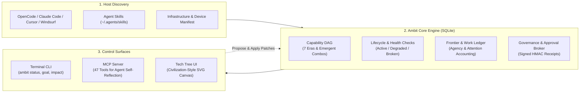
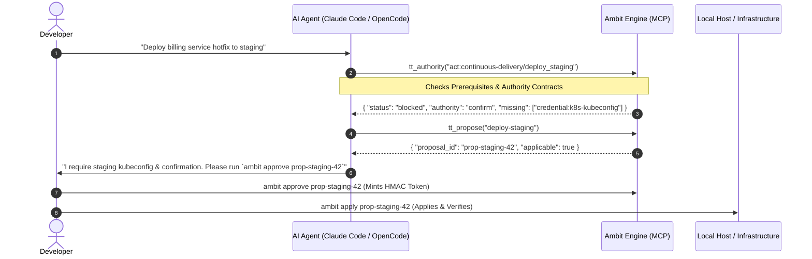

<div align="center">

# Ambit

**The meta-MCP capability graph for AI agent environments.**

[](https://github.com/zz-plant/ambit/actions/workflows/ci.yml)
[](https://github.com/zz-plant/ambit/releases/latest)
[](https://nodejs.org)
[](https://bun.sh)
[](./LICENSE)

[**Live Interactive Demo**](https://zz-plant.github.io/ambit/?demo=1) · [Get Started](#get-started) · [5 Core Strengths](#where-ambit-succeeds) · [Terminal CLI](#ask-questions-from-the-terminal) · [Agent MCP](#connect-it-to-your-agent) · [Deep Dive](./docs/deep-dive.md)

<br>


<sub><strong>Live Frontier:</strong> Adding a provider unlocks compound capabilities across your stack, surfaces reachable next steps, and streams verification & approval receipts.</sub>

<br><br>

**[Open the zero-install demo →](https://zz-plant.github.io/ambit/?demo=1)**

</div>

---

Try the [zero-install demo](https://zz-plant.github.io/ambit/?demo=1) first. It uses example data; a local checkout is required to inspect your own machine.

---

## Why Ambit?

If you use AI agents, your setup is fragmented across dozens of pieces: LLM providers, MCP servers, local CLI tools, skill directories, API keys, and multiple machines. Each tool has its own isolated config file.

**What they all add up to — what your human + agent system can actually *do* — is invisible.**

Ambit is the **meta-MCP server** for that sprawl: the MCP server that maps, audits, and plans across your other MCP servers and agent infrastructure. It models the environment as a formal capability tech tree, answering questions no single config or tool list can:

1. **What works right now?** What is reached, what is broken, and what is one dependency away?
2. **What breaks downstream** if a model, tool, or credential expires?
3. **What compound abilities emerge** when two independent tools are combined?
4. **What is worth setting up next**, priced by the human attention time it will save?

<div align="center">

<br><sub><strong>The Capability Tech Tree:</strong> Filled nodes are active · Outlined nodes are one step away on your frontier · Faded nodes have unmet prerequisites</sub>
</div>

---

## Architecture & Data Flow



---

## Where Ambit Succeeds

Ambit is built around five core capabilities designed to solve agent environment sprawl:

### 1. Civilization-Style Capability Graph & Combo Unlocks
Instead of a flat list of isolated tools, Ambit constructs a Directed Acyclic Graph (DAG) of capabilities across 7 evolutionary eras (from *Foundation* and *Tool Use* to *Memory*, *Assurance*, and *Sovereignty*).
* **Compound "Combo" Discovery:** Detects higher-order abilities unlocked by combining separate tools (e.g. `Vector DB` + `Local Embeddings` $\to$ `Semantic Retrieval`).
* **Near-Miss Detection:** Tells you when you are 1–2 simple prerequisites away from unlocking major new automation capabilities.

> [!TIP]
> Run `ambit graph combos` in your terminal to immediately identify tools you can unlock with minimal setup time.

### 2. Agent Meta-Introspection via MCP (47 Tools)
Ambit embeds directly into agent loops (**OpenCode**, **Claude Code**, etc.) via the Model Context Protocol. Rather than hallucinating or blindly failing, agents can query their own operational boundary mid-flight.



<details>
<summary><b>🔍 View the Full 47-Tool MCP Surface</b></summary>

| Group | Tools | Purpose |
| :--- | :--- | :--- |
| **Graph & Topology** | `tt_stats`, `tt_context`, `tt_cap`, `tt_combos`, `tt_diff`, `tt_health`, `tt_decay`, `tt_near`, `tt_bottlenecks`, `tt_spof`, `tt_impact`, `tt_credentials` | Query graph structure, SPOFs, combo prerequisites, and blast radius. |
| **Lifecycle & Assurance** | `tt_verify`, `tt_evidence`, `tt_authority`, `tt_actions`, `tt_plan`, `tt_goal`, `tt_paths`, `tt_preferences`, `tt_scope`, `tt_affordances`, `tt_since`, `tt_ledger` | Inspect health lifecycles, test verification contracts, and compute prerequisite paths. |
| **Operations & Economics** | `tt_work`, `tt_usage`, `tt_run_begin`, `tt_run_end`, `tt_work_event`, `tt_digest`, `tt_economics`, `tt_goal_value`, `tt_opportunities`, `tt_opportunity`, `tt_catalog`, `tt_roi`, `tt_roi_summary`, `tt_audit`, `tt_incidents`, `tt_incident_resolve`, `tt_portfolio`, `tt_can` | Record telemetry, compute attention ROI, query opportunities, and verify permissions. |
| **Governance & Planning** | `tt_blocked`, `tt_deficits`, `tt_simulate`, `tt_propose`, `tt_proposals`, `tt_proposal` | Propose environment patches and simulate future frontier states safely. |

</details>

### 3. Resilience, SPOF & Cascade Failure Analysis
Ambit strictly separates **configuration (`state`)** from **health (`lifecycle`)**:
* **Health Attestation:** A capability can be configured but `degraded` or `broken` if its verification command fails.
* **Single Points of Failure (SPOF):** Automatically calculates bottlenecks where dozens of downstream capabilities rely on a single fragile dependency.

> [!WARNING]
> Revoking a shared credential or stopping a Docker daemon can silently break multiple independent agents. Ambit flags these shared dependencies before failure cascades occur.

### 4. Attention Economics & Human-Agency Accounting
Quantifies friction and human-in-the-loop interventions in real dollars and time:
* **Attention Ledger:** Calculates the cognitive cost of manual interventions vs. autonomous agent execution time.
* **Opportunity Engine:** Ranks candidate tools and skills by **realized ROI** based on observed failure patterns and setup time.

### 5. Zero-Trust Local Governance & Signed Approvals
Host-level agent tools represent high-risk attack surfaces. Ambit enforces strict defense-in-depth:
* **Strict Loopback Isolation:** Binds strictly to `127.0.0.1` and blocks non-local `Origin` headers before routing.
* **No Remote Code Execution:** The web/API layer cannot create arbitrary MCP command entries over HTTP.
* **Cryptographic Approvals:** Generates signed approval receipts (`mintApproval` / `verifyApproval`) before applying configuration proposals.

> [!CAUTION]
> Ambit purposefully rejects requests to add new MCP executable entries over HTTP. Modifying agent execution capabilities must always go through signed local receipts or manual configuration.

---

---

## Visual Tour & Interactive Decision Suite

The Ambit Web UI (`./bootstrap.sh web`) is an interactive operational canvas equipped with live simulation and governance lenses:

<div align="center">

### The Built-in Capability & Ontology Guide

<sub>Plain-language definitions of capabilities, eras, verification contracts, and authority levels.</sub>

<br><br>

### Configuration & Live Inspection

<sub>Inspect providers, runtimes, MCP servers, and per-action execution boundaries.</sub>

</div>

### 🎛️ Four Dynamic Lenses on the Capability Canvas

| Lens | What It Renders | Ideal For |
| :--- | :--- | :--- |
| **🗺️ Standard Tree** | Chronological 7-era columns with reached, frontier, and locked nodes. | Exploring high-level evolutionary progression. |
| **🔥 Attention Heatmap** | Nodes glowing amber/crimson based on human intervention frequency and \$ / month friction cost. | Identifying which tools are interrupting developers the most. |
| **🛡️ Credential SPOFs** | Highlights shared authentication tokens and Single Points of Failure. | Audit blast radius before rotating API keys or access tokens. |
| **💻 Physical Hosts** | Groups capabilities into machine clusters (Laptop, GPU Server, Edge Pi, Cloud). | Diagnosing distributed homelab and edge device outages. |

### ⚡ Interactive Simulator (Outage Blast Radius & What-If Frontier)
Click any node in the inspector panel to enter simulation mode:
* **`[⚡ Simulate Outage (Blast Radius)]`**: Dims the canvas and renders the entire multi-hop failure cascade in **pulsing red** with a sticky count of disabled downstream capabilities.
* **`[✨ Simulate Unlocking (What-If)]`**: Simulates acquiring a locked primitive and lights up newly reachable compound capabilities in **glowing emerald green**.

### 🛡️ 1-Click Proposal Approval Broker
When an autonomous agent running in Claude Code or OpenCode proposes an environment change via MCP (`tt_propose`), click **`🛡️ PROPOSALS`** in the top navigation bar to review the diff and mint a cryptographically signed HMAC approval receipt in one click.

---

## Get Started

### Option A: Run from a checkout (CLI, engine, and visualizer)

```bash
git clone https://github.com/zz-plant/ambit.git
cd ambit
./bootstrap.sh
```

On first run, Ambit automatically discovers OpenCode, Claude Code, Cursor, Windsurf, and `~/.agents/skills`, initializes the local SQLite database, and reports your frontier. Cursor and Windsurf MCP servers are read from their standard config paths and remain attributed to the runtime that supplied them.

```console
First run — reading your agent config and building the graph…
✓ 168 capabilities discovered

  reached: 156
  total: 168
  domains:
    ai-ml     22/26
    backend   6/8
    infra     26/28
```

### Option B: Run only the visual tree

```bash
git clone https://github.com/zz-plant/ambit.git
cd ambit
./bootstrap.sh web
```

*Want to preview without touching anything? Run `./bootstrap.sh --dry-run`.*

---

## Connect It to Your Agent

Register Ambit as an MCP server so your agent can inspect its own toolchain and plan around missing capabilities. The npm package is not published yet, so use the checkout path below.

### Claude Code
```bash
claude mcp add ambit -- /absolute/path/to/ambit/cli.js mcp
```

### OpenCode (`~/.config/opencode/opencode.json`)
```json
{
  "mcp": {
    "ambit": {
      "type": "local",
      "command": ["ambit", "mcp"],
      "enabled": true
    }
  }
}
```

*An agent can inspect the map, query missing steps, and **propose** configuration changes — but applying changes always requires your explicit approval.*

---

## Ask Questions from the Terminal

| Command | What It Answers |
|---|---|
| `ambit status` | Overall environment health — active, degraded, and fragile nodes |
| `ambit goal <name>` | Step-by-step path to unlock a capability with time estimates |
| `ambit impact <id>` | Blast radius: what breaks if this tool, model, or credential goes down |
| `ambit opportunities` | Ranked suggestions for what to set up next, priced by time saved |
| `ambit authority` | Per-action permissions: what runs autonomously vs. what requires confirmation |
| `ambit history since` | Frontier movement: what capabilities were unlocked over time |

### Example: Goal Pathing

```console
$ ambit goal local-embeddings

  Local Embeddings
    missing: 1
    steps: 2 · estimated setup: 25m
    order: Embeddings Provider → Local Embeddings
```

### Example: Single Point of Failure (SPOF) Analysis

```console
$ ambit impact tool:docker

  Impact of tool:docker:
    direct dependents: 4
    downstream cascade: 12 capabilities blocked
    critical path: Container Sandbox → Isolated Evaluation → Self-Testing
```

---

## Exemplary Use Cases in Action

### 1. The Blast Radius Audit (Preventing Silent Outages)
* **The Situation:** Rotating a shared personal access token (`github-user-token`).
* **Before Ambit:** You revoke the token; two background MCP tools and a scheduled sync agent crash silently in production.
* **With Ambit:** Running `ambit impact credential:github/user-token` warns you that 3 providers and 8 capabilities depend on this single token, prompting you to provision granular tokens first.

### 2. The "Near-Miss" Combo Unlock
* **The Situation:** You have local Postgres and Ollama installed, but your agent cannot perform private semantic code search.
* **With Ambit:** `ambit graph combos` points out you are 1 step away (`CREATE EXTENSION vector;`). Running `ambit goal offline-semantic-search --simulate` shows you that this 5-minute fix unlocks 6 downstream capabilities with zero cloud API costs.

### 3. In-Flight Agent Self-Diagnosis via MCP
* **The Situation:** An autonomous agent in Claude Code is asked to deploy to staging.
* **Before Ambit:** The agent runs raw `kubectl` commands, gets unauthorized errors, retries endlessly, and corrupts local state.
* **With Ambit:** The agent calls `tt_authority` over MCP, sees `authority: confirm` and `missing: staging-kubeconfig`, stops cleanly, and asks the human to approve a signed proposal.

---

## How Ambit Compares

```
+-----------------------------------------------------------------------------------+
|                            THE AGENT TOOLING STACK                               |
+-----------------------------------------------------------------------------------+
|  1. Workflow Orchestration | LangGraph, CrewAI, Temporal (Execution Control Flow) |
|  2. Semantic Tool Routing  | Tool-RAG, Gorilla, AnyTool (API Search)              |
|  3. Capability & Frontier  | Ambit (Prerequisites, Combos, SPOF, Attention Cost)  |  <-- Ambit
|  4. Protocol Layer         | Model Context Protocol (JSON-RPC stdio/SSE)          |
|  5. Runtime / Isolation    | E2B, Docker, Nix, Local OS Host Filesystem           |
+-----------------------------------------------------------------------------------+
```

* **vs. Vector Tool-RAG:** Vector search finds tools by semantic keyword similarity, but is blind to prerequisite order and broken dependencies. Ambit models prerequisites and verifies health.
* **vs. Workflow State Machines (LangGraph):** LangGraph models *what to do in a specific task workflow*. Ambit models *what the host environment as a whole is capable of executing*.
* **vs. Package Managers (Nix/Homebrew):** Nix builds isolated binaries; Ambit models the higher-level cognitive affordance and human attention economics.

---

## Security & Invariants

Because Ambit inspects developer toolchains and configuration files, security invariants are strictly enforced:

1. **Loopback Only:** The API server binds strictly to `127.0.0.1`. Remote network interfaces are never opened.
2. **Strict Origin Validation:** Requests with non-local `Origin` headers are rejected with `403 Forbidden` prior to routing.
3. **No Entry Creation over HTTP:** The HTTP server can edit existing tool settings, but **cannot create new MCP server entries** over HTTP, eliminating remote code execution (RCE) vectors.
4. **Local Data Sovereignty:** Everything is stored locally in an embedded SQLite database. Zero telemetry or credentials leave your machine.

---

## Documentation & Deep Dive

* [Deep Dive Architecture & API Guide](./docs/deep-dive.md) — Detailed reference on nodes, assurance checks, authority contracts, the work ledger, and all 47 MCP tools.
* [Why Ambit](./docs/why-ambit.md) — The engineering motivation and backstory.
* [The Affordance Frontier](./docs/affordance-frontier.md) — Theoretical foundation: capability as a property of human-machine systems.
* [Roadmap](./ROADMAP.md) — Future development milestones.
* [Security Guide](./SECURITY.md) & [Agent Invariants](./AGENTS.md) — Security policies and rules.
* [Launch Kit](./docs/launch.md) — Listing copy, repository topics, Show HN draft, and the social-preview asset.

---

## Contributing

Contributions are welcome! Whether it is adding new capability models, refining runtime adapters, improving UI visualizations, or reporting edge cases:

- Review [CONTRIBUTING.md](./CONTRIBUTING.md) for development workflow and PR guidelines.
- Review [SECURITY.md](./SECURITY.md) and [AGENTS.md](./AGENTS.md) for core security invariants.
- Read our [Code of Conduct](./CODE_OF_CONDUCT.md) to understand community standards.

---

## License

[MIT](./LICENSE) © Ambit Contributors
