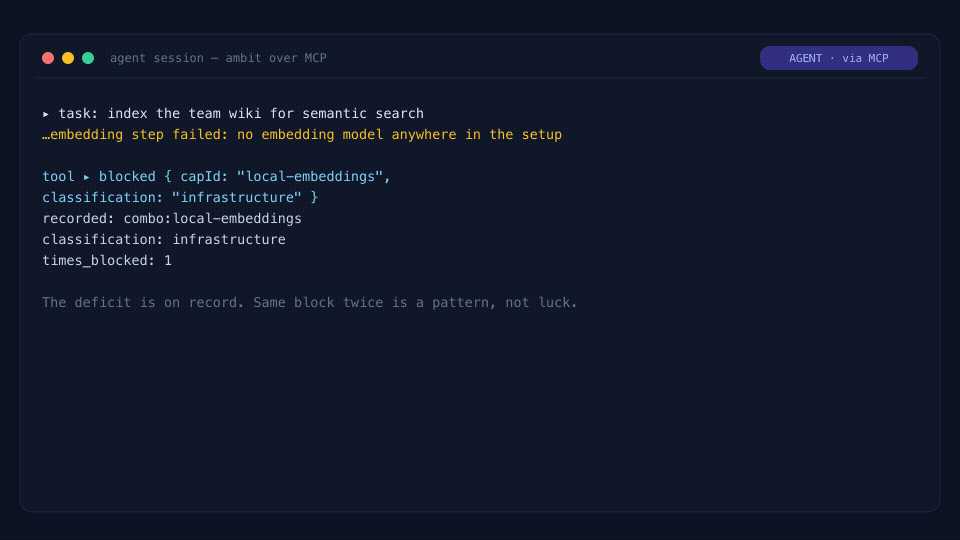
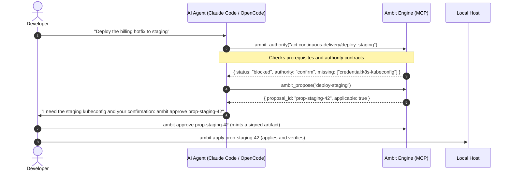

<div align="center">

# Ambit

**What you, your agents, and your machines can jointly do — and where your own time is going.**

[](https://github.com/zz-plant/ambit/actions/workflows/ci.yml)
[](https://github.com/zz-plant/ambit/releases/latest)
[](https://nodejs.org)
[](./LICENSE)

[**Live demo**](https://zz-plant.github.io/ambit/?demo=1) · [Get started](#get-started) · [Terminal](#ask-from-the-terminal) · [Agent MCP](#connect-it-to-your-agent) · [How it works](#how-it-works) · [Deep dive](./docs/deep-dive.md)

<br>


<sub>One setup, mapped. Pick a tool and Ambit shows what depends on it; switch it off and it shows the fourteen things that stop working with it. Then which tools interrupt you most, and a change waiting on your approval.</sub>

</div>

---

## What Ambit is

If you use AI agents, your setup is spread across LLM providers, MCP servers, local CLI tools, skill directories, credentials, and more than one machine. Every piece has its own config file.

What they add up to — what your human-plus-agent system can actually *do* — is written down nowhere.

Ambit reads those configs and builds one map out of them. Every tool, model, skill, and credential becomes a point on it; everything one of them needs in order to work becomes a line to another. That map answers questions no single config file can:

1. **What works right now?** What is set up, what is broken, and what is one dependency away.
2. **What breaks downstream** if a model, tool, or credential goes away.
3. **What compound abilities emerge** when two independent tools are combined.
4. **What is worth setting up next**, priced by the human attention it would save.

You ask from the terminal. Your agents ask over MCP, mid-session, rather than finding the limit by running into it — Ambit is itself an MCP server, so the thing describing your MCP servers speaks the same protocol they do. (A *meta-MCP server*, if you want the term to search for.)

### The words Ambit uses

Four of them carry most of the meaning, in the terminal and on the map alike.

- **Capability** — one thing your setup can do. Every MCP server, agent, skill, provider, model, and command in your config becomes one, as does every node of the curated tree.
- **Era** — how far up the tree a capability sits. Later eras depend on earlier ones. Eras describe ordering, not importance.
- **Reached, next, blocked** — reached means something in your config provides it. Next means the prerequisites are met but nothing was detected: this is the frontier, and `ambit goal` lists it. Blocked means a prerequisite is missing, which is usually the most informative of the three.
- **Hard vs soft prerequisite** — a hard prerequisite gates the capability; a soft one strengthens it without gating. Only hard prerequisites block a node. Both are drawn, soft ones fainter.

<div align="center">

<br><sub>Filled nodes are active · Outlined nodes are one step away on your frontier · Faded nodes have unmet prerequisites</sub>
</div>

---

## Get started

The [hosted demo](https://zz-plant.github.io/ambit/?demo=1) runs on example data and installs nothing. Inspecting your own machine needs a local checkout.

### Option A — full install (CLI, engine, visualizer)

```bash
git clone https://github.com/zz-plant/ambit.git
cd ambit
./bootstrap.sh
```

On first run Ambit discovers OpenCode, Claude Code, Cursor, Windsurf, Gemini CLI, Claude Desktop, Codex CLI, and `~/.agents/skills`, initializes a local SQLite database, and reports your frontier.

```console
First run — reading your agent config and building the graph…
✓ 168 capabilities discovered

  reached: 156
  total: 168
  domains:
    ai-ml     22/26
    backend   6/8
    infra     26/28
```


### Option B — visualizer only

```bash
git clone https://github.com/zz-plant/ambit.git
cd ambit
./bootstrap.sh web
```

`bootstrap.sh` also links the `ambit` command into `~/.local/bin` when that directory is on your PATH. If it is not, the script prints the `ln -s` line to run instead, and everything below works the same way with `/path/to/ambit/cli.js` in place of `ambit`.

To see what the installer would do without running it: `./bootstrap.sh --dry-run`.

> [!NOTE]
> The npm package is built and ready but not yet published, so `npx ambit` will not work. Use the checkout paths above.

---

## Ask from the terminal

| Command | What it answers |
|---|---|
| `ambit status` | Environment health — active, degraded, and fragile nodes, plus pending approvals |
| `ambit goal <name>` | The path to unlock a capability, in order, with setup estimates |
| `ambit impact <id>` | Blast radius: what breaks if this tool, model, or credential goes down |
| `ambit graph combos` | Compound capabilities, including the ones you are one prerequisite away from |
| `ambit opportunities` | What to set up next, ranked by the attention time it would save |
| `ambit authority` | Per-action permissions: what runs unattended, what needs confirmation |
| `ambit verify [id]` | Run a capability's declared check and record whether it actually works |
| `ambit history [since]` | How the frontier moved, separating what you acquired from what emerged |
| `ambit share` | A self-contained HTML snapshot of the map, written locally and safe to post |

`ambit help` lists the full surface, grouped by what you are trying to do.

Everything above answers on a graph Ambit builds by itself. A second group — `attention`, `work`, `usage`, `opportunities`, `roi`, `audit` — prices the human cost of running the stack, and reads from a work ledger that starts empty. Those commands tell you what they need rather than returning a number, and they become useful after a few weeks of recorded runs, not on install.

The three blocks below are captured from a run against a fixture graph by `npm run docs:examples`, and CI fails if they drift from what the commands actually print.

### Where the environment stands

<!-- example: ambit status -->
```console
$ ambit status

    summary: 37/56 capabilities reached · 26 with a single provider
    reached: 37
    total: 56
    verified: 0
    failing: 0
    evidence:
        proven: 0
        unproven: 14
        failing: 0
        last check: never
        provable now: Automated Tests, Browser Automation, Code Intelligence, File Editing, Local Runtime, Shell Execution, Version Control, Web Research
        note: configured is not working — ambit verify would turn 8 of the unproven into evidence
    domains:
      ai-ml
    …
```
<!-- /example -->

### What it would take to reach something

<!-- example: ambit goal local-embeddings -->
```console
$ ambit goal local-embeddings

    goal: Local Embeddings
    exact: true
    reachable: true
    steps: 2
    estimated setup: 25m
    order:
      Embeddings
        id: combo:embeddings
        setup seconds: 600
        options:
          nomic-embed via local runtime
            setup seconds: 600
            recurring cost: none
            privacy: local
    …
```
<!-- /example -->

### What breaks if this goes away

<!-- example: ambit impact combo:local-runtime -->
```console
$ ambit impact combo:local-runtime

    capability: Local Runtime
    decayed:
      Local Tool Calling
        becomes unavailable: false
      Model Routing
        becomes unavailable: false
      Local Embeddings
        becomes unavailable: false
      Self-Hosted Stack
        becomes unavailable: false
    combos at risk:
      Local Tool Calling
        severity: warning
      Model Routing
    …
```
<!-- /example -->

`ambit share` builds its HTML from an allow-list — name, kind, domain, era, state, lifecycle, edges. Commands, URLs, paths, descriptions, and economics cannot enter the file, people render as "a person", and `--redact` replaces every non-curated name with its category. Nothing is uploaded; writing the file locally is the whole command.

---

## Connect it to your agent

Registering Ambit as an MCP server lets an agent inspect its own toolchain and plan around what is missing.

### Claude Code

```bash
claude mcp add ambit -- ambit mcp
```

### OpenCode (`~/.config/opencode/opencode.json`)

```json
{
  "mcp": {
    "ambit": {
      "type": "local",
      "command": ["ambit", "mcp"],
      "enabled": true
    }
  }
}
```

Both assume `bootstrap.sh` linked `ambit` onto your PATH. If it did not, use the absolute path to `cli.js` instead.

An agent can read the map, query what a goal is missing, and **propose** a configuration change. Applying one always requires your approval.

Here is the whole loop from a live run. `node --experimental-strip-types scripts/demo-agent-loop.ts` re-records it, and every frame is real engine output — a failing loop fails the recording rather than rendering a fiction.

<div align="center">

<br><sub>Agent: hits a block, records the deficit, asks <code>goal</code>, drafts a proposal · Human: <code>approve</code>, <code>apply</code> · One config patch, four capabilities.</sub>
</div>

### What the exchange looks like



<details>
<summary><b>The full 48-tool MCP surface</b></summary>

Forty-eight tools, each advertised once. Each answers with MCP `structuredContent` — the result as data — alongside the text block, so an agent reads a field rather than parsing a string. A legacy `tt_` prefix is still accepted for configs written before the rename, but is no longer listed: advertising both doubled `tools/list` to 96 entries and spent about 3,600 tokens of every agent's context on duplicates.

| Group | Tools | Purpose |
| :--- | :--- | :--- |
| **Graph & topology** | `stats`, `context`, `cap`, `combos`, `diff`, `health`, `decay`, `near`, `bottlenecks`, `spof`, `impact`, `credentials` | Query structure, single points of failure, combo prerequisites, and blast radius. |
| **Lifecycle & assurance** | `verify`, `evidence`, `authority`, `actions`, `plan`, `goal`, `paths`, `preferences`, `scope`, `affordances`, `since`, `ledger` | Inspect health, run verification contracts, resolve authority scope, compute prerequisite paths. |
| **Work & economics** | `work`, `usage`, `run_begin`, `run_end`, `work_event`, `digest`, `economics`, `goal_value`, `opportunities`, `opportunity`, `catalog`, `roi`, `roi_summary`, `audit`, `incidents`, `incident_resolve`, `portfolio`, `can` | Record telemetry, price attention, rank opportunities, and check permission before acting. |
| **Governance & planning** | `blocked`, `deficits`, `simulate`, `propose`, `proposals`, `proposal` | Record deficits, simulate future frontier states, and draft reviewable patches. |

</details>

---

## How it works

Discovery reads your host configs into an embedded SQLite graph. Three surfaces read that graph back out — the terminal CLI, the MCP server, and the web canvas — and the only path that writes to it is a proposal you approve.

Each client is read from its own standard config path, and every server stays attributed to the client that listed it. When two clients name the same server, that is one capability with two sources rather than two capabilities — which is what stops Ambit from counting a single binary twice and calling the result redundancy.

### Seven eras, and what follows from them

Discovered capabilities are placed into a curated tree that runs from **Foundation** and **Model Access** through **Tool Use**, **Memory**, **Autonomy**, and **Assurance** to **Sovereignty**. Because each capability records what it needs, Ambit works out what you can reach rather than taking a config file's word for it.

Two things follow from that:

- **Combos.** Higher-order abilities appear from tools that were configured separately — a vector store plus local embeddings becomes semantic retrieval, which neither config mentions.
- **Near misses.** When you are one or two prerequisites from a capability that unlocks several others, that gap is worth naming. `ambit graph combos` lists them.

### Configured is not working

Ambit keeps two properties apart, and the distinction is load-bearing:

- `state` is **structural** — is this thing configured, and what does it depend on. This is what the frontier ledger records.
- `lifecycle` is **health** — did its declared verification command actually pass. A capability can be fully configured and still `degraded` or `broken`.

Every availability decision gates on lifecycle, not state. A broken capability is excluded from plans, simulations, goals, authority checks, and opportunity ranking, because a plan routed through a tool that does not run is worse than no plan.

`ambit status` reports proven, unproven, and failing counts. The map badges each reached node: `✓` for a passing check, `!` for a failing one, nothing for configured-but-never-verified.

### Fragility is computed, not guessed

- **Single points of failure** — capabilities with exactly one provider.
- **Bottlenecks** — nodes ranked by how much sits downstream of them.
- **Shared credentials** — providers presenting the same credential fail together, so three providers behind one token is not redundancy. This one is declared rather than inferred: name the sharers in a `credentials` block and `ambit impact credential:...` will show what revoking it would end.

---

## The map

The web UI (`./bootstrap.sh web`) is an operational canvas over the same graph the CLI reads.

The **Docs** button defines every term on the canvas; [the four above](#the-words-ambit-uses) cover most of it.

### Three lenses on the canvas

Press <kbd>1</kbd>–<kbd>3</kbd> to switch.

| Lens | What it renders | Use it for |
| :--- | :--- | :--- |
| **Standard** | Chronological era columns with reached, frontier, and locked nodes. | Reading overall progression and what is nearby. |
| **Attention** | Nodes warmed amber to crimson by how often a human has had to intervene. | Finding which tools keep interrupting you. |
| **SPOFs** | Highlights capabilities that hang off shared authentication. | Checking blast radius before rotating a key. |

### Simulation

Select a node to open the inspector, then simulate against it. Neither mode writes anything.

- **Simulate outage** dims the canvas and renders the multi-hop failure cascade in red, with a running count of disabled downstream capabilities.
- **Simulate unlocking** acquires a locked primitive hypothetically and lights up everything that becomes reachable in green.

### Approving proposals

When an agent proposes an environment change over MCP, the **Proposals** panel shows the diff and mints a signed approval receipt in one click. The same thing happens from the terminal with `ambit approve <id> <who>`.

---

## The control plane

Host-level agent tooling is a real attack surface, so execution goes through an interceptor rather than straight to the shell.

- **Interception.** Before a tool call reaches your machine, the proxy in `src/control_plane/proxy.ts` checks three things: are this capability's prerequisites in place, is it actually working, and is the caller allowed to do this. A call that fails any of them is refused — `AMBIT_BLOCKED_UNAUTHORIZED`, exit code `2` — and nothing on the machine has changed.
- **Human-in-the-loop remediation.** A blocked execution drafts a structured proposal and an HMAC challenge. `ambit approve <proposal-id> <person>` mints a signed artifact that the executor verifies before any state changes. An artifact stops being valid if the proposal changed after approval, or if it has expired.
- **Tracing.** Spans and structured events record DAG evaluations, missing authorizations, challenges, and verification receipts.
- **The environment is simulated.** The decision is real — the DAG check, the authority evaluation, the approval artifact and the audit trail all run against your actual graph. What sits on the other side of the gate is a fixture: `simulatedAdapter` in `src/control_plane/proxy.ts` keeps its state in a JSON file. Ambit ships no deployment integration. A real one implements the three-method `EnvironmentAdapter` in that file, and nothing above the gate changes.

A worked example — an autonomous deploy agent blocked mid-flight, then remediated — is written up in [`docs/incidents/INCIDENT_TRACE_001.md`](./docs/incidents/INCIDENT_TRACE_001.md).

```bash
npm test                                                  # the suite behind the walkthrough
npm run demo:incident                                     # the 90-second terminal walkthrough
asciinema play docs/incidents/demo_intervention_trace.cast # replay the recording
```

---

## In practice

### The combo you already almost have

You run local Postgres and Ollama, but your agent cannot do private semantic code search over your repositories.

`ambit graph combos` reports the gap as one step — `CREATE EXTENSION vector;` — and `ambit goal offline-semantic-search --simulate` shows what that five-minute change reaches, with no cloud API in the path.

### An agent diagnosing itself

An agent in Claude Code is asked to deploy to staging. Left alone it runs `kubectl`, collects unauthorized errors, retries, and leaves local state worse than it found it.

Calling `ambit_authority` first returns `authority: confirm` and `missing: staging-kubeconfig`. The agent stops cleanly and asks for an approval it can name.

### Rotating a shared token

You are about to revoke a personal access token. Without a model of what depends on it, two background MCP tools and a scheduled sync agent fail silently some hours later.

`ambit impact credential:github/user-token` names the providers and capabilities standing on that one credential, which is the argument for provisioning granular tokens first.

This one needs setup first. Ambit will not guess which providers share a secret, so the credential graph is read from a `credentials` block you write — the [deep dive](./docs/deep-dive.md) has the format. Until you do, `ambit credentials` reports that none are declared.

---

## Where this sits in the stack

Ambit sits above the protocol layer and below workflow orchestration. It neither routes calls nor runs them.

- **Against vector tool-RAG.** Semantic search finds tools that sound relevant. It has no view of prerequisite order and cannot tell a working tool from a broken one.
- **Against workflow state machines.** LangGraph models control flow within one task. Ambit models what the host environment is capable of executing at all.
- **Against package managers.** Nix and Homebrew install binaries. Ambit models the affordance those binaries add up to, and what it costs a person to keep them working.

---

## Security invariants

Ambit reads developer toolchains and writes to agent configs, so a few properties are fixed and cannot be relaxed. [`AGENTS.md`](./AGENTS.md) and [`SECURITY.md`](./SECURITY.md) carry the full posture.

1. **Loopback only.** The API server binds `127.0.0.1`. No LAN, no tunnel.
2. **Origin allowlist.** A request with a non-local `Origin` is rejected with 403 *before* routing. Response headers alone are not sufficient — a simple request skips preflight and would otherwise reach the handler.
3. **No entry creation over HTTP.** The HTTP layer can edit fields on existing MCP entries and nothing else. An MCP entry carries a command the runtime later executes, so creating one over HTTP would be remote code execution. Adding a server returns a snippet for you to paste.
4. **Local data only.** Everything lives in an embedded SQLite database on your machine. No telemetry, no credentials leaving the host.

---

## Documentation

* [Deep dive](./docs/deep-dive.md) — nodes, assurance checks, authority contracts, the work ledger, and every MCP tool in detail.
* [Why Ambit](./docs/why-ambit.md) — what the tool is for and why it exists.
* [The affordance frontier](./docs/affordance-frontier.md) — capability as a property of human-machine systems rather than of software.
* [Roadmap](./docs/roadmap.md) — where the data model is heading. Direction, not description.
* [Changelog](./CHANGELOG.md) — what changed per release, and why.
* [Security](./SECURITY.md) · [Agent invariants](./AGENTS.md) — the rules above, in full.

---

## Contributing

New capability models, runtime adapters, visualization work, and edge-case reports are all welcome.

- [CONTRIBUTING.md](./CONTRIBUTING.md) — development workflow and PR guidelines.
- [AGENTS.md](./AGENTS.md) — the invariants a change must not break.
- [CODE_OF_CONDUCT.md](./CODE_OF_CONDUCT.md) — community standards.

`npm run lint && npm run typecheck && npm test` is the gate. Both halves of the repo typecheck under `strict`, and the suite runs against real SQLite.

---

## License

[MIT](./LICENSE) © Ambit Contributors
