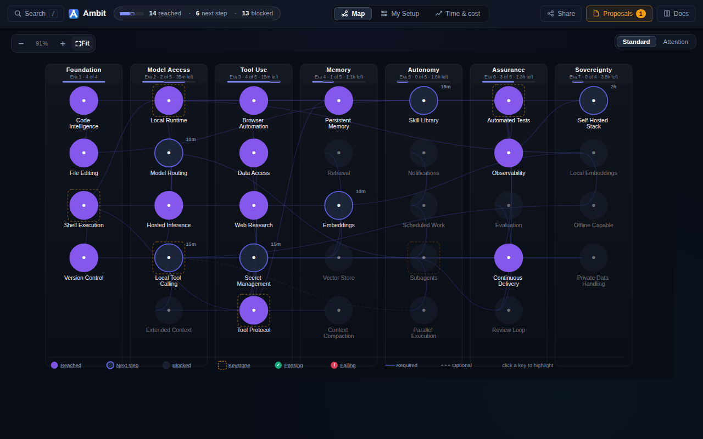
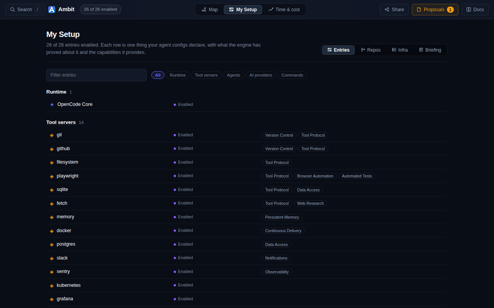
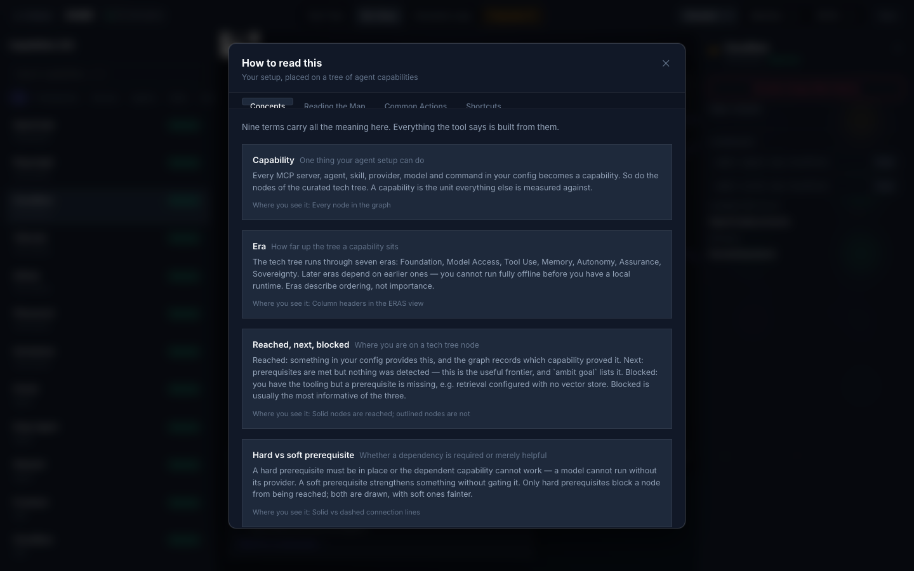

<div align="center">

# Ambit

**A capability graph for agent stacks.**

[](https://github.com/zz-plant/ambit/releases/latest)
[](./LICENSE)
[](https://nodejs.org)
[](https://bun.sh)
[](#security)

[**Live demo**](https://zz-plant.github.io/ambit/) · [Quick start](#start-here) · [CLI](#ask-better-questions-about-your-stack) · [MCP](#agents-can-query-it-too) · [Roadmap](./ROADMAP.md) · [Why Ambit](./docs/why-ambit.md)

</div>

Ambit is a capability-accounting system for agentic infrastructure. It gives agents and their users a persistent model of what their combined environment can actually do: which capabilities exist, what they depend on, what is one step away, what is decaying, and what would break if something disappeared.

The premise is that the meaningful capabilities of an AI system do not reside entirely in the model. They arise from composition — models, tools, credentials, machines, networks, memory, schedulers, humans, policies, persistent processes — so the question worth answering is not what the model knows or what appears in a config file, but:

> **What can this human-machine system actually cause to happen right now?**

It is built for the point where an agent setup stops fitting comfortably in your head.

You have multiple models. MCP servers. Skills. Subagents. Local machines. Hosted services. Credentials. Scheduled jobs. Maybe a homelab.

The individual pieces are visible in configuration files. Their combined action space is not.

Ambit makes that action space explicit.

<div align="center">

<br><sub>Filled = reached · outlined = next, with setup cost · faded = blocked by a missing prerequisite</sub>
</div>

## Why Ambit exists

Agent systems are becoming capable through composition.

A shell is one capability. Tailscale is another. Docker is another. Monitoring is another. Together, under the right conditions, they may amount to:

> safely diagnose and recover a failed service without human intervention

No individual config entry says that.

Likewise, the presence of a tool does not prove an agent can reliably use it. A model may technically support tool calling and fail in practice. An agent may hold credentials for an action it is not authorised to take. A machine may have idle compute that no agent can actually reach.

As agent environments grow, several different questions collapse into one:

> **What can this system actually do?**

Ambit treats that as a graph problem. It models capabilities, dependencies, costs, maturity, and composition so that both humans and agents can reason over the environment they share.

## The core idea

Configuration tells you what is declared. Ambit tries to tell you what those declarations amount to.

A capability in a tool registry looks like *"GitHub access: yes."* The useful form is closer to:

> Can diagnose a failing service, modify its repository, deploy a fix, verify recovery, and report the intervention — because the system currently has repository write access, shell execution, deployment credentials, monitoring visibility, network reachability, persistent execution, and the required human authorisation.

That second description is **effective capability**, and it is the object Ambit is built around. Getting there means keeping apart seven things that ordinary registries collapse into one:

| | | today |
|---|---|---|
| **Available** | something appears to exist | ✅ |
| **Reachable** | all necessary dependencies are currently accessible | ✅ |
| **Composed** | several lower-level capabilities together make a higher-order action possible | ✅ |
| **Verified** | the capability has actually succeeded | roadmap |
| **Authorized** | the system has permission to use it | roadmap |
| **Delegated** | a human or another agent supplies a missing step | roadmap |
| **Persistent** | it can operate beyond the current interaction | roadmap |

Capability *change* is now recorded over time — see [the ledger](#the-ledger) — which is the accounting half of that table rather than a seventh state.

Three of seven, and the README says which. [The roadmap](./ROADMAP.md) is the rest.

The compressed form of the same point:

```
installed ≠ callable ≠ working ≠ reliable ≠ authorized ≠ appropriate
```

## What it does today

Ambit reads your agent configuration and maps discovered components onto a capability graph. It ships with a curated seven-era capability model:

```
1  Foundation     shell · files · code intelligence · version control
2  Model Access   hosted inference · local runtime · local tool calling
                  extended context · model routing
3  Tool Use       tool protocol · browser automation · web research
                  secret management · data access
4  Memory         embeddings · vector store · retrieval
                  persistent memory · context compaction
5  Autonomy       subagents · skills · parallel execution
                  scheduled work · notifications
6  Assurance      tests · review loop · evaluation
                  observability · continuous delivery
7  Sovereignty    local embeddings · offline operation
                  private data · self-hosted infrastructure
```

Each node is in one of three states:

- **Reached** — your environment provides evidence for it, and the graph records which capability provided that evidence
- **Next** — its prerequisites are satisfied and nothing is configured yet
- **Blocked** — an implementation exists but a prerequisite is missing

Ambit also records explicit dependency edges from your configuration: `provider → model`, and `model → agent` for agents pinned to one.

<table>
<tr>
<td width="50%" valign="top">

<br><sub><b>CONFIG</b> — your configuration as a graph, with diagnostics.</sub>
</td>
<td width="50%" valign="top">

<br><sub><b>DOCS</b> — nine terms carry all the meaning; the same definitions back <code>tt explain</code>.</sub>
</td>
</tr>
</table>

Any view is linkable: `?view=tree`, `?layout=constellation`, `?docs=open`.

## Start here

```bash
git clone https://github.com/zz-plant/ambit.git
cd ambit
./bootstrap.sh
```

Bootstrap installs dependencies, discovers your environment, and seeds the graph:

```
Installing...
✓ 168 capabilities
┌─ Toolchain ───────────────────────────────────────────┐
│ 156/168 capabilities, 8 domains, 33 combos
│ █████████░ ai-ml        22/26
│ ████████░░ backend      6/8
│ █████████░ devops       7/8
│ ██████████ frontend     1/1
│ █████████░ infra        26/28
│ ██████████ meta         88/89
│ ████████░░ quality      5/6
│ █████░░░░░ security     1/2
└───────────────────────────────────────────────────────┘
```

To inspect what it would find without changing anything:

```bash
./bootstrap.sh --dry-run
```

To launch the visualizer:

```bash
./bootstrap.sh web
```

Homebrew installs the CLI on its own:

```bash
brew install zz-plant/tap/ambit
```

**Requires** Bun for the visualizer and server, Node 22+ for the engine and CLI.

## Ask better questions about your stack

Run `tt` with no arguments and it shows where you are, what is one step away, and what to do next. The full set:

```
Explore    stats · context · health · profile · export · explain
Maintain   decay · diff · trend · prune · prune <id> · ledger · since
Plan       near · combos · fork · insight
Analyze    bottlenecks · impact <id> · budget <setup> <tokens>
```

| | asks |
|---|---|
| `tt near` | What am I one or two dependencies away from being able to do? |
| `tt bottlenecks` | Which capability would unlock the largest part of the graph? |
| `tt impact <id>` | What becomes unavailable if this disappears? |
| `tt fork` | Which nearby path has the best trade-off between setup cost, regret, and downstream leverage? |
| `tt decay` | Which parts of the system appear to be rusting? |
| `tt since` | What became reachable since a past date — and what emerged rather than being added? |

Real output — one dependency away, and the dependency it names gates four further capabilities:

```console
$ tt near

  Local Embeddings
    missing: 1
    met count: 1
    total required: 2
    met maturity: 70
    investment: Add Embeddings
```

More useful is where composition *fails*. Capabilities you have already half-built carry the reason:

```
Retrieval          configured, but Vector Store is not in place yet
Offline Capable    configured, but Local Embeddings is not in place yet
Self-Hosted Stack  configured, but Observability is not in place yet
```

Nothing declared those. They fall out of the dependency structure, and they are invisible in every file you own.

### The ledger

`capabilities` holds the present state and is overwritten on every seed, so on its own the graph can only say what the system can do *now*. Every seed also records the whole frontier, which lets it answer what was reachable at a past date:

```console
$ tt since
  frontier then: 13
  frontier now:  19
  gained:    Embeddings · Local Embeddings · nomic-embed-text
  emergent:  Model Routing · Offline Capable · Subagents
```

One embedding model was added. Six capabilities moved. The three under `emergent` became reachable although **nothing providing them was added** — their prerequisites were satisfied by something else entirely. Offline Capable was already provided by an agent that did not change.

That is the entry a per-component changelog structurally cannot produce, because no single change explains it. Accumulated capacity to act is a graph property, and this is where it shows up.

Every command prints for a person by default and takes `--json` for scripts.

## Agents can query it too

Ambit ships an MCP server exposing the graph directly to an agent:

```
tt_stats   tt_context  tt_recs    tt_cap     tt_decay   tt_combos
tt_diff    tt_health   tt_impact  tt_budget  tt_trend   tt_near
tt_insight tt_profile  tt_prune   tt_fork    tt_bottlenecks
```

This matters because Ambit is not only a dashboard for the user. An agent should be able to ask:

- What infrastructure am I operating inside?
- Which capabilities are already available?
- Why is this task outside the current action space?
- Is this limitation local to the task, or are we repeatedly missing the same primitive?
- Which existing component is a single point of failure?

The agent no longer has to reconstruct the environment from conversational context every session.

## Runtimes are nodes, not owners

Ambit represents agent runtimes rather than being one. A runtime becomes a node, and everything it contributes hangs off it — so two runtimes configuring the same MCP server produce **one capability with two providers**, not two capabilities.

```bash
bun run scripts/adapters/hermes.ts          # what Hermes provides
bun run scripts/adapters/hermes.ts --seed   # add it to the graph
```

Against a real install, that yields:

```
runtime:opencode — contributes 127 capabilities
runtime:hermes   — contributes 32 capabilities
shared by both   — mcp:fetch · mcp:filesystem · mcp:git · mcp:sequential-thinking
```

`tt impact runtime:hermes` then answers what would be lost if that runtime went away — and the answer is smaller than its capability count, because the shared four survive.

The adapter also reads what a config file cannot infer but the runtime states outright: Hermes reports `approvals: manual`, `cron_mode: deny`, eight messaging surfaces, a policy engine, and zero scheduled jobs — which is the difference between a capability that persists and one that lasts a session.

Hermes has no machine-readable config export today, so the adapter reads its documented paths. That is a stopgap: the durable contract is for runtimes to publish their capability surface and for Ambit to consume it.

## The visualizer

Four views: **ERAS** (capability model by era), **CONSTELLATION** (3D), **ORBITAL** (concentric by type), **FLAT** (force-directed).

The visualizer is a view over the model, not the product's ultimate abstraction. The underlying graph is meant to stay useful when no human is looking at it.

## Infrastructure belongs in the graph

Agent capabilities do not stop at the model boundary. A local GPU, NAS, browser worker, Proxmox host, database, or cloud account can all contribute to what the system can accomplish.

Ambit scans infrastructure from an explicit local manifest (`INFRA_MANIFEST`, default `~/.config/opencode/infrastructure.json`). With no manifest it returns an empty scan rather than an error — no host addresses are baked in.

The goal is not another homelab inventory. It is to treat infrastructure as capability-bearing:

```
GPU node
  ├─ local inference
  ├─ embeddings
  ├─ batch evaluation
  └─ private processing
```

A machine matters because of the actions it makes reachable.

## Humans are nodes, not outsiders

Ambit does not model humans only as users issuing prompts. Humans supply legal authority, physical access, money, institutional standing, subjective judgement, approval, and actions machines cannot perform. A capability chain can therefore run:

```
diagnose hardware failure → request replacement → human approves expenditure
→ vendor ships component → human installs it → agent configures it
→ monitoring verifies recovery
```

The capability belongs to the human-machine system, not to either half. That lets partial, structured autonomy be described as it actually is, rather than forcing everything into "fully autonomous" or "human controlled".

*Not built yet — humans are not currently nodes in the graph. See [ROADMAP.md §2](./ROADMAP.md).*

## Composition is the interesting part

A growing agent environment produces capabilities that no individual component declares:

```
monitoring + shell + service manager + network reachability
+ notifications + appropriate authority

        → diagnose and recover a failed service
```

Ambit's direction is to represent and verify those compositions explicitly — moving from *which tools are installed?* toward *which goals are reachable?*

## From configured to demonstrated

Detection is a first approximation. Today Ambit infers capability from configuration and naming patterns. The deeper model is empirical:

```
unknown → detected → configured → demonstrated
        → repeatedly verified → degraded → unavailable
```

A capability should eventually mean more than "something with the right name exists". It should mean the system has evidence the action can be performed under known conditions. That distinction matters more as agents gain authority.

## Capability and authority are different things

Being technically capable of an action should not imply permission to perform it.

```
CAN OBSERVE    autonomous
CAN PLAN       autonomous
CAN SIMULATE   autonomous
CAN EXECUTE    approval required
CAN VERIFY     autonomous
CAN ESCALATE   autonomous
```

This lets technical capability accumulate without silently broadening delegated authority. It is not a restriction on the capability model — it is what makes a larger capability surface governable.

## Why an AI might ask you to install Ambit

The interesting case is not *"you should install another developer tool."* It is an agent recognising:

> I keep encountering environmental limitations that neither of us can represent or fix systematically.

That happens when every session rediscovers the same machines and permissions, when unrelated tasks fail on the same missing primitive, when capabilities exist but their composition is unclear, or when the distinction between *possible* and *permitted* lives only in conversation.

The point is not to make the agent indiscriminately more powerful. It is to give the joint system a durable representation of the environment it is already building.

## Why this may matter beyond developer tooling

As AI systems acquire more persistent means of action, capability increasingly becomes a **systems property** rather than a model property. Effective agency can grow through thousands of small integrations without any dramatic increase in model intelligence — credentials, persistence, schedulers, tools, machines, memory, delegation, and network reach all contribute.

A useful design norm follows:

> **No increase in effective capability without a corresponding increase in legibility, verification, and governability.**

Ambit does not attempt to solve alignment. It addresses a narrower problem: the growth of effective agency outpacing our ability to represent, bound, verify, and revoke it.

A mature capability graph could make several invariants explicit — no autonomous acquisition of new authority; no delegation beyond the delegator's; no persistent worker without an owner and a kill path; no capability promotion without verification; no irreversible action without a recovery path.

The larger idea is simple: **make capability accumulation explicit rather than accidental.**

There is a longer version of this argument in [why-ambit.md](./docs/why-ambit.md).

## Architecture

```
agent config
infrastructure manifest
        │
        ▼
   Ambit engine
        │
        ▼
    SQLite graph
        │
        ├──► CLI                tt
        ├──► MCP server         17 tools, JSON-RPC over stdio
        ├──► visualizer API     Bun.serve, port 3001
        └──► tracking plugin    config-change events
```

TypeScript · Node 22 with `node:sqlite` · Bun server · React + Vite · Three.js · JSON-RPC MCP · local-first state.

## Security

The server reads and writes `opencode.json`, so two invariants hold:

- **Loopback only.** It binds `127.0.0.1` and rejects non-local origins **before routing** — CORS headers alone are insufficient, because a simple request skips preflight and reaches the handler regardless.
- **It cannot create configuration entries.** An MCP entry carries a command your agent runtime executes, so creating one over HTTP would be remote code execution. The API can toggle an MCP and edit an existing agent's description or model; adding a server generates a snippet you paste yourself.

Ambit should become more capable without making its own control surface casually dangerous. There is no telemetry.

## Other configurations

OpenCode is the default input format, but the engine is not tied to it. Map another JSON configuration with `CONFIG_MAPPING`:

```bash
CONFIG_MAPPING='{
  "config_keys": {
    "tools": { "type": "tool", "domain": "devops", "desc_field": "description" }
  }
}' \
OPENCODE_CONFIG=my-project.json \
./bootstrap.sh
```

The default mapping covers MCP servers, agents, providers, commands, and skills.

The eventual goal is broader: different agent runtimes should attach to the same capability model rather than each maintaining a private and incompatible understanding of the environment.

## Status

Ambit is early. Today it is strongest as capability discovery, dependency mapping, maturity and decay analysis, failure-cascade analysis, near-miss discovery, budget-aware planning, and an MCP-readable external model of an agent environment.

The larger direction — verified capability, explicit authority, goal-to-capability planning, acquisition recipes, cross-runtime persistence — is the architecture the current graph is meant to grow toward. See [ROADMAP.md](./ROADMAP.md).

The point is not to pretend those pieces exist. It is to build toward them without changing the fundamental object. That object is the system's **ambit**: the set of actions presently reachable by the combined capabilities of its human, agents, tools, and machines.

## Contributing

Fork → branch → commit → PR. See [AGENTS.md](./AGENTS.md) for conventions, the typechecking setup, and the security invariants the server must preserve.

## License

MIT — see [LICENSE](./LICENSE).
