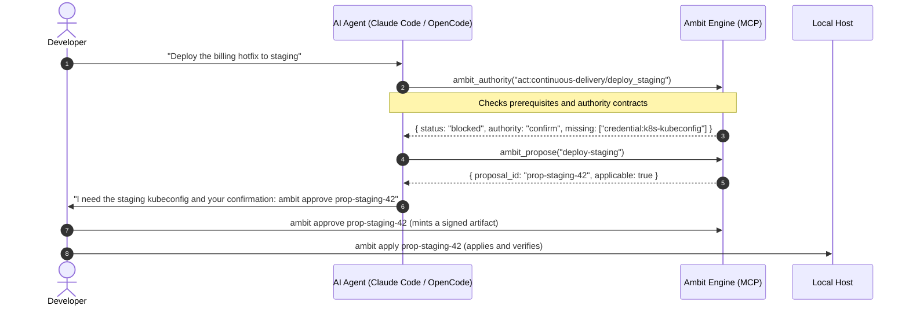

<div align="center">

# Ambit

**What you, your agents, and your machines can jointly do — and where your own time is going.**

[](https://github.com/zz-plant/ambit/actions/workflows/ci.yml)
[](https://github.com/zz-plant/ambit/releases/latest)
[](https://nodejs.org)
[](./LICENSE)

[**Live demo**](https://zz-plant.github.io/ambit/?demo=1) · [What it is](#what-ambit-is) · [Get started](#get-started) · [Terminal](#ask-from-the-terminal) · [Agent MCP](#connect-it-to-your-agent) · [The map](#the-map) · [In practice](#in-practice) · [How it works](#how-it-works) · [FAQ](./docs/faq.md) · [Deep dive](./docs/deep-dive.md)

<br>


<sub>One setup, mapped. Pick a tool and Ambit shows what depends on it; switch it off and it shows the eight things that stop working with it and the two that only lose a provider. Then which tools interrupt you most, and a change waiting on your approval.</sub>

`brew install zz-plant/tap/ambit && ambit`, or [open the hosted demo](https://zz-plant.github.io/ambit/?demo=1) and install nothing.

</div>

---

## What Ambit is

If you use AI agents, your setup is spread across LLM providers, MCP servers, local CLI tools, skill directories, credentials, and more than one machine. Every piece has its own config file.

What they add up to — what your human-plus-agent system can actually *do* — is written down nowhere.

Ambit reads those configs and builds one map out of them. Every tool, model, skill, and credential becomes a point on it; everything one of them needs in order to work becomes a line to another. That map answers questions no single config file can:

1. **What works right now?** What is set up, what is broken, and what is one dependency away.
2. **What breaks downstream** if a model, tool, or credential goes away.
3. **What compound abilities emerge** when two independent tools are combined.
4. **What is worth setting up next**, priced by the human attention it would save.

You ask from the terminal. Your agents ask over MCP, mid-session, before they run into the limit — Ambit is itself an MCP server, so the thing describing your MCP servers speaks the same protocol they do. (A *meta-MCP server*, if you want the term to search for.)

### The words Ambit uses

Four of them carry most of the meaning, in the terminal and on the map alike.

- **Capability** — one thing your setup can do. Every MCP server, agent, skill, provider, model, and command in your config becomes one, as does every node of the curated tree.
- **Era** — how far up the tree a capability sits. Later eras depend on earlier ones. Eras describe ordering, not importance.
- **Reached, next step, blocked** — reached means something in your config provides it. A next step is one whose prerequisites are met with nothing detected: this is the frontier, and `ambit goal` lists it. Blocked means a prerequisite is missing, which is usually the most informative of the three.
- **Required vs optional prerequisite** — a required prerequisite gates the capability; an optional one strengthens it without gating. Only required ones block a node. Both are drawn, optional ones fainter. The data model and the CLI call these hard and soft.

<div align="center">

<br><sub>Filled nodes are reached · Outlined nodes are a next step · Faded nodes are blocked, with a prerequisite missing</sub>
</div>

---

## Get started

| Way in | What it gives you |
| :--- | :--- |
| **In the browser** | [Open the hosted demo](https://zz-plant.github.io/ambit/?demo=1) and read an example setup, or drop your own `opencode.json` on the page and it is mapped in the tab, uploading nothing. |
| **On your machine** | `brew install zz-plant/tap/ambit && ambit` reads your real agent config and prints where you stand. |
| **With the map** | `git clone https://github.com/zz-plant/ambit.git && cd ambit && ./bootstrap.sh web` builds the graph from your own configs and serves the canvas the figures on this page show. |
| **In a cloud IDE** | [](https://codespaces.new/zz-plant/ambit?quickstart=1) A full checkout with the map running, in a browser tab. |
| **From your agent** | Register Ambit over MCP and the agent can ask what it is able to do before it tries. [Connect it to your agent](#connect-it-to-your-agent) has the snippet for each client. |

Homebrew installs the CLI, the engine, and the MCP server from the tagged release, on macOS or Linux. A checkout adds the map: `./bootstrap.sh` discovers OpenCode, Claude Code, Cursor, Windsurf, Gemini CLI, Claude Desktop, Codex CLI, and the skill directories `~/.agents/skills` and `~/.opencode/skills`, builds a local SQLite graph, and finishes by printing `ambit status`, which [Ask from the terminal](#ask-from-the-terminal) shows against a fixture graph. It links `ambit` into `~/.local/bin` when that is on your PATH and prints the `ln -s` line otherwise; `--dry-run` shows what it would do. Codespaces runs the same checkout in a container, so the graph is the container's and nothing touches your machine.

> [!NOTE]
> The npm package is built and ready but not yet published, so there is no `npx` path yet.

<div align="center">

<br><sub>My Setup is the list the map is drawn from: every server, agent, and model found on the machine, whether it is on, what its check said, and which capabilities on the map it provides</sub>
</div>

---

## Ask from the terminal

| Command | What it answers |
| :--- | :--- |
| `ambit status` | Environment health — what is reached, what is failing its declared check, what has a single provider, plus pending approvals |
| `ambit goal <name>` | The path to unlock a capability, in order, with setup estimates |
| `ambit impact <id>` | Blast radius: what breaks if this tool, model, or credential goes down |
| `ambit graph combos` | Compound capabilities, including the ones you are one prerequisite away from |
| `ambit authority` | Per-action permissions: what runs unattended, what needs confirmation |
| `ambit verify [id]` | Run a capability's declared check and record whether it actually works |
| `ambit history [since]` | How the frontier moved, separating what you acquired from what emerged |
| `ambit share` | A self-contained HTML snapshot of the map, written locally and safe to post |

`ambit help` covers a first session; `ambit help --all` is the full surface, grouped by what you are trying to do, and `ambit help <term>` explains one concept.

Everything above answers on a graph Ambit builds by itself. A second group (`attention`, `work`, `usage`, `opportunities`, `roi`, `audit`) prices the human cost of running the stack, and reads from a work ledger that starts empty. Those commands tell you what they need instead of returning a number, and they become useful after a few weeks of recorded runs, not on install. [The FAQ](./docs/faq.md#i-ran-ambit-attention-and-it-says-nothing-is-recorded-is-it-broken) says how to start recording them.

The three console blocks below are captured from a run against a fixture graph by `npm run docs:examples`, and CI fails if they drift from what the commands actually print.

### ambit status — where the environment stands

<!-- example: ambit status -->
```console
$ ambit status

    summary: 39/59 capabilities reached · 9 with a single provider
    reached: 39
    total: 59
    verified: 0
    failing: 0
    actions: 18/28 reached
    evidence:
        proven: 0
        unproven: 15
        failing: 0
        last check: never
        provable now: Automated Tests, Browser Automation, Code Intelligence, Continuous Delivery, Data Access, File Editing, Local Runtime, Shell Execution
        note: configured is not working — ambit verify would turn 11 of the unproven into evidence
    domains:
    …
```
<!-- /example -->

### ambit goal — what it would take to reach something

<!-- example: ambit goal local-embeddings -->
```console
$ ambit goal local-embeddings

    goal: Local Embeddings
    exact: true
    reachable: true
    steps: 2
    estimated setup: 25m
    order:
      Embeddings
        id: combo:embeddings
        setup seconds: 600
        options:
          nomic-embed via local runtime
            setup seconds: 600
            recurring cost: none
            privacy: local
    …
```
<!-- /example -->

### ambit impact — what breaks if this goes away

<!-- example: ambit impact combo:local-runtime -->
```console
$ ambit impact combo:local-runtime

    capability: Local Runtime
    decayed:
      Local Tool Calling
        becomes unavailable: false
      Model Routing
        becomes unavailable: false
      Local Embeddings
        becomes unavailable: false
      Self-Hosted Stack
        becomes unavailable: false
      Local Typed Judgment
        becomes unavailable: false
    combos at risk:
      Local Tool Calling
    …
```
<!-- /example -->

### ambit share — what may leave the graph, and what may not

`ambit share` builds its HTML from an allow-list — name, kind, category, domain, era, state, lifecycle, edges. Commands, URLs, paths, descriptions, and economics cannot enter the file, people render as "a person", and `--redact` replaces every non-curated name with its category. Nothing is uploaded; writing the file locally is the whole command.

---

## Connect it to your agent

Registering Ambit as an MCP server lets an agent inspect its own toolchain and plan around what is missing.

Sixty tools, each advertised once, each answering with MCP `structuredContent` alongside the text block so an agent reads a field and never parses a string. [The deep dive](./docs/deep-dive.md#the-full-mcp-surface) names all sixty, grouped. (The `tt_` prefix from before the rename is still accepted, just no longer listed.)

### Claude Code

```bash
claude mcp add ambit -- ambit mcp
```

Ambit also publishes a resource, `ambit://briefing`, which a client reads on
connect: what is reached and proven, what is configured but failing, what is
waiting on you, what blocked work in the last week, and what is worth reaching
next. It is capped at about 1,200 tokens. To put the same thing at the top of
every session yourself, add a hook to `~/.claude/settings.json`:

```json
{
  "hooks": {
    "SessionStart": [{ "hooks": [{ "type": "command", "command": "ambit briefing" }] }]
  }
}
```

### OpenCode (`~/.config/opencode/opencode.json`)

```json
{
  "mcp": {
    "ambit": {
      "type": "local",
      "command": ["ambit", "mcp"],
      "enabled": true
    }
  }
}
```

Both assume `ambit` is on your PATH. Homebrew puts it there; from a checkout, `bootstrap.sh` links it into `~/.local/bin` and prints the `ln -s` line if that directory is not on your PATH. Failing both, use the absolute path to `cli.js`.

An agent can read the map, query what a goal is missing, and **propose** a configuration change. Applying one always requires your approval.

### The one line for your agent's instructions

The habit worth teaching is a single question before an unfamiliar tool, because the alternative is the retry loop that spends your attention:

> Before running a tool you have not used this session, call `ambit_can` with
> the capability. On `yes`, act. On `ask`, put it to the person. On `no`, it has
> already recorded the deficit, so do not retry it under another name.

It answers from the graph without probing anything, and a refusal files itself as a deficit, which is what makes the third occurrence show up as infrastructure that should exist instead of a wall to work around again.

Here is the whole loop from a live run. `node --experimental-strip-types scripts/demo-agent-loop.ts` re-records it, and every frame is real engine output — a failing loop fails the recording instead of rendering a fiction.

<div align="center">

<br><sub>Agent: hits a block, records the deficit, asks <code>goal</code>, drafts a proposal · Human: <code>approve</code>, <code>apply</code> · One config patch, four capabilities.</sub>
</div>

### What the exchange looks like



---

## The map

The web UI (`./bootstrap.sh web`) is three views over the same graph the CLI reads. The **map** is the curated tree with your position on it. **My Setup** is one row per entry your configs declare, with what the engine has proved about it and the nodes on the map it provides; its Briefing tab is the prose an agent is given at connect, so what the agent believes about the machine is inspectable. **Time & cost** is the ledger and the governance half: what may act without asking, which grants have earned a threshold nobody set, what to reach next and why, and how the frontier moved this week. Search (<kbd>/</kbd>) finds anything by name and opens it where it lives.

Select a node and its edges are drawn apart: what it needs in teal, what it enables in indigo, one hop each way. The panel states the answer before the simulation that draws it: what would stop and what would only lose a provider if the node went down, or what stands between it and being reached and how long that would take. The header counts the map's nodes by state, and each count highlights its nodes, the way the legend keys do.

The **Docs** button defines every term on the canvas; [the four above](#the-words-ambit-uses) cover most of it.

### Two lenses on the canvas

The switch sits over the map, top right. Press <kbd>1</kbd> or <kbd>2</kbd> to change it from the keyboard.

| Lens | What it renders | Use it for |
| :--- | :--- | :--- |
| **Standard** | Era columns with reached, next-step and blocked nodes. | Reading overall progression and what is nearby. |
| **Attention** | Nodes shaded by how often a person had to step in, offered once the ledger has recorded any. | Finding which tools keep interrupting you. |

### Simulation

Select a node to open the inspector, then simulate against it. Neither mode writes anything.

- **Simulate an outage** dims the canvas and draws the cascade: red for what stops, amber for what keeps another provider and only loses one, with the count of each.
- **Simulate unlocking** acquires a locked primitive hypothetically and lights up everything that becomes reachable in green.
- **Show the gap** draws what a blocked node is waiting on, every hop up, priced in setup time.

### Approving proposals

When an agent proposes an environment change over MCP, the **Proposals** panel shows what it would save, what it costs, whether every step can be undone, what it unlocks, and how you have decided on things like it before, then mints a signed approval receipt in one click, or records a no with the reason, which is what the next draft learns from. The same things happen from the terminal with `ambit approve <id> <who>` and `ambit reject <id> <who> "why"`. When you are away from the machine, `ambit dispatch <id>` pushes the draft to a Slack, Discord or Telegram webhook, or an ntfy topic, with the commands that decide it; the decision itself still happens here, on a machine that holds the approval key.

---

## In practice

### The combo you already almost have

You run local Postgres and Ollama, but your agent cannot do private semantic code search over your repositories.

`ambit graph combos` reports the gap as one step — `CREATE EXTENSION vector;` — and `ambit goal retrieval --simulate` shows what that five-minute change reaches, with no cloud API in the path.

### An agent diagnosing itself

An agent in Claude Code is asked to deploy to staging. Left alone it runs `kubectl`, collects unauthorized errors, retries, and leaves local state worse than it found it.

Calling `ambit_authority` first returns `authority: confirm` and `missing: staging-kubeconfig`. The agent stops cleanly and asks for an approval it can name.

### Rotating a shared token

You are about to revoke a personal access token. Without a model of what depends on it, two background MCP tools and a scheduled sync agent fail silently some hours later.

`ambit impact credential:github/user-token` names the providers and capabilities standing on that one credential, which is the argument for provisioning granular tokens first.

The `credentials` block that declares the sharing is in [the deep dive](./docs/deep-dive.md#what-a-node-is). Until you write one, `ambit credentials` reports that none are declared.

---

## How it works

Discovery reads your host configs into an embedded SQLite graph. Three surfaces read that graph back out — the terminal CLI, the MCP server, and the web canvas. Discovery, verification, and the work ledger write to the graph. Your agent configuration changes only through a proposal you approve, or through the map's editor for entries that already exist, which cannot create one.

Each client is read from its own standard config path, and every server stays attributed to the client that listed it. When two clients name the same server, that is one capability with two providers, not two capabilities, which is what stops Ambit from counting a single binary twice and calling the result redundancy.

### Seven eras, and what follows from them

Discovered capabilities are placed into a curated tree that runs from **Foundation** and **Model Access** through **Tool Use**, **Memory**, **Autonomy**, and **Assurance** to **Sovereignty**. Because each capability records what it needs, Ambit works out what you can reach without taking a config file's word for it.

Two things follow from that:

- **Combos.** Higher-order abilities appear from tools that were configured separately — a vector store plus local embeddings becomes semantic retrieval, which neither config mentions.
- **Near misses.** When you are one or two prerequisites from a capability that unlocks several others, that gap is worth naming. `ambit graph combos` lists them.

### Configured is not working

Ambit keeps two properties apart, and the distinction is load-bearing:

- `state` is **structural** — is this thing configured, and what does it depend on. This is what the frontier ledger records.
- `lifecycle` is **health** — did its declared verification command actually pass. A capability can be fully configured and still `degraded` or `broken`.

Every availability decision gates on lifecycle, not state. A broken capability is excluded from plans, simulations, goals, authority checks, and opportunity ranking, because a plan routed through a tool that does not run is worse than no plan.

`ambit status` reports proven, unproven, and failing counts. The map badges each reached node: `✓` for a passing check, `!` for a failing one, nothing for configured-but-never-verified.

### Fragility is computed, not guessed

- **Single points of failure** — capabilities with exactly one provider.
- **Bottlenecks** — nodes ranked by how much sits downstream of them. The map marks the same idea on each node, as a keystone.
- **Shared credentials** — providers presenting the same credential fail together, so three providers behind one token is not redundancy. This one is declared, never inferred: name the sharers in a `credentials` block and `ambit impact credential:...` will show what revoking it would end.

---

## The control plane

Host-level agent tooling is a real attack surface, so execution goes through an interceptor and never straight to the shell. The decision is real: the DAG check, the authority evaluation, the approval artifact and the audit trail all run against your actual graph. What sits on the other side of the gate is a fixture: `simulatedAdapter` in `src/control_plane/proxy.ts` keeps its state in a JSON file, and Ambit ships no deployment integration. A real one implements the three-method `EnvironmentAdapter` in that file, and nothing above the gate changes.

- **Interception.** Before a tool call reaches your machine, the proxy in `src/control_plane/proxy.ts` checks three things: are this capability's prerequisites in place, is it actually working, and is the caller allowed to do this. A call that fails any of them is refused — `AMBIT_BLOCKED_UNAUTHORIZED`, exit code `2` — and nothing on the machine has changed.
- **Human-in-the-loop remediation.** A blocked execution drafts a structured proposal and an HMAC challenge. `ambit approve <proposal-id> <person>` mints a signed artifact that the executor verifies before any state changes. An artifact stops being valid if the proposal changed after approval, or if it has expired.
- **Tracing.** Spans and structured events record DAG evaluations, missing authorizations, challenges, and verification receipts.

A worked example — an autonomous deploy agent blocked mid-flight, then remediated — is written up in [`docs/incidents/INCIDENT_TRACE_001.md`](./docs/incidents/INCIDENT_TRACE_001.md).

```bash
npm test                                                  # the suite behind the walkthrough
npm run demo:incident                                     # the 90-second terminal walkthrough
asciinema play docs/incidents/demo_intervention_trace.cast # replay the recording
```

---

## Where this sits in the stack

Ambit sits above the protocol layer and below workflow orchestration. It neither routes calls nor runs them.

| System | Finds a tool | Knows prerequisite order | Tells working from configured | Prices human attention | Gates what an agent may do |
| :--- | :---: | :---: | :---: | :---: | :---: |
| Vector tool-RAG | by similarity | – | – | – | – |
| Workflow state machines (LangGraph) | – | within one task | – | – | within one task |
| Package managers (Nix, Homebrew) | – | for binaries | – | – | – |
| A list of configured MCP servers | by name | – | – | – | – |
| Typed decision models (Jev) | – | – | – | – | by a probability, which text in the state can move |
| **Ambit** | by what it needs | across the whole host | ✓ declared checks | ✓ work ledger | ✓ authority contracts, signed approvals |

Semantic search finds tools that sound relevant and cannot tell a working one from a broken one. A workflow graph models control flow within one task. A package manager installs binaries. Ambit models what those binaries add up to on this host, what it costs a person to keep them working, and what an agent may do with them.

A typed decision model such as TypeSafe's [Jev](https://en.wikipedia.org/wiki/Jev_(AI_model)) answers whether a tool call looks safe with a calibrated probability, cheaply enough to ask on every call. Injected text can move that probability, so Ambit maps Jev as a capability and never lets it decide what an agent may do. [The FAQ](./docs/faq.md#i-use-jev-where-does-it-fit) says how the two fit together.

---

## Position in the revisable-delegation loop

Ambit is one of five systems that each hold a step of the loop an institution runs when it delegates consequential work to machines: believe, know what can be done, decide what authority is justified, act, detect mismatch, revise. Ambit holds **capability** and **authorization**. A grant holds only while what it rests on does, and every narrowing is written as an append-only, hash-chained stream of [STD-07 Revisable Delegation Records](https://ethotechnics.org/standards/std-07-revisable-delegation-record) that another Ambit environment can read as evidence and never as an instruction. [The deep dive](./docs/deep-dive.md#delegation-records) has the record kinds, the objection path, and the limits; the siblings are [Whether](https://github.com/zz-plant/whether) (act), [Refract](https://github.com/refract-org/refract) (discrepancy), [NextConsensus](https://nextconsensus.com) (belief), and [Ethotechnics](https://ethotechnics.org) (the record shape).

---

## Security invariants

Ambit reads developer toolchains and writes to agent configs, so four properties are fixed and cannot be relaxed. [`SECURITY.md`](./SECURITY.md) states each in full, with what is in scope and what is not; [`AGENTS.md`](./AGENTS.md#security-posture) says where each is enforced.

1. **Loopback only.** The API server binds `127.0.0.1`. No LAN, no tunnel.
2. **Origin allowlist.** A request with a non-local `Origin` is rejected with 403 *before* routing, because a simple request skips preflight and response headers alone would not stop it.
3. **No entry creation over HTTP.** The HTTP layer edits entries that already exist and nothing else. An MCP entry carries a command the runtime later executes, so creating one over HTTP would be remote code execution; adding a server returns a snippet for you to paste.
4. **No egress you did not type.** The graph is an embedded SQLite database on your machine, and there is no telemetry. Five commands open a socket at all (`notify`, `notify-approvals`, `dispatch`, `incidents`, and `goal --judge`). The first four each need a target you name, and the last refuses any host but this machine. [The FAQ](./docs/faq.md#does-anything-leave-my-machine) lists exactly what each one sends.

---

## Documentation

- [FAQ](./docs/faq.md) — what needs installing, what leaves the machine, why the attention commands are empty on day one.
- [Deep dive](./docs/deep-dive.md) — the reference for the model under everything above.
- [Security](./SECURITY.md) · [Agent invariants](./AGENTS.md) · [Support](./SUPPORT.md) · [Contributing](./CONTRIBUTING.md) — the invariants above in full, where each is enforced, where each kind of question goes, and how to send a change.
- [Everything else](./docs/) — the argument, the theory, the design notes, the changelog, the incident traces.
- [`llms.txt`](https://zz-plant.github.io/ambit/llms.txt) — the project in one page, for an agent that is deciding whether to recommend it.

---

## Contributing

New capability models, runtime adapters, visualization work, and edge-case reports are all welcome. [CONTRIBUTING.md](./CONTRIBUTING.md) gets you from a clone to a passing pull request and [lists every check CI runs](./CONTRIBUTING.md#the-checks-ci-runs), documentation included: the console blocks above are checked against a fresh run, and the prose against a corpus ceiling ([AGENTS.md rule 17](./AGENTS.md#rules)).

---

## Support the project

Ambit is a personal project. If it answered a question your config files could not, [a star](https://github.com/zz-plant/ambit/stargazers) is how the next person with the same stack finds it, and [the release notes](https://github.com/zz-plant/ambit/releases) explain each change.

- Post an `ambit share --redact` snapshot of your own map. The file names nothing on your machine, and every real graph is an argument the demo cannot make.
- Report the runtime it does not read yet, or the capability it models wrong. Both are [issue templates](https://github.com/zz-plant/ambit/issues/new/choose).
- Citing it in writing? [`CITATION.cff`](./CITATION.cff) is what GitHub's *Cite this repository* button reads.

---

## License

[MIT](./LICENSE) © Kanav Jain
