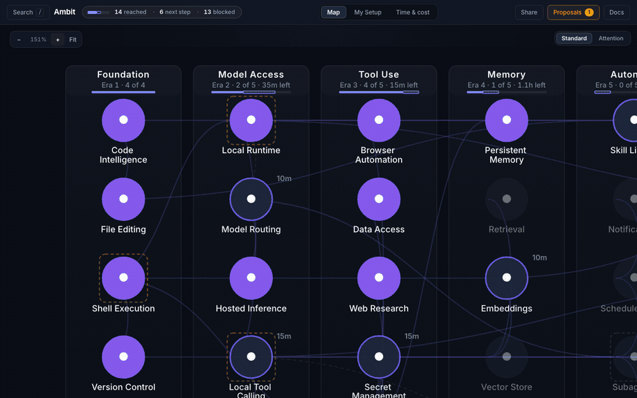

<div align="center">

# Ambit

**A map of what your AI agent setup can do — and what one change would unlock next.**

[](https://github.com/zz-plant/ambit/actions/workflows/ci.yml)
[](https://github.com/zz-plant/ambit/releases/latest)
[](./LICENSE)

[**Try the live demo**](https://zz-plant.github.io/ambit/?demo=1) · [Get started](#get-started) · [CLI](#ask-questions-from-the-terminal) · [Deep dive](./docs/deep-dive.md) · [Why Ambit](./docs/why-ambit.md) · [Roadmap](./ROADMAP.md)

</div>

If you use AI agents, your setup is probably spread across many pieces: models, tool servers, skills, credentials, maybe a couple of machines. Each piece has its own config file. What they all add up to — what the whole system can actually *do* — isn't written down anywhere.

Ambit reads your agent configuration and turns it into a map. The map answers three questions no single config file can:

- **What works right now?** What's reached, what's one step away, what's blocked on a missing piece.
- **What breaks** if a tool, model, or machine disappears?
- **What's worth setting up next**, and roughly what it costs you not to have it?

<div align="center">

<br><sub>Filled circles work today · outlined circles are within reach · faded ones are missing a prerequisite</sub>
</div>

## Try it — 30 seconds, nothing to install

[**Open the live demo**](https://zz-plant.github.io/ambit/?demo=1). The map loads immediately with example data — no install, no config, no account. Click any circle to see what depends on it.

## Get started

One command, no install — you need [Node 22.18](https://nodejs.org) or newer, nothing else:

```bash
npx ambit-cli
```

On first run it finds your agent configuration (OpenCode or Claude Code — it checks for both automatically), builds the map, and prints where you stand:

```
First run — reading your agent config and building the graph…
✓ 168 capabilities

  reached: 156
  total: 168
  domains:
    ai-ml     22/26
    backend   6/8
    infra     26/28
```

Every other command works the same way: `npx ambit-cli goal <thing>`, `npx ambit-cli impact <id>`. To keep the command around as plain `ambit`, install it once with `npm install -g ambit-cli` or `brew install zz-plant/tap/ambit`.

The visual map runs from a git checkout (it also needs [Bun](https://bun.sh)):

```bash
git clone https://github.com/zz-plant/ambit.git
cd ambit
./bootstrap.sh web
```

Not sure yet? `./bootstrap.sh --dry-run` shows what a checkout would find without changing anything.

**Everything stays on your machine.** The map is a single SQLite file in your home directory. The local server only accepts connections from your own computer, and nothing is ever uploaded. Details in [Security](#security).

## Ask questions from the terminal

Once seeded, the `ambit` command answers questions about your setup in plain output:

| Command | What it tells you |
|---|---|
| `ambit status` | Overall health — what works, what's failing, what's fragile |
| `ambit goal <thing>` | The steps to reach a capability you don't have yet, with a time estimate |
| `ambit impact <id>` | What stops working if this tool or machine goes away |
| `ambit history since` | What became possible since a past date — including things that unlocked themselves |
| `ambit opportunities` | Ranked suggestions for what to set up next, priced by the time it's costing you |
| `ambit authority` | What the system may do on its own vs. what needs your approval |

A real example — you're one dependency away, and the tool tells you the order:

```console
$ ambit goal local-embeddings

  Local Embeddings
    missing: 1
    steps: 2 · estimated setup: 25m
    order: Embeddings → Local Embeddings
```

Run `ambit` with no arguments to see everything, or `ambit help <term>` for any concept. Every command takes `--json` for scripts. The [deep dive](./docs/deep-dive.md) documents the full surface.

## The built-in guide

The visualizer explains itself. A **DOCS** button opens a guide to every term the tool uses — the same definitions back `ambit help` in the terminal:

<div align="center">

</div>

Any view is linkable — `?view=tree`, `?docs=open` — so you can send someone straight to what you're looking at.

## Connect it to your agent

Ambit ships an MCP server, so your agent can ask the same questions you can — *what infrastructure am I operating in, why is this task blocked, what's the missing piece we keep hitting?* Register it with Claude Code:

```bash
claude mcp add ambit -- npx -y ambit-cli mcp
```

Or in `opencode.json` (or any runtime that takes a stdio command):

```json
{ "mcp": { "ambit": {
    "type": "local",
    "command": ["npx", "-y", "ambit-cli", "mcp"],
    "enabled": true } } }
```

With a global install or a git checkout, `ambit mcp` (or `node --experimental-sqlite /path/to/ambit/src/mcp/server.ts`) does the same.

An agent can read the map, plan, and *propose* changes — but approving and applying a change always stays with you. The [deep dive](./docs/deep-dive.md#the-full-mcp-surface) lists every tool.

## How it works

Ambit reads your config files and places what it finds on a curated tree of agent capabilities — from basics like shell access and version control up through memory, autonomy, and self-hosting. Every capability lands in one of three states:

- **Reached** — something in your setup provides it, and the map records what
- **Next** — the prerequisites are met; this is your frontier, one setup step away
- **Blocked** — you have the tool, but a prerequisite is missing

The interesting part is what falls out of the connections. Adding one piece can unlock capabilities *nothing new provides* — their prerequisites were just finally met. Removing one piece can silently break things three steps downstream. Neither fact is written in any config file; both are properties of the map.

<div align="center">

<br><sub>Live: a provider is added, Scheduled Work fills in, Notifications becomes reachable, and an approval arrives.</sub>
</div>

There's much more underneath — verification, per-action permissions, a work ledger, change proposals with signed approvals and automatic rollback. All of it is documented in the [deep dive](./docs/deep-dive.md).

## Security

The local server can read and edit `opencode.json`, so two rules are absolute:

- **Your computer only.** It binds `127.0.0.1` and rejects requests from anywhere else before routing.
- **It cannot create config entries over HTTP.** An MCP entry carries a command your agent runtime would execute, so the API can only toggle or edit existing entries — adding a server generates a snippet you paste yourself.

No secrets are ever read or stored, and nothing leaves your machine unless you explicitly opt in to a notification push. The invariants are spelled out in [AGENTS.md](./AGENTS.md).

## Going deeper

| | |
|---|---|
| [Deep dive](./docs/deep-dive.md) | The full model: nodes, verification, authority, the ledger, the economic loop, every CLI and MCP command |
| [Why Ambit](./docs/why-ambit.md) | The story of why this exists, in the author's words |
| [The affordance frontier](./docs/affordance-frontier.md) | The theory: capability as a property of human-machine systems, not models |
| [Roadmap](./ROADMAP.md) | Where this is going |

## Status

The mapping half is solid: discovery, dependencies, failure analysis, verification, per-action permissions, and the MCP surface. The economics half (pricing your attention, ranking what to build next) works end to end but gets sharper the longer you use it, because it learns from observed work. See [Status in the deep dive](./docs/deep-dive.md) and the [roadmap](./ROADMAP.md).

## Contributing

Fork → branch → commit → PR. See [AGENTS.md](./AGENTS.md) for conventions and the security invariants the server must preserve.

## License

MIT — see [LICENSE](./LICENSE).
