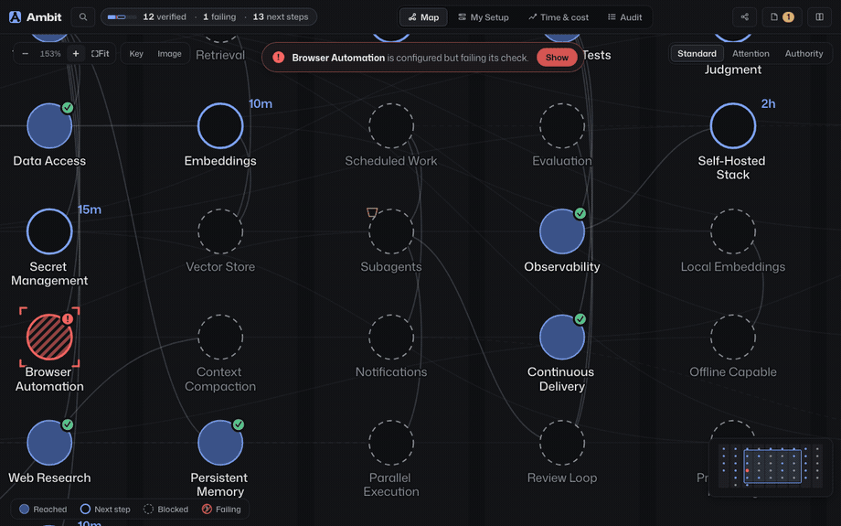
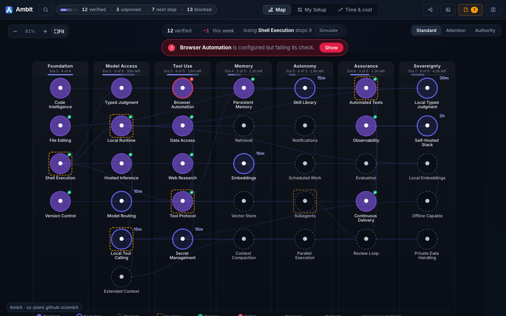
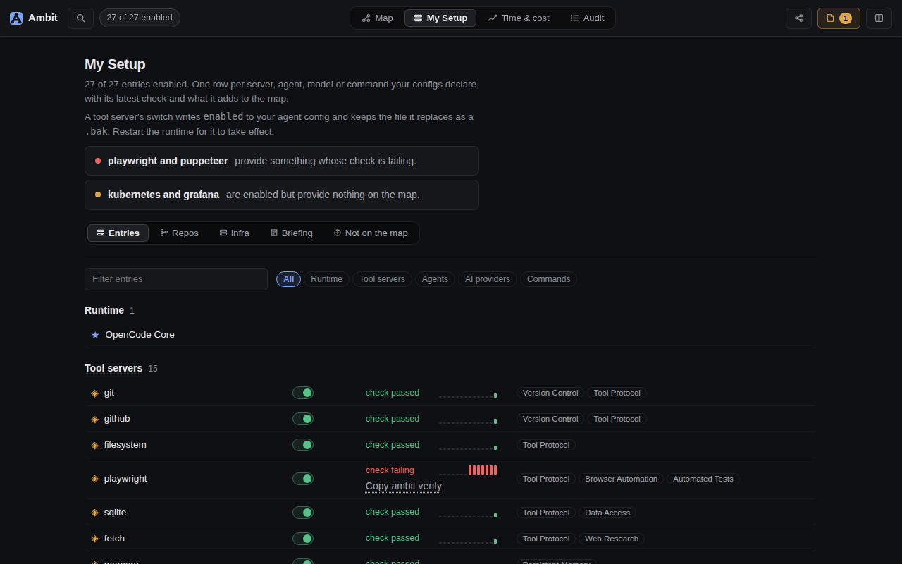
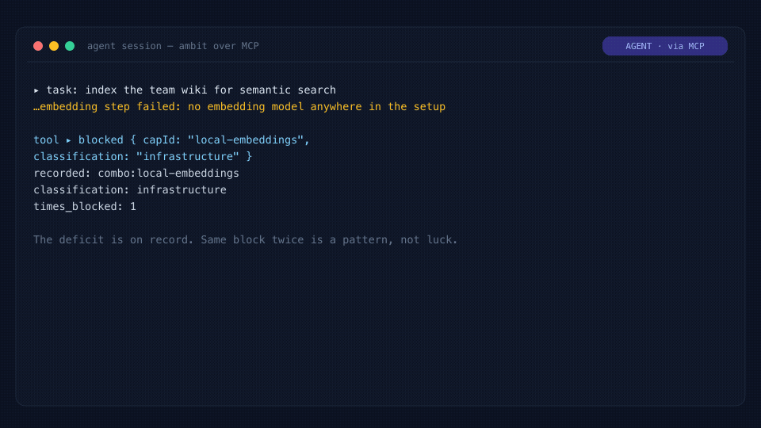

<div align="center">

# Ambit

**What you, your agents, and your machines can jointly do — and where your own time is going.**

That is your *ambit*. Ambit reads the configs of Claude Code, Cursor, OpenCode and [the other agent runtimes it knows](#get-started) into one local map of it, and shows how to widen it: what you can do now, what one more step would unlock, and which of what you have is configured but not actually working.

[](https://github.com/zz-plant/ambit/actions/workflows/ci.yml)
[](https://github.com/zz-plant/ambit/releases/latest)
[](https://nodejs.org)
[](./LICENSE)

[**Try the live demo**](https://zz-plant.github.io/ambit/?demo=1) · [Get started](#get-started) · [Connect it to your agent](#connect-it-to-your-agent) · [FAQ](./docs/faq.md) · [Docs](https://zz-plant.github.io/ambit/docs/)

<br>



<sub>One setup, mapped. Pick a next step and Ambit shows what it would open: four more capabilities. Pick one you rely on and switch it off, and it counts the nine working things that would stop with it. Then which tools interrupt you most, and a change waiting on your approval.</sub>

`npx ambit-cli`, or `brew install zz-plant/tap/ambit && ambit`, or [open the hosted demo](https://zz-plant.github.io/ambit/?demo=1) and install nothing.

</div>

---

## What Ambit is

An *ambit* (from Latin *ambitus*: circuit, perimeter, sphere of action) is the boundary of what someone can reach. Working with agents, yours is set by a stack spread across LLM providers, MCP servers, local CLI tools, skill directories, credentials and machines, each with its own config file. What they add up to is written down nowhere, and so is where the boundary sits and how to move it.

The claim under everything else: **what an agent setup can do is not written in any config file.** It is composed from pieces configured separately, a configured piece may not work, and none of it says what the setup is allowed to do. Ambit computes that reach and helps you widen it, with evidence for each step and a person's approval for each change. Widening is the point. The checks, the authority model and the outage analysis are what make a wider reach safe to lean on, and the attention ledger, the "where your own time is going" of the tagline, is how you tell whether a step was worth taking.

Ambit reads those configs into one model, the capability graph. Every server, model, skill and declared credential is a node, as is every capability of the curated tree, and an edge records what one needs from another or provides to it. My Setup lists what your configs declare, and the map draws the curated tree with your position on it. The edge of what you reach is the *frontier*, with the next steps just past it. The graph answers four questions no single file can:

1. **What is one step away?** Just past the frontier: capabilities whose prerequisites you already meet, each with its setup time, and the near misses one or two prerequisites from unlocking several more. Tools configured separately combine, too: a vector store plus local embeddings is semantic retrieval, which neither config mentions.
2. **What is worth setting up next?** Ranked by what keeps blocking your agents and by how much each step unlocks, and once the work ledger holds a few weeks, by the human attention it would save.
3. **What actually works?** A configured tool is not a working one. Ambit runs each capability's declared check (`ambit verify`) and keeps what is configured, what is proven and what is permitted apart: `installed ≠ working ≠ authorized`. A capability no check has run on still counts. One whose check fails is taken out of every plan without asking, so the boundary it draws is one you can lean on.
4. **What would stop if one piece went?** It follows dependencies all the way down, so three "redundant" providers behind one shared token show up as the single point of failure they are.

You ask from the terminal. Your agents ask over MCP: what they can do before they try, and when they hit a limit, what would lift it, drafted as a change you approve. Ambit is itself an MCP server, so the thing describing your MCP servers speaks their protocol. (A *meta-MCP server*, if you want the term to search for.)

### The words Ambit uses

These carry most of the meaning, in the terminal and on the map alike.

- **Capability**: one thing your setup can do. Every MCP server, agent, skill, provider, model and command in your config becomes one, as does every node of the curated tree.
- **Reached, next step, blocked**: reached means something in your config provides it and its required prerequisites are reached. A next step has every required prerequisite reached and nothing in your config providing it yet: it sits just past the frontier, and `ambit goal` lists it. Blocked means a required prerequisite is missing, which is usually the most informative of the three.
- **Verified**: reached, and its declared check last passed. `ambit status` counts these as proven. Reached is what counts, and verified is the part of it with evidence behind it; a failing check takes a capability out of every plan until it passes again.
- **Required vs optional prerequisite**: a required prerequisite gates the capability; an optional one strengthens it without gating. Only required ones block a node. The data model and the CLI call these hard and soft.
- **Combo**: a capability the curated tree defines as composed from others, such as semantic retrieval from a vector store and local embeddings. Every node on the map is one, which is why their ids start with `combo:`.
- **Era**: how far up the tree a capability sits. Later eras depend on earlier ones. Eras describe ordering, not importance.

<div align="center">

<br><sub>Filled nodes are reached · Bright rings are a next step, with their setup time · Dashed nodes are blocked, with a prerequisite missing · The line on top is what the map found</sub>
</div>

---

## Who it is for

Anyone running AI agents who wants them to do more. A small setup, one runtime and a few MCP servers, has the most ground ahead of it, and Ambit names the step that unlocks the most and the combos a single missing piece would give you. A large one, with several runtimes, dozens of servers and a second machine, gets the other half as well: what is configured but failing, and what would stop together if one shared piece went.

The demo walks a sample setup in five steps: the next step worth taking and what it would open, the outage that shows what that reach rests on, a check that was already failing, the approval every change waits for, and then your own config, pasted into the tab and mapped there with nothing uploaded.

## Get started

| Way in | What it gives you |
| :--- | :--- |
| **In the browser** | [Open the hosted demo](https://zz-plant.github.io/ambit/?demo=1) for a sample setup, or drop in your own MCP config from Claude Code, Claude Desktop, Cursor, Windsurf, Gemini CLI, Cline, Roo Code, Copilot CLI, Kiro or OpenCode, and it is mapped in the tab, uploading nothing. |
| **On your machine** | `npx ambit-cli` (Node 22.18 or newer), or `brew install zz-plant/tap/ambit && ambit`, reads your real agent configs, names what it found, and shows what one more step would open. That is the CLI, the MCP server and the map: `ambit web` serves the map on localhost from any install. `npm install -g ambit-cli` puts `ambit` on your path. |
| **With the map** | `git clone https://github.com/zz-plant/ambit.git && cd ambit && ./bootstrap.sh web` builds the graph from your own configs and serves the map the pictures on this page show. |
| **In a cloud IDE** | [](https://codespaces.new/zz-plant/ambit?quickstart=1) A full checkout with the map running, in a browser tab, touching nothing on your machine. |
| **From your agent** | Register Ambit over MCP and the agent can ask what it is able to do before it tries. [Connect it to your agent](#connect-it-to-your-agent) has the snippet. |

npm and Homebrew install the tagged release, on macOS or Linux. `./bootstrap.sh` discovers OpenCode, Claude Code, Cursor, Windsurf, Gemini CLI, Claude Desktop, Codex CLI, Cline, Roo Code, Continue, Zed, VS Code, Copilot CLI, Amp, Goose and Kiro, the skill directories `~/.agents/skills`, `~/.opencode/skills` and `~/.config/opencode/skills`, and the models Ollama and LM Studio keep on disk, builds a local SQLite graph, links `ambit` into `~/.local/bin` (or prints the `ln -s` line when that is not on your PATH), and ends on `ambit status`. `--dry-run` shows what it would do first.

<div align="center">

<br><sub>My Setup lists every server, agent, and model found on the machine: whether it is on, what its check said, and which capabilities on the map it provides</sub>
</div>

---

## From A to B

Your agents, tools, credentials and machines are your loadout. Point A is a pile of configs: one runtime, a few servers from a list, an agent that does chores while you approve every call, and no way to tell what works. Point B is a loadout that does a class of work without you, with its reach known, its pieces proven, its autonomy granted per action, and you present only where judgment is needed. The way from A to B runs through seven legs:

1. **See where it stands**: every runtime's config in one map, and which pieces pass their checks.
2. **Pick the next step**: ranked by what has blocked work and how much it opens.
3. **Add it safely**: a proposal you sign, applied with an undo, proven by a check.
4. **Hand over trust gradually**: autonomy per action and per target, widening when the evidence meets a bar you set and narrowing on one failing check. Without this, the only choices are approving every call or none.
5. **Keep it standing**: what is failing, and what stops if a piece goes.
6. **Know whether it paid**: the time you spent stepping in, before and after.
7. **Let the agent ask for what it lacks**: it records what blocked it and drafts the step that closes it.

My Setup opens on a readout of these seven legs for your own loadout. [Your loadout, from A to B](./docs/loadout.md) walks them with the demo's numbers.

Building a product alone? `ambit goal "launch my saas"` lists what stands between you and real users, in order, and [Building alone](./docs/solo.md) covers what an agent may do to production without asking you. Planning it with Spec Kit or OpenSpec? `ambit goal --spec specs/001-feature` asks the same of every task in the feature before an agent starts on it.

---

## In practice

**The combo you already almost have.** You run local Postgres and Ollama, but your agent cannot search your code semantically. `ambit graph combos` reports the gap as one step, `CREATE EXTENSION vector;`, and `ambit goal retrieval --simulate` shows what that five-minute change reaches, with no cloud API in the path.

**An agent that asks for what it lacks.** Mid-task, an agent needs local embeddings and has none. It records the deficit, asks Ambit what the goal is missing, and drafts a proposal: one config patch. You approve and apply it, and the frontier moves by four capabilities, Local Embeddings among them, through combination. [The recording below](#the-one-habit-worth-teaching) is that loop, run for real.

**Rotating a shared token.** Before you revoke a personal access token, `ambit impact credential:github/user-token` names everything standing on it: the two background MCP tools and the scheduled sync agent that would otherwise fail some hours later without a word. The sharing is declared in a `credentials` block, whose shape is in [the deep dive](./docs/deep-dive.md#what-a-node-is); until you write one, `ambit credentials` says none are declared.

---

## What is new here

Most tools that touch an agent's setup list it, search it or route through it. Ambit treats what the setup can do as something to compute, prove and govern, and these are the parts no other tool we know of does:

1. **Capability is computed, not declared.** A capability can exist that no component declares: a vector store plus local embeddings is semantic retrieval. The frontier ledger records when one appears *emergent*, reached with nothing new providing it, which no per-component changelog can show. ([The frontier ledger](./docs/deep-dive.md#the-frontier-ledger))
2. **Evidence gates every decision.** `installed ≠ working ≠ authorized`. A capability counts once something provides it and its prerequisites are reached, and is proven once its declared check passes. One failing check takes it out of every plan, permission and ranking without anyone asking. ([Assurance](./docs/roadmap.md#4-detection-becomes-verification--built-and-gates))
3. **Authority changes asymmetrically.** A grant widens only past a threshold a person set in advance, and narrows on one failing check with nobody asked; a refusal beats any narrower scope. Technical reach can grow without silently broadening permission. ([Capability and authority](./docs/deep-dive.md#capability-and-authority-are-different-things))
4. **The agent asks for what it lacks.** Friction becomes a recorded deficit, then a proposal, a signed approval, a check, and a measured return against the hours it was forecast to save. ([The economic loop](./docs/deep-dive.md#the-economic-loop))
5. **Reach has a history.** Each observation records what the setup could do then, so the question is not only what it can do now but how that set is changing. ([The map through time](./docs/deep-dive.md#the-frontier-ledger))

The nearest prior work is attack-graph analysis, which asks what a principal can reach given a topology, and the capability approach in economics, which separates having resources from being able to achieve with them. Ambit applies the first to all productive action, not only attack paths, and makes the second's conversion computable for one kind of system. [The ideas behind Ambit](./docs/ideas.md) sets these out at length.

---

## Where this sits in the stack

Ambit sits above the protocol layer and below workflow orchestration. It neither routes calls nor runs them.

| System | Finds a tool | Knows prerequisite order | Tells working from configured | Prices human attention | Gates what an agent may do |
| :--- | :---: | :---: | :---: | :---: | :---: |
| Vector tool-RAG | by similarity | – | – | – | – |
| Workflow state machines (LangGraph) | – | within one task | – | – | within one task |
| Package managers (Nix, Homebrew) | – | for binaries | – | – | – |
| Flat MCP catalogs (Smithery, registries) | by name | – | – | – | – |
| **Ambit** | by what it needs | across the whole host | ✓ declared checks | ✓ work ledger | ✓ authority contracts, signed approvals |

Semantic search finds tools that sound relevant and cannot tell a working one from a broken one. A workflow graph models control flow within one task. A package manager installs binaries. Flat catalogs index servers without tracking whether their prerequisites exist on your machine. Ambit models what those tools add up to on this host, what it costs a person to keep them working, and what an agent may do with them.

---

## Ask from the terminal

| Command | What it answers |
| :--- | :--- |
| `ambit status` | Environment health: what is reached and how much of it is proven, what is failing its declared check, what has a single provider, pending approvals, and the one command to type next |
| `ambit goal <name>` | The path to unlock a capability, in order, with setup estimates |
| `ambit impact <id>` | Blast radius: what breaks if this tool, model, or credential goes down |
| `ambit graph combos` | Compound capabilities, including the ones you are one prerequisite away from |
| `ambit authority` | Per-action permissions: what runs unattended, what needs confirmation |
| `ambit verify [id]` | Run a capability's declared check and record whether it actually works |
| `ambit history [since <when> [<until>]]` | How the frontier moved, separating what you acquired from what emerged |
| `ambit share` | A self-contained HTML snapshot of the map, written locally and safe to post |

`ambit help` covers a first session, `ambit help --all` the full surface, and `ambit help <term>` one concept.

Everything above answers on a graph Ambit builds by itself. A second group (`attention`, `work`, `usage`, `opportunities`, `roi`, `audit`) prices the human cost of running the stack from a work ledger that starts empty. Those commands say what they need instead of returning a number, and they become useful after a few weeks of recorded runs, not on install. [The FAQ](./docs/faq.md#i-ran-ambit-attention-and-it-says-nothing-is-recorded-is-it-broken) says how to start recording.

### ambit status — where the environment stands

<!-- example: ambit status -->
```console
$ ambit status

    39 of 70 reached · 0 proven · 8 with a single provider
    ──────────────────────────────────────────────────────
    proven          0
  › unproven       15
    failing         0
    last check  never

    actions: 18/66 reached
    provable now: Automated Tests, Browser Automation, Code Intelligence, Continuous Delivery, Data Access, File Editing, Local Runtime, Shell Execution
    domains:
      ████░░░░░░ ai-ml     5/13
      ██████░░░░ backend   7/11
      █████░░░░░ devops    4/8
      █████░░░░░ frontend  1/2
    …

    Next  ambit verify · turns 11 of the unproven into evidence
```
<!-- /example -->

This is a fresh graph, before any check has run: reached and proven lead, the `›` marks the count that wants a person, and the last line is the command to type next. CI captures the block from a fixture graph and fails if it drifts from what the command prints.

### ambit impact — what stops if a piece goes

<!-- example: ambit impact mcp:playwright -->
```console
$ ambit impact mcp:playwright

    If playwright went away
    ───────────────────────
  › Stops working  Automated Tests, Browser Automation, Continuous Delivery, Observability · and the 3 actions they confer
    Survives  Tool Protocol (12 other providers)
```
<!-- /example -->

What ends comes first, marked with the `›`, as far down as it goes: Continuous Delivery needs Automated Tests, so it ends too. What survives says on how many other providers, and a capability whose remaining providers all present one credential is said to survive on one key, since revoking it would end that too. Given a credential, `impact` answers what revoking it ends, the same answer as `ambit credentials`.

### ambit share — what may leave the graph, and what may not

`ambit share` builds its HTML from an allow-list: name, kind, category, domain, era, state, lifecycle, edges. Commands, URLs, paths, descriptions and economics cannot enter the file, people render as "a person", and `--redact` replaces every non-curated name with its category. Nothing is uploaded; writing the file locally is the whole command.

### From a script, or an agent's shell

`--json` prints any answer as data, color is drawn only on a terminal, and the exit code says whether the command worked. Two commands can gate a script the way `git diff --exit-code` does:

```bash
ambit can shell-execution --exit-code     # 0 go ahead, 1 put it to the person, 2 stop
ambit verify shell-execution --exit-code  # 1 unless every check that ran passed
```

[The CLI reference](./docs/deep-dive.md#the-full-cli-surface) has every exit code and flag.

---

## Connect it to your agent

Registered as an MCP server, Ambit lets an agent check what it can do before it tries, and plan around what is missing.

An agent can try it before anyone registers anything: `ambit status` reads the agent configs on the machine, and the token counts in the session logs Claude Code, Codex, OpenCode and Amp keep, and writes only Ambit's own file (`~/.local/share/ambit/graph.db`), changes no config, and sends nothing anywhere. Deleting that file undoes it. One command and what it found ("three of your servers are failing their checks") is usually the whole case for keeping it. [`llms.txt`](https://zz-plant.github.io/ambit/llms.txt) lists when an agent should suggest Ambit, what to run for each case, and when not to.

### Claude Code

The plugin is the one-step route: it registers the MCP server, reads the briefing at session start, and adds a skill Claude loads when you ask which MCP servers you have, why one is failing, what breaks if one goes, or what to set up next.

It also records which tools each session ran and for how long, which failed and with what error, and when you were asked to approve one, so Time & cost, promotion and `ambit next` have something to read. A hook appends one line per event to `~/.local/state/ambit/claude-code.jsonl`: when it ran, the session, the tool's name and Claude Code's id for the call, never a tool's input or output. The next `ambit` command reads it into the graph and removes it, keeping only the line of a call still running. A call is timed from the hook before it to the hook after it, and one you were asked to approve is left untimed, since that span holds your wait. A session's token counts come from its transcript, plugin or not (below), and the transcript is read whole once more when the session ends. Nothing leaves the machine; `AMBIT_NO_LEDGER=1` turns it off.

No agent needs a plugin for its token counts, since each keeps a log of its sessions: every `ambit` command, and the MCP server when it opens the graph, reads what changed in Claude Code's transcripts in `~/.claude/projects` (or `CLAUDE_CONFIG_DIR`), Codex's `~/.codex/sessions` and `archived_sessions` (or `CODEX_HOME`), OpenCode's `opencode.db` in `~/.local/share/opencode` (or `OPENCODE_DATA_DIR`), opened read-only, and Amp's `~/.local/share/amp/threads` (or `AMP_DATA_DIR`). From each session it keeps the session's id, the model, the hour each use was in, and the tokens by part; never a prompt, a reply, a file path, a command, or a tool's input or output. A session is one run with its tokens kept per hour, and reading its log again adds only what is new, so a session still running shows its tokens as it goes. Declare a price with `ambit economics price <model> --input=5 --cache-read=0.5 --output=25`, in dollars per million tokens, and tokens on that model recorded from then on, from any of the four, are a spend against the budget on Hosted Inference, if one is set; a model with no price declared records none. `ambit usage --refresh` reads every log again from the top, and `AMBIT_NO_LEDGER=1` stops this reading too.

Claude Code and Codex plans reset in five-hour windows, and `ambit usage --windows` counts them as ccusage's `blocks` report does: a window starts at the hour of the first use after the last one ended and lasts five hours, each runtime's apart. Each window lists its tokens by model and part, its cost where a price is declared, and for the current one the time left; Time & cost shows the current window beside the month's tokens. Ambit knows no plan's limit, so it never shows a share of one or the tokens remaining.

```bash
claude plugin marketplace add zz-plant/ambit
claude plugin install ambit@ambit
```

`ambit-gate@ambit` is a second, separate plugin: the gate below, on every tool call. Install it once you have grants you want binding. The first plugin runs Ambit through `npx` and needs nothing else installed; the gate runs on every call, so it calls an installed `ambit` (`npm install -g ambit-cli`) to stay fast, and without one it says at the start of each session that it is inactive. By hand, without the plugin:

```bash
claude mcp add ambit -- ambit mcp --profile=agent
```

`--profile=agent` lists the ten tools an agent that asks before it acts uses, in 4.4KB of its context. Leave the flag off for all sixty, about 19.5KB; the other fifty answer by name either way. [The deep dive](./docs/deep-dive.md#the-full-mcp-surface) names every tool and [says how a call is answered](./docs/deep-dive.md#how-a-call-is-answered).

Ambit also publishes `ambit://briefing`, a resource a client reads on connect: what is reached and proven, what is failing, what is waiting on you, what blocked work in the last week, and what is worth reaching next, in about 1,200 tokens. To put it at the top of every session yourself, add a hook to `~/.claude/settings.json`:

```json
{
  "hooks": {
    "SessionStart": [{ "hooks": [{ "type": "command", "command": "ambit briefing" }] }],
    "PreToolUse": [{ "matcher": "*", "hooks": [{ "type": "command", "command": "ambit gate", "timeout": 10 }] }]
  }
}
```

The `PreToolUse` entry makes the gate binding in Claude Code. Before each tool call, `ambit gate` finds the capability the call exercises and answers: forbidden is a deny, asking first or having no grant yet is put to you, and anything allowed or unknown gets no answer, so Claude Code's own permissions decide. It can only narrow what Claude Code would do, never widen it, and it adds about an eighth of a second to each call. Run `ambit gate` in a terminal for the entry on its own.

`ambit statusline` is a line for Claude Code's status line, which Claude Code refreshes after every message: what is failing its check, how many proposals wait on your decision, and how many capabilities are verified, as in `! 1 failing: Browser Automation · › 2 proposals to decide`. A part with nothing to say is left out, so a quiet graph reads `12 verified`. It opens the graph read-only, writes nothing, and answers in about a twentieth of a second from an installed copy. A plugin cannot set a status line, so `ambit connect claude-code --statusline` adds it to `~/.claude/settings.json` when none is set there, keeping the file in `settings.json.bak`; one you already have is never replaced. By hand:

```json
{ "statusLine": { "type": "command", "command": "ambit statusline" } }
```

Claude Code runs one status line command. To keep yours and add Ambit's, save these two lines as a script, with your command in place of `npx ccstatusline`, and point `command` at the script:

```bash
input=$(cat)
printf '%s  %s\n' "$(printf '%s' "$input" | npx ccstatusline)" "$(printf '%s' "$input" | ambit statusline)"
```

### OpenCode

`ambit connect opencode` adds the entry to `~/.config/opencode/opencode.json` in whichever shape the file already uses, OpenCode 1's or 2's, and keeps what the file held in `opencode.json.bak` first. A file with comments is left alone, since writing it back would delete them. By hand, in OpenCode 1's shape:

```json
{
  "mcp": {
    "ambit": {
      "type": "local",
      "command": ["ambit", "mcp", "--profile=agent"],
      "enabled": true
    }
  }
}
```

OpenCode 2 puts the same entry under `mcp.servers`, with `"disabled": false` in place of `"enabled": true`.

Both clients assume `ambit` is on your PATH, which Homebrew and `bootstrap.sh` both arrange; failing that, use the absolute path to `cli.js`. An agent can read the map, ask what a goal is missing, and **propose** a configuration change. Applying one always requires your approval.

### Cursor

`ambit connect cursor` adds the server to `~/.cursor/mcp.json`. With `--ledger` it also adds a hook to `~/.cursor/hooks.json` on four events, beside any hooks already there, keeping what the file held in `hooks.json.bak`; `--dry-run` prints the hook's command and events and writes nothing. The hook appends one line per event to the file the Claude Code plugin writes, `~/.local/state/ambit/claude-code.jsonl`: when it ran and the conversation's id; for a shell command or MCP call that ran, the server's and tool's names and how long Cursor says it took, your wait for approval left out; for a failed call, Cursor's id for it, its error text, its failure kind and whether you stopped it; and why a conversation ended. Never a command's text or output, an MCP call's arguments or result, a file, your prompt or your email. Cursor's hooks report no token counts and no approval prompts, so a Cursor run records neither. The hook asks Cursor for nothing, so it can neither block a call nor allow one, and `AMBIT_NO_LEDGER=1` turns it off. By hand, with the path the dry run prints:

```json
{
  "version": 1,
  "hooks": {
    "afterShellExecution": [{ "command": "node /path/to/ambit-cli/plugins/cursor/ambit-ledger.mjs", "timeout": 5 }],
    "afterMCPExecution": [{ "command": "node /path/to/ambit-cli/plugins/cursor/ambit-ledger.mjs", "timeout": 5 }],
    "postToolUseFailure": [{ "command": "node /path/to/ambit-cli/plugins/cursor/ambit-ledger.mjs", "timeout": 5 }],
    "sessionEnd": [{ "command": "node /path/to/ambit-cli/plugins/cursor/ambit-ledger.mjs", "timeout": 5 }]
  }
}
```

### The one habit worth teaching

> Before running a tool you have not used this session, call `ambit_can` with
> the capability. On `yes`, act. On `ask`, put it to the person. On `no`, it has
> already recorded the deficit, so do not retry it under another name.

The server sends this line itself, as the `instructions` a client receives when it connects. For a client that does not pass those to its model, `ambit init-rules` writes the line into `CLAUDE.md`, `AGENTS.md` or `.cursorrules`, and an agent with a shell and no MCP asks the same question with `ambit can <capability> --exit-code`. A refusal files itself as a deficit, so the third time something is missing it shows up as infrastructure that should exist, not a wall to work around again.

<div align="center">

<br><sub>Agent: hits a block, records the deficit, asks <code>goal</code>, drafts a proposal · Human: <code>approve</code>, <code>apply</code> · One config patch, four capabilities. Every frame is real engine output, re-recorded by <code>scripts/demo-agent-loop.ts</code>.</sub>
</div>

---

## The map

`./bootstrap.sh web` serves four views over the graph the CLI reads.

- **Map**: the curated tree with your position on it, its states keyed in a strip underneath. One line over it says what it found before you read a node: on your machine, a capability failing its check, or else the next step that reaches the most; on the hosted demo the next step leads and the failing check follows.
- **My Setup**: one row per entry your configs declare, with its recent check runs and the capabilities it provides. Its Briefing tab is the text an agent is given at connect, so what the agent believes about the machine can be read.
- **Time & cost**: the work ledger, what may act without asking, what to reach next, and how the frontier moved this week.
- **Audit**: proposals, approvals, check runs and work runs, newest first, with a query bar.

Select a node and the panel says what would stop if it went down, or what stands between it and being reached and how long that would take. **Simulate an outage** draws that cascade, filled red for what stops, a red outline for what was never set up, and amber for what only loses a provider; **simulate unlocking** lights what one missing piece would make reachable. Neither writes anything. Three lenses repaint the map: **Standard** (reached, next step, blocked), **Attention** (which tools keep interrupting a person) and **Authority** (what may act alone, what must ask, what is forbidden).

When an agent proposes a change over MCP, the **Proposals** panel reads it as a plan before you sign: its steps, which of them nothing can undo, what it unlocks and costs, and how you decided on drafts like it before. Approving mints a signed artifact, and applying it is a separate `ambit apply`.

[The reference](./docs/deep-dive.md#the-map-and-what-it-is-allowed-to-do) covers the rest: what each mark means, focus, the minimap, the timeline that replays the map as it was, deciding several drafts at once, and pushing one to your phone.

---

## How it works

Discovery reads your host configs into an embedded SQLite graph, and three surfaces read it back out: the CLI, the MCP server and the map. Discovery, verification and the work ledger write to the graph. Your agent configuration changes only through a proposal you approve, or through the map's switch for an entry that already exists, which cannot create one.

Each client is read from its own standard config path, and every server stays attributed to the client that listed it. Two clients naming the same server is one capability with two providers, which is what stops Ambit counting one binary twice and calling the result redundancy. Local models are read by name from the folders Ollama and LM Studio keep them in: no model server is asked, so one that is not running is found all the same. Each is filed under a `local` provider, which keeps it out of Hosted Inference and off the spend meter.

Discovered capabilities are placed in a curated tree of nine eras: seven for the agent setup, from **Foundation** and **Model Access** through **Tool Use**, **Memory**, **Autonomy** and **Assurance** to **Sovereignty**, and two for the product it builds, **Product** (hosting, a production database, accounts, payments, email) and **Operations** (error tracking, analytics, uptime, backups, and **Launch Ready**, reached when the launch checklist is done). Because each capability records what it needs, Ambit works out what you can reach without taking a config file's word for it, which combos emerge from tools configured apart, and which near misses are one or two prerequisites from unlocking several others.

### Configured is not working

Ambit keeps two properties apart, and the distinction is load-bearing:

- `state` is **structural**: is this thing configured, and what does it depend on. This is what the frontier ledger records.
- `lifecycle` is **health**: did its declared verification command actually pass. A capability can be fully configured and still `broken`, or `degraded`: recovering, its last check passed after one that failed.

Every availability decision gates on lifecycle, not state. Checks only ever take something away: a capability no check has run on stays in every plan, and a broken one is excluded from plans, simulations, goals, authority checks and opportunity ranking, because a plan routed through a tool that does not run is worse than no plan. The latest check decides, so one pass after a fix brings it back; it counts as unproven, and is named as recovering, until its last five runs pass. `ambit status` reports proven, unproven and failing counts, and the map badges each reached node: `✓` for a passing check, `!` for a failing one, nothing for configured but never verified, or recovering.

### Fragility is computed, not guessed

- **Single points of failure**: capabilities with exactly one provider.
- **Bottlenecks**: nodes ranked by how much sits downstream of them. The map marks the same idea on each node, as a keystone.
- **Shared credentials**: providers presenting the same credential fail together, so three providers behind one token is not redundancy. This one is declared, never inferred: name the sharers in a `credentials` block and `ambit impact credential:...` shows what revoking it would end.

---

## The control plane

Ambit answers whether a step may run wherever it is asked, and the answer binds in three places: `ambit apply`, always; this interceptor, for execution routed through it; and Claude Code's tool calls, once the `ambit gate` hook is installed. Other runtimes choose whether to ask `ambit_can`.

Host-level agent tooling is a real attack surface, so the interceptor can stand between an agent and the shell. Before a tool call routed through it reaches your machine, the proxy in `src/control_plane/proxy.ts` checks three things: are this capability's prerequisites in place, is it actually working, and is the caller allowed to do this. A call that fails any of them is refused (`AMBIT_BLOCKED_UNAUTHORIZED`, exit code `2`) and nothing on the machine changes. A blocked call drafts a proposal and an HMAC challenge; `ambit approve <proposal-id> <person>` mints a signed artifact the executor verifies, and it stops being valid if the proposal changed after approval or has expired. Spans record each evaluation, challenge and receipt.

The decision is real and runs against your actual graph. What sits on the other side of the gate is chosen when the control plane starts, and every span names it. The default, `simulatedAdapter`, is a fixture: it merges the change into a JSON file and runs nothing.

`AMBIT_ADAPTER=docker`, or `--adapter=docker` on `src/control_plane/cli.ts`, puts a Docker adapter there instead, and an approved step's `payload.command` runs in a throwaway container. The approval names the command: the step a person signs shows it, and a retry carrying a different one is refused. Break-glass runs nothing there, since an agent cannot authorise its own command. Each step gets its own container from an image you pulled yourself (`alpine:3.20` unless `AMBIT_DOCKER_IMAGE` names another), with no network, a read-only root, every Linux capability dropped, an unprivileged user, and limits on memory, CPU and processes. The container is removed afterwards and its output, capped, comes back in the result; a step that exits non-zero ends the run as failed. A step reaches the network only when you started the control plane with `AMBIT_DOCKER_NETWORK=bridge` and a grant for the `network` action on its capability answers ALLOW. Nothing from the host is mounted unless `AMBIT_DOCKER_WORKDIR` names a directory, which is mounted read-only, and never your home directory, its dot-directories or the Docker socket. If Docker cannot run the step, the control plane refuses before anything runs and does not fall back to the simulator.

Neither adapter deploys anything anywhere. Another one (Kubernetes, a deploy API) implements the same three-method `EnvironmentAdapter`, and nothing above the gate changes. [`INCIDENT_TRACE_001`](./docs/incidents/INCIDENT_TRACE_001.md) walks a deploy agent blocked mid-flight and then remediated, and `npm run demo:incident` replays it in 90 seconds; with `AMBIT_ADAPTER=docker` the authorized deploy runs `echo` in a container.

---

## Security invariants

Ambit reads developer toolchains and writes to agent configs, so four properties are fixed and cannot be relaxed. [`SECURITY.md`](./SECURITY.md) states each in full, with what is in scope and what is not; [`AGENTS.md`](./AGENTS.md#security-posture) says where each is enforced.

1. **Loopback only.** The API server binds `127.0.0.1`. No LAN, no tunnel.
2. **Origin allowlist.** A request whose `Origin` is not Ambit's own page, a page on another localhost port included, is rejected with 403 *before* routing, because a simple request skips preflight and response headers alone would not stop it.
3. **No entry creation over HTTP.** The HTTP layer edits entries that already exist and nothing else. An MCP entry carries a command the runtime later executes, so creating one over HTTP would be remote code execution; adding a server returns a snippet for you to paste.
4. **No egress you did not type.** The graph is an embedded SQLite database on your machine, and there is no telemetry. Five commands open a socket from Ambit's own code (`notify`, `notify-approvals`, `dispatch`, `incidents`, and `goal --judge`). The first four each need a target you name, and the last refuses any host but this machine. A declared check is a command and may reach the network as well, so checks run only from `verify` and `apply` or an agent's `ambit_verify`, and never from the server. A step the control plane's Docker adapter runs has no network unless you gave it one. [The FAQ](./docs/faq.md#does-anything-leave-my-machine) lists exactly what each one sends.

---

## Documentation

- [FAQ](./docs/faq.md): what needs installing, what leaves the machine, why the attention commands are empty on day one.
- [Deep dive](./docs/deep-dive.md): the reference for the model under everything above, the map in full, and where Ambit sits in the revisable-delegation loop.
- [Where each AI agent keeps its MCP config](./docs/mcp-config-locations.md) · [What breaks if an MCP server goes down](./docs/mcp-outage.md) · [Auditing an agent's MCP servers](./docs/audit-mcp-servers.md) · [Ambit and MCP gateways](./docs/compare.md): the questions people search for, answered with the commands above.
- [Security](./SECURITY.md) · [Agent invariants](./AGENTS.md) · [Support](./SUPPORT.md) · [Contributing](./CONTRIBUTING.md): the invariants above in full, where each is enforced, where each kind of question goes, and how to send a change.
- [Everything else](./docs/): the argument, the theory, Jev, the design notes, the changelog, the incident traces.
- [`llms.txt`](https://zz-plant.github.io/ambit/llms.txt): the project in one page, for an agent that is deciding whether to recommend it.

---

## Contributing

New capability models, runtime readers, visualization work and edge-case reports are all welcome. Issues labelled [good first issue](https://github.com/zz-plant/ambit/labels/good%20first%20issue) are scoped to an afternoon and name the files to start from. [CONTRIBUTING.md](./CONTRIBUTING.md) gets you from a clone to a passing pull request and [lists every check CI runs](./CONTRIBUTING.md#the-checks-ci-runs).

---

## Support the project

Ambit is a personal project. If it answered a question your config files could not, [a star](https://github.com/zz-plant/ambit/stargazers) is how the next person with the same stack finds it.

- Post an `ambit share --redact` snapshot of your own map. The file names nothing on your machine, and every real graph is an argument the demo cannot make.
- Report the runtime it does not read yet, or the capability it models wrong. Both are [issue templates](https://github.com/zz-plant/ambit/issues/new/choose).
- To hear when a new runtime reader or capability lands, choose **Watch → Custom → Releases**.

---

## License

[MIT](./LICENSE) © Kanav Jain
