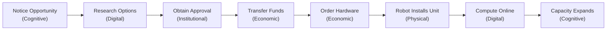
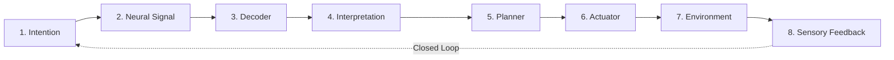

# The affordance frontier

> This document is theory. It describes the object Ambit is trying to model, not what the software currently does. The argument it supports is [Why Ambit](./why-ambit.md); the software is the [README](../README.md), and the design rationale is [the roadmap](./roadmap.md).

## The object

Ambit models the **affordance frontier** of extended human-machine systems: the set of digital, cognitive, physical, social, institutional, and economic actions made reachable by the composition of humans, models, software, authority, bodies, and machines.

The shortest form: *Ambit makes the capability frontier of an agentic system legible.*

```
A(S) = A_digital ∪ A_cognitive ∪ A_physical ∪ A_social ∪ A_institutional ∪ A_economic
```

These compose *across* boundaries, which is where the interesting cases live:



That chain is not well described as "an AI using a tool." It is a self-extending sociotechnical system.

## Why "affordance" and not "capability"

A hammer does not contain hammering. Hammering emerges from a relation between an agent, the tool, the agent's motor ability, a suitable target, and an environment. Affordances are relational; capabilities sound like possessions.

The same is true of the digital case, which is easy to miss because software feels like a list of features. *Shell access* is not really a capability. It is a resource that participates in producing one. The actual affordance might be *modify the running service*, and it exists only when reasoning, shell, credentials, network, target machine, installed software, and authorization all line up.

Robotics makes the relational character obvious, because physical affordances have always worked this way. A robot possesses a gripper; whether it can open a particular door depends on gripper geometry, force, perception, handle type, reach, locomotion, planning, door state, authorization, and possibly a human holding something aside.

Ambit generalizes that logic to digital and institutional action.

## The hard cases

The test of an abstraction is whether it survives cases it was not designed for. Two of them.

### Robotics

Robotics adds physical actuation. The primitives change; the accounting problem does not.

```
Capability: deliver medication to patient
  cognition      planning model
  perception     cameras + localization
  actuation      mobile base + gripper
  authority      authorized for this ward
  human          pharmacist loads the medication
  environment    elevator API reachable
  verification   delivery confirmed by recipient
```

The capability belongs to the assembled system, not to "the robot." A single warehouse robot cannot fulfill an order; inventory software plus a planner plus conveyors plus pickers plus payment authorization plus human exception handling can. The meaningful unit is the fulfillment system.

This also lets embodiment be discussed without mysticism. A body supplies sensors, actuators, position, energy constraints, physical access, vulnerability, and feedback — it is one class of affordance-producing infrastructure, not a precondition for agency. A corporation has consequential physical agency through employees, trucks, factories, and bank accounts without possessing one body. An AI system may acquire physical agency the same way: cameras in several buildings, drones elsewhere, warehouse robots, contracted humans, automated purchasing. Its body would be distributed.

The operational question is therefore not *does this system have a body* but **which physical affordances can it reliably bring about, through which actuators?**

### Brain-computer interfaces

BCIs are harder, because they erode the boundary the model depends on.



Where is *pick up the cup* in that loop? Not in the unaided nervous system, the decoder, the model, the planner, or the arm. It exists only in the closed circuit.

This forces a distinction Ambit should eventually make explicit:

- **Human-gated** — the machine acts only after approval.
- **Human-composed** — human cognition is necessary to produce the action.
- **Machine-composed-human** — the machine extends what the human can perceive, remember, decide, communicate, or do.

"Human in the loop" implies two pre-existing entities passing control. A tight enough interface produces a coupled system whose relevant cognition spans both, and which has abilities neither participant has alone. Calling the human a supervisor misses what is happening.

BCIs also introduce **cognitive affordances** — remember, communicate intention, retrieve external knowledge, control a device, maintain attention — where the frontier of a person with a memory prosthesis differs from the same person without one.

## Intellectual genealogy

No existing field studies this frontier directly. Its concepts are distributed:

| Field | Asks | Contributes |
| :--- | :--- | :--- |
| **Cybernetics** | what can this system control? | understanding a system through its effective possibilities rather than its parts' intelligence |
| **Sociotechnical systems** | how do humans, technology and institutions interact? | the correct boundary: human + machine + institution |
| **Security / attack graphs** | what can this principal reach? | that innocuous permissions compose into reachable paths |
| **Capability approach** (Sen, Nussbaum, Robeyns) | what can a person actually achieve? | resources ≠ effective freedom to achieve an outcome |
| **Agent evaluation** | can the agent do task X? | empirical autonomy measurement |
| **Systems engineering / CMDB** | what depends on what? | dependency and failure-propagation machinery |

The security parallel is the closest structurally. Attack-graph analysis already asks *given this topology, what can this principal reach* — Ambit generalizes the question from unauthorized attack paths to all productive capacity for action.

The capability-approach parallel is the closest conceptually. Where Sen distinguishes possessing resources from possessing the effective freedom to achieve an outcome, Ambit distinguishes *tool installed* from *capability actually reachable*, and tries to make the conversion function computationally explicit: resources, permissions, skills, connectivity, persistence and authority into effective capabilities.

What appears underdeveloped is the intersection: given an evolving assemblage of models, software, credentials, infrastructure, persistent processes, organizations and humans, **what set of outcomes is reachable, and how is that set changing?**

```
C(S_t) = { outcomes S can reliably and legitimately cause at time t }
ΔC     = C(S_t+1) − C(S_t)
```

Ambit's [ledger](./deep-dive.md#the-frontier-ledger) is a first, narrow implementation of ΔC over one kind of system.

## The AGI thesis

AGI need not arrive as one monolithic model crossing a threshold. It may arrive compositionally: models plus tools plus persistence plus credentials plus infrastructure plus humans, forming systems whose aggregate ability to act becomes the historically relevant thing.

The conventional framing plots *model capability over time* and asks how many intellectual tasks a model can perform. The systems framing plots **system capability frontier over time** and asks across how many domains an assembled system can perceive opportunities, form goals, marshal resources, act, observe consequences, adapt, and continue.

Those curves need not move together. A model release can move the first considerably and the second barely, for want of authority and infrastructure. Connect an unchanged model to a persistent runtime, a bank account, a fleet of machines and broad organizational authority, and the benchmarks barely move while the second curve climbs: *this model did not change, but the system around it acquired twelve new reachable capabilities this month.* At some point descriptions like that stop looking like a chatbot's tool configuration and start looking like the operational anatomy of a persistent actor.

That discrepancy is the thing almost nobody has needed to measure, and it may become one of the more important quantities in an agentic world.

The key variable is **cross-domain composability**. A system that writes excellent essays and proves theorems but cannot connect those abilities to persistent action has broad cognition and narrow agency. A system with weaker models that combines reasoning, software, money, institutions, robots, humans, memory, communication and manufacturing may have far greater general agency.

Which suggests a criterion:

> General agency exists when an extended system possesses a sufficiently broad and composable affordance frontier that it can pursue consequential goals across domains without requiring a separately constructed human workflow for each one.

And a sharper historical line than "which model was first":

> AGI may turn out not to describe what a machine became, but what human-machine systems became capable of doing.

At that point, asking whether the intelligence resides in the person, the model, the robot, or the interface is probably the wrong level of analysis.

## What the software does with this

Four concrete consequences have landed.

- The infrastructure manifest accepts devices of any kind. A robot arm declared as a device and a neural decoder declared as a service on it seed into the graph as first-class nodes with a `runs_on` edge between them, exactly as a Pi and a container do.
- The domain vocabulary was entirely software, so anything acting on the world collapsed into the `meta` column. `physical` is now a domain, and such resources render in their own column.
- The relational reading is now the data model rather than a gloss on it. A node declares what kind of thing it is — capability, action, provider, resource, actor, runtime — and an edge declares what the relation means. *Shell access* is a provider; the affordance is the action it confers, and the two are different rows. That is the paragraph above about hammers, made executable.
- Actions carry their own authority and their own evidence. `read a repository` and `merge to its default branch` are one capability and two permissions, and the graph says so.

The distinction the affordance reading forces — that an affordance exists only when reasoning, tool, target, and authorization line up — is what the split buys. A capability is reached when something supplies it; an action is exercisable when it is reached *and* permitted *and* has evidence behind it, and those are three columns rather than one boolean.

The domains are derived from structure, not matched from keywords: `ambit graph affordances` calls a capability institutional when an authority holder must approve it and physical when a provider runs on a device. What it derives, the map does not draw. What has not landed is the line the whole project sits behind: Ambit describes authority, and enforcement stops at its own gate. `apply` and the control-plane proxy refuse a step that fails `canExecute`; nothing forces a runtime to consult that gate, so a system that acts without asking is not stopped by the graph. [Roadmap §7b and §9](./roadmap.md#status-at-a-glance) carry the current state of each, and the theory above still runs ahead of them.
