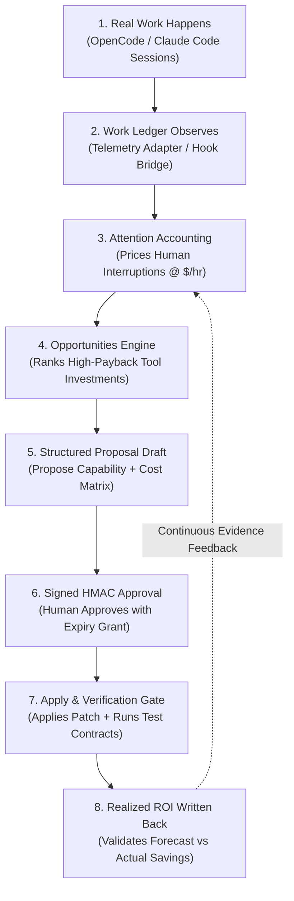

# Ambit reference

This is the long-form reference for how Ambit models capability. The [README](../README.md) covers getting started and the three surfaces; this covers the model underneath. The argument for building it is [why-ambit.md](./why-ambit.md); the theory under that is [the affordance frontier](./affordance-frontier.md).

<details>
<summary><b>Contents</b></summary>

**The model**

[The core idea](#the-core-idea) · [What a node is](#what-a-node-is) · [People in the graph](#people-in-the-graph) · [Runtimes are nodes, not owners](#runtimes-are-nodes-not-owners) · [Infrastructure belongs in the graph](#infrastructure-belongs-in-the-graph) · [Capability and authority are different things](#capability-and-authority-are-different-things) · [The frontier ledger](#the-frontier-ledger)

**What gets recorded, and what it buys**

[The work ledger](#the-work-ledger) · [The economic loop](#the-economic-loop) · [Previewing a change](#previewing-a-change) · [Delegation records](#delegation-records)

**The surfaces**

[The full CLI surface](#the-full-cli-surface) · [The full MCP surface](#the-full-mcp-surface) · [The map, and what it is allowed to do](#the-map-and-what-it-is-allowed-to-do)

</details>

---

## The model

### The core idea

Configuration tells you what is declared. Ambit tries to tell you what those declarations amount to.

A capability in a tool registry looks like *"GitHub access: yes."* The useful form is closer to:

> Can diagnose a failing service, modify its repository, deploy a fix, verify recovery, and report the intervention — because the system currently has repository write access, shell execution, deployment credentials, monitoring visibility, network reachability, persistent execution, and the required human authorization.

That second description is **effective capability**, and it is the object Ambit is built around. Getting there means keeping apart seven things that ordinary registries collapse into one:

| Property | What it means | Today |
| :--- | :--- | :--- |
| **Available** | something appears to exist | ✅ |
| **Reachable** | all necessary dependencies are currently accessible | ✅ |
| **Composed** | several lower-level capabilities together make a higher-order action possible | ✅ |
| **Verified** | the capability has actually succeeded | ✅ a passing check; a failing one reads as `degraded`/`broken` and stops being available |
| **Authorized** | the system has permission to use it | ✅ per action, declared, and enforced by `canExecute` on apply |
| **Delegated** | a human or another agent supplies a missing step | ✅ people are nodes; a plan names the person a step needs |
| **Persistent** | it can operate beyond the current interaction | roadmap |

Capability *change* is recorded over time (see [the frontier ledger](#the-frontier-ledger)), which is the accounting half of that table, not a seventh state.

Six of seven, with the caveats stated in the table and not hidden. Checks exist for eight capabilities, and for individual contract actions too, so `ambit verify act:version-control/commit_changes` proves the action and not the capability that confers it. A check that last failed **gates** the capability out of everything that decides availability, and nothing applies without a signed approval artifact and a per-step `canExecute` pass. [The roadmap](./roadmap.md) is the rest.

```
ambit verify            # run the declared checks, record what happened
  checked: 8 · verified: 8 · failed: 0
  Local Runtime   verified   23ms   reliability 4/4

ambit authority         # reached is not the same as permitted
  autonomous      File Editing · Parallel Execution
  needs approval  Shell Execution · Version Control · Continuous Delivery
  forbidden       Secret Management

ambit authority version-control    # and permission is finer than a capability
  exercisable     read_repository · commit_changes
  needs approval  push_branch · merge_to_default

ambit goal offline-capable
  goal: Offline Capable · steps: 2 · estimated setup: 25m
  1. Embeddings   2. Local Embeddings
```

The compressed form of the same point:

```
installed ≠ callable ≠ working ≠ reliable ≠ authorized ≠ appropriate
```

### What a node is

Every node says what kind of thing it is, and every edge says what the relation means:

```
capability   an action the system can bring about — the curated model's nodes
action       one concrete thing a capability confers, or that a person supplies
provider     what supplies a capability — an MCP server, a skill, a tool
resource     what a provider needs — a model, an inference endpoint, a machine
actor        a person: authority, money, judgment, physical access
runtime      an agent runtime, which contributes providers rather than owning them
credential   what a provider authenticates with — the identity of one, never the secret

provides · contributes · requires · optional · authorizes · runs_on · uses
```

**Redundancy is counted by what fails together.** A capability with three providers survives losing one — unless all three present the same token. Counting providers assumes they fail independently, and providers sharing a credential do not: one revocation takes all of them at once, and the capability reads as robust the whole time. Worse, having several providers is what *excluded* it from the single-point-of-failure report.

A `credentials` block declares the sharing:

```json
{ "credentials": {
    "github/user-token": { "name": "GitHub user token",
                           "used_by": ["mcp:github", "tool:bash"] } } }
```

`ambit status` then lists the capability among its spofs, `ambit impact` calls what survives `nominal` rather than `redundant`, and `ambit credentials` answers the question you have before rotating a token — what stops working. Only a credential *every* provider presents counts: given providers holding `{A}`, `{A,B}` and `{B}`, losing either leaves one standing, and calling that fragile would be the same overstatement inverted.

**No secret is read or stored.** Only the name, the holders and a note are consulted, so there is no field a value could arrive in and no column it could be written to. Sharing is declared, never inferred — guessing it from environment variable names would produce a redundancy claim nobody made, and a wrong one is worse than none.

Ten capabilities declare a `contract.can` — the actions they confer — and each becomes a node with its own authority. That is what lets the model say *may read the repository, may not merge to its default branch*, which the coarse node cannot. `ambit authority <cap>` reports them; the visualizer leaves them out of the era columns on purpose, because legibility is the point of that view.

Alongside `state`, each capability carries a **lifecycle** derived from its providers and its recorded evidence. The argument for keeping those two apart is in the README, under [Configured is not working](../README.md#configured-is-not-working); what follows here is where the lifecycle values come from.

| Lifecycle | When it holds |
| :--- | :--- |
| `unknown` | nothing supplies it |
| `detected` | something supplies it, but it is not reachable yet |
| `configured` | reachable, with no check run against it |
| `verified` | its check passed, and has not been run often |
| `reliable` | five runs or more, and the last five all passed |
| `degraded` | the last run passed, and recent ones did not |
| `broken` | the last run failed |

Nothing writes the column directly. It is recomputed from the evidence on seed and after verification, which are the two moments the inputs can change.

### People in the graph

Humans supply what machines cannot — legal authority, money, physical access, judgment — so they are nodes rather than users of the graph. An `actors` block declares them:

```json
{ "actors": { "kanav": {
    "provides": ["physical-access", "approve-purchases"],
    "authorizes": ["combo:continuous-delivery"] } } }
```

`provides` becomes a capability only that person supplies. `authorizes` becomes a required (hard) prerequisite, so a plan says whose step it is:

```
ambit goal continuous-delivery
  goal: Continuous Delivery
  requires person: Kanav
  steps: 1 · estimated setup: 30m
```

A plan that hides the human step reads as autonomous when it is not. A capability chain can therefore run:

```
diagnose hardware failure → request replacement → human approves expenditure
→ vendor ships component → human installs it → agent configures it
→ monitoring verifies recovery
```

The capability belongs to the human-machine system, not to either half — which lets partial, structured autonomy be described as it actually is, rather than forced into "fully autonomous" or "human controlled".

Every intervention is recorded. `ambit attention` counts the human acts in a window — approvals, applications, permission blocks, failed checks — and names the reducible ones: an approval given three times for the same capability is infrastructure shaped like a person, and the fix is a grant, not another reminder.

```
ambit attention 30
  interventions: 12
  3× approval: deploy to production
  2× permission block: restart svc:ollama
  2× failed: local embeddings
  reducible: deploy to production — grant bounded authority rather than approving each time
```

`ambit notify <topic>` pushes that digest to [ntfy](https://ntfy.sh), and only when a topic is given. Nothing leaves the machine otherwise; the push is a single HTTP POST of the digest text, no graph data.

### Runtimes are nodes, not owners

Ambit represents agent runtimes rather than being one. A runtime becomes a node, and everything it contributes hangs off it — so two runtimes configuring the same MCP server produce **one capability with two providers**, not two capabilities.

```bash
node --experimental-strip-types scripts/adapters/claude-code.ts          # what Claude Code provides
node --experimental-strip-types scripts/adapters/claude-code.ts --seed   # add it to the graph
node --experimental-strip-types scripts/adapters/hermes.ts               # the same for Hermes
```

The Claude Code adapter reads `~/.claude.json` and `~/.claude/` — MCP servers global and per project, skills, subagents, a pinned model — plus the authority the runtime states outright: permission mode, and how many allow, deny and ask rules are in force. Rule *names* only; an allow rule can name a path, and those are not Ambit's to copy into a graph you may export.

Against a real install, that yields:

```
runtime:opencode — contributes 127 capabilities
runtime:hermes   — contributes 32 capabilities
shared by both   — mcp:fetch · mcp:filesystem · mcp:git · mcp:sequential-thinking
```

`ambit impact runtime:hermes` then answers what would be lost if that runtime went away, and the answer is smaller than its capability count, because the shared four survive.

The adapter also reads what a config file cannot infer but the runtime states outright: Hermes reports `approvals: manual`, `cron_mode: deny`, eight messaging surfaces, a policy engine, and zero scheduled jobs — which is the difference between a capability that persists and one that lasts a session.

Hermes has no machine-readable config export today, so the adapter reads its documented paths. That is a stopgap: the durable contract is for runtimes to publish their capability surface and for Ambit to consume it.

### Infrastructure belongs in the graph

Agent capabilities do not stop at the model boundary. A local GPU, NAS, browser worker, Proxmox host, database, or cloud account can all contribute to what the system can accomplish.

Ambit scans infrastructure from an explicit local manifest (`INFRA_MANIFEST`, default `~/.config/opencode/infrastructure.json`). With no manifest it returns an empty scan rather than an error — no host addresses are baked in.

The manifest is not specific to servers. A device is anything that can act — a Pi, a GPU host, a robot arm, a sensor, a decoder — and they seed as first-class nodes in a `physical` domain. Devices and services seed into the engine graph itself: a device is a `resource` with a `runs_on` edge to every service hosted on it, so `ambit impact device:nuc` answers what actually breaks when the machine disappears, and a plan can point at capacity the graph counts. Whether that generalization is the right one is argued in [the affordance frontier](./affordance-frontier.md); what is implemented is that the model does not assume software.

The goal is not another homelab inventory. It is to treat infrastructure as capability-bearing:

```
GPU node
  ├─ local inference
  ├─ embeddings
  ├─ batch evaluation
  └─ private processing
```

A machine matters because of the actions it makes reachable.

### Capability and authority are different things

Being technically capable of an action should not imply permission to perform it.

```
CAN OBSERVE    autonomous
CAN PLAN       autonomous
CAN SIMULATE   autonomous
CAN EXECUTE    approval required
CAN VERIFY     autonomous
CAN ESCALATE   autonomous
```

This lets technical capability accumulate without silently broadening delegated authority. It is not a restriction on the capability model — it is what makes a larger capability surface governable.

Authority is recorded per action, and from two sources. The curated model says what an action is like in general; the runtime that would execute it says what it permits here — Hermes publishes `approvals.mode` and `approvals.cron_mode`, Claude Code publishes `permissions.defaultMode`, and both adapters pass them through. Where the two disagree the narrower wins, and `ambit authority` names which source narrowed it.

Enforcement lands where it matters. `ambit can <cap> [--target X] [--spend N]` is the decision API: it returns ALLOW, CONFIRM or DENY with the governing grant, the scope, and the remaining budget. `apply` gates every step through it, and nothing applies without a signed, unexpired approval artifact. The one limit worth stating: enforcement is on Ambit's own apply path, not yet interposed between every runtime and every tool — the runtime adapters are the next boundary.

### The frontier ledger

`capabilities` holds the present state and is overwritten on every seed, so on its own the graph can only say what the system can do *now*. Every seed also records the whole frontier, which lets it answer what was reachable at a past date:

```
ambit history since
  frontier then: 13
  frontier now:  19
  gained:    Embeddings · Local Embeddings · nomic-embed-text
  emergent:  Model Routing · Offline Capable · Subagents
```

One embedding model was added. Six capabilities moved. The three under `emergent` became reachable although **nothing providing them was added** — their prerequisites were satisfied by something else entirely. Offline Capable was already provided by an agent that did not change.

That is the entry a per-component changelog structurally cannot produce, because no single change explains it. Accumulated capacity to act is a graph property, and this is where it shows up.

A fourth class, **vocabulary**, exists to keep `gained`, `emergent` and `lost` honest. When Ambit starts modeling a part of your system it did not model before — a new action on a contract, or a capability added to the curated tree that your existing tools already provide — the node is new and nothing about the machine changed. Those are described and not counted, so `frontier_now` stays comparable with `frontier_then`:

```
ambit history since
  frontier then: 21
  frontier now:  21
  vocabulary: 12   act:shell-execution/run_command · act:file-editing/write_file · …
```

Without it, upgrading Ambit would read as a dozen capabilities acquired on a machine where nothing happened, which is exactly what the ledger exists not to say.

---

## What gets recorded, and what it buys

### The work ledger

The work ledger that `attention` reads is written by observation, not by hand. The visualizer API exposes a loopback `POST /api/telemetry` that speaks the ledger's own verbs — `run`, `end`, `event`, `use`, `intervention`, `resource`, `outcome`, `failure` — so a runtime adapter records actual work without knowing the schema:

```bash
echo '{"run":{"goal":"recover production service","runType":"incident"}}' \
    | node --experimental-strip-types scripts/adapters/telemetry.ts
```

`scripts/adapters/telemetry.ts` is the ingestion client (stdin → one JSON object per line → `POST /api/telemetry`). A plugin bridge ships at `plugins/ambit-telemetry.js`: copy it to `~/.config/opencode/plugins/` and every tool execution in an OpenCode session lands in the ledger as a work event, and every permission prompt as an `authority` intervention. The endpoint is loopback-only and origin-allowlisted like every other route, and a telemetry payload is structured data — never a command.

Failures land in the ledger too, classified from what a runtime states outright: a shell's own message for a missing binary, an MCP error kind, a permission refusal. Nothing reads what the failure was *about*. So `deficits` and `opportunities` stop saying "nothing observed" within a day of real work, without anyone remembering to record anything, and `ambit signals` is the raw view, including the failures no capability could be attributed to. Those are a gap in the model, not in the environment.

`ambit work` reads the ledger back: each run with its elapsed time, events, capabilities exercised, interventions, resources, and outcome. `ambit usage <days>` aggregates where effort went per capability — the raw material the opportunity engine ranks.

### The economic loop

The graph half answers *what can this system do*. The loop that pays for it answers *where is the scarce resource going, and which durable fix is worth the next dollar or hour*:



- `ambit attention` prices the human half of the ledger and, critically, **classifies agency**: clerical, exception, physical and authority-as-repeated-gate are reducible — *the human is the duct* — while judgment and knowledge are keepers, never proposed for removal however often they recur.
- `ambit economics` is the declared model: attention value per hour, purchase and recurring costs, goal values. Dollars declare, cents store. An undeclared actor's attention defaults to $250/hr and is reported as such.
- `ambit opportunities` ranks the durable fixes — observed middleware burden priced by attention value, acquisition cost, expected effect, payback, confidence (high = observed five-plus times, low = deficits only). Rank by `--by=attention|cash|roi|reliability|frontier`, or allocate a budget: `--budget=N` returns the best combination of investments within $N. Each opportunity carries its acquisition options from the catalog, so it is a purchase decision, not a report.
- `ambit roi` closes the loop. With a proposal id it measures before/after on the affected capability — interventions, human hours, attention dollars, verification failures — and returns a verdict (performing near forecast, above, below, too early). With no argument it is the cumulative headline: hours and dollars saved per year and forecast accuracy, written back so the next prediction has evidence to learn from.
- `ambit incidents` is the managed-ops vertical's first turn: probe the infrastructure manifest, open an incident run for every offline service, record detection, resolve the recovery against authority, and close it with MTTR from the ledger's own timestamps.
- `ambit audit` is the governance trail: a run end to end, a proposal's steps/approval/enforcement/result, or one person's approvals and interventions.
- `ambit portfolio` reads `federation` imports across environments: the same human burden recurring in several places, person-specific SPOFs, and where capex would produce the most. A portfolio layer reads signed receipts; it never merges graphs, and the receipts carry aggregates only — no credentials, no raw sessions.

The graph half is useful the moment you seed. `status`, `briefing`, `next`, `plan`, `verify` and `authority` need no telemetry at all.

### Previewing a change

`ambit goal <cap> --simulate` computes the frontier as it would be, without touching anything. What makes it worth reading is the second line:

```
ambit goal vector-store --simulate
  frontier before: 21
  frontier after:  23
  acquired:  Vector Store
  unblocked: Retrieval          # already provided, waiting on the prerequisite
```

`ambit propose` turns that into a reviewable draft — ordered steps, the alternative chosen, and what it costs beyond time:

```
ambit propose retrieval
  Retrieval · 25m
    Embeddings     nomic-embed via local runtime      none / local
    Vector Store   pgvector on existing Postgres      none / local
  simulated:
    frontier before: 21
    frontier after:  24
  applicable: false
```

Choosing the hosted alternatives (`ambit propose retrieval 1`) takes it to 13 minutes, at a per-token bill and a data boundary.

Where an acquisition genuinely *is* a config change, the step carries a declarative patch and Ambit derives its undo — removing what it adds, or restoring what it overwrites. Anything needing an installer gets no inverse, and a proposal is `applicable` only when every step has one.

```
ambit approve prop-msrrv9c2 kanav
  proposal: prop-msrrv9c2 · goal: Web Research
  approved by: Kanav · applicable: true
  note: Approved. Every step has an inverse. The approval artifact is signed and expires in 24 hours.
```

Approval mints a **signed artifact** — proposal hash, actor, budget, scope, expiry, timestamp, HMAC-signed with a machine-local key (`AMBIT_APPROVAL_KEY`, default `~/.config/opencode/ambit-approval.key`). It is also minted by the browser broker, `POST /api/proposals/:id/approve` (loopback, origin-allowlisted), which approves and signs but never applies. The visualizer's AG-UI stream surfaces the approval as a toast telling you exactly which terminal commands to run.

```
ambit apply prop-msrsqzij
  applied: true · keys: mcp.fetch
  backup: opencode.json.ambit-prop-msrsqzij.bak

ambit rollback prop-msrsqzij
  removed: mcp.fetch          # git survives — the inverse reverses only this
```

Approval and apply stay off the MCP surface — an agent may draft, preview, and ask, but never approve or apply. Proposing more capability and granting more authority are different acts, and the artifact is what keeps them apart.

### Delegation records

Ambit holds two steps of the revisable-delegation loop — capability and authorization — and writes what happens to them as [STD-07 Revisable Delegation Records](https://ethotechnics.org/standards/std-07-revisable-delegation-record), so another system can read it without sharing Ambit's database.

**The grant holds only while what it rests on does.** A capability whose hard prerequisite has started failing no longer runs unattended: `ambit can <capability>` returns CONFIRM instead of ALLOW and names what took it down. The declared grant is not rewritten — what a person wrote down stays written down — and the narrowing is a property of the decision, so it lifts by itself when the check passes again. A declared sandbox is exempt, because consequences are contained there.

**The export.** `ambit delegation --export` writes newline-delimited records. Four kinds are written automatically for every grant currently narrowed: the `capability` that broke, the `authorization` that rested on it with `depends_on` and `invalidated_by` populated, the `discrepancy`, and the `revision` superseding the authorization. The stream is append-only and hash-chained; `ambit delegation verify` recomputes it. Conformance level 2, declared in [`server.json`](../server.json) and measurable with the [record conformance checker](https://ethotechnics.org/diagnostics/record-conformance).

**A record can be argued with.** Every record names who may contest it — an exercise of authority names the people it binds, an observation names anyone who can re-run the check. `ambit delegation object <record> --by --basis` writes the challenge as an `objection`; `ambit delegation answer <objection> --by --because [--refuse]` writes the answer it is owed; `ambit delegation objections` lists the unanswered. Neither widens authority: an objection that reopened an unattended grant would make the gate negotiable, so widening still costs what it costs — fix the capability, or re-declare the grant. A stream containing an objection and its answer measures at level 3.

**Reading another system's records.** `ambit delegation ingest <file>` takes an STD-07 stream and records its `discrepancy` records about capabilities this graph knows, as evidence attributed to the sender. Three limits, each deliberate. It never moves a lifecycle, so no remote system can narrow a grant here by sending a file. Only `discrepancy` records are read, because a foreign `authorization` is that system's account of its own grants and importing it would be importing authority rather than evidence. A subject this graph has never heard of is reported as unmatched rather than dropped, since a sender and receiver disagreeing about what exists is the most useful thing a first integration can tell you.

**Sources are read without being asked.** `ambit delegation source add <id> --system --instance --from --by` declares where a system's records arrive, and a full `ambit verify` reads every enabled source from then on. A local path, deliberately: an outbound read on the verification path would put a remote host between this graph and its own evidence. A source that cannot be read records why and verification continues. `ambit delegation sources` shows when each was last read and what happened. `server.json` points `upstream` at these declarations instead of naming a peer, so it claims nothing while the honest answer is nothing.

**The source that works is another Ambit.** A peer runs the same tech tree, so it names capabilities identically, which is the whole reason its discrepancies are legible here; nothing else in the loop shares the vocabulary. A source must say which environment it is (`--instance`), because two graphs on the same tree produce identical record ids, and declaring this environment as a source is refused. When the laptop reports `combo:shell-execution` broken, the server records that as evidence attributed to `std07:ambit/laptop` and its own grant on `act:shell-execution/read_output` still returns ALLOW; on the laptop, where the check actually failed, the same grant returns CONFIRM. A peer can tell this graph something. It cannot revoke anything in it.

**What is honestly not there.** `action` and `outcome` records: the environment adapter is simulated, so an action record from here would attest to a fixture. Nothing forces a runtime to consult the gate, so a runtime that never calls `ambit can` is unaffected by any of this. And no sibling yet consumes what Ambit emits; the reading edge runs one way.

---

## The surfaces

### The full CLI surface

Run `ambit` with no arguments and it shows where the environment stands; `ambit help --all` shows the surface. Forty-two commands group under five nouns, and the grouping is presentation only — every verb also works flat, so `ambit impact x` and `ambit graph impact x` are the same command:

```
           seed · briefing [--json|--peek] · status · next [n] · help [term]
graph      impact <id> · catalog <cap> · where · skills · objects [target]
           share [--redact] [--out=path] · sync export|import <path>
           graph [surface|combos|affordances]
plan       goal <cap-or-sentence> [--paths|--simulate|--prefs] · next [n]
           reversible
           opportunities [--by=…] [--budget=N] · opportunity <id>
           propose <cap> [option] · roi [proposal-id] · portfolio [--budget=N]
check      verify [cap] [--history] [--target=<object>]
           authority [cap] [scope <target>]
           authority promote [<cap> <action> --after=N --window=30d --scope=X --by=<person>]
           authority sandbox [<target> --by=<person>] · budget [set|clear]
           can <cap> [--target X] [--spend N] · credentials
           incidents · incident resolve <svc> <outcome>
govern     proposals [--pending] · proposal <id> · approve <id> [<id>…] <person>
           reject <id> <person> ["why"]
           apply <id> · rollback <id> · history [since <when>]
           audit [run-…|prop-…|human:name|days]
           delegation [verify] [--record] [--export] · delegation ingest <file>
           delegation object|answer|objections · delegation source add|sources|pull
report     work [limit] · usage [days] · economics · attention [days]
           digest [days] · notify <topic> · notify-approvals <topic>
           record <cap> [class] [note] · record skill:<name> --provides= --verify=
           signals [days] · preferences [--observed] · federation export|import
```

Two more sit outside the groups because they start a process rather than answer a question: `ambit web` opens the visualizer (it needs a checkout — an installed copy carries no dev dependencies) and `ambit mcp` runs the MCP server.

The table covers the commands whose answer is not obvious from the name, in the same five-noun order as the block above.

| Command | The question it answers |
| :--- | :--- |
| **first session** — *the commands listed above the groups* | |
| `ambit briefing` | What an agent should know before its first tool call — reached and proven, configured but failing, waiting on a person, blocked recently, worth reaching next, and what changed since the last briefing. Prose, capped near 1,200 tokens, also served as the MCP resource `ambit://briefing` |
| `ambit status` | How are we doing — reached, verified, failing, degraded, SPOFs, recurring deficits, pending approvals, all in one report |
| `ambit next [n]` | What to reach next and why — ranked by what has actually blocked work once the ledger has observations, and by leverage per hour of setup before then. The answer says which basis it used |
| **graph** — *the structure, and what it would cost to lose a piece* | |
| `ambit impact <id>` | What becomes unavailable if this disappears — and what survives on another provider? |
| `ambit catalog <cap>` | The ways to acquire a capability — build, buy, subscribe, delegate, hire — compared by setup, one-time and recurring cost, privacy, verification and rollback |
| `ambit objects [target]` | What may be done to a particular thing, and what has been proved about doing it *there*. Evidence about one repository is not a claim about another |
| `ambit sync export\|import <path>` | The graph and the ledger as one file, so a container rebuilt from nothing gets its history back. No authority grants, no skill check commands, no credentials — a command in a data file is a command that runs on import |
| `ambit graph` | The whole graph as JSON; `graph surface` is the runtime-owned vocabulary a runtime would publish, `graph combos` the near-reachable ones, `graph affordances` the structural domains |
| **plan** — *what to acquire next, and whether it paid* | |
| `ambit goal <sentence>` | Route a free-form goal — "deploy without me" — to the capabilities whose words cover it, each with its plan delta |
| `ambit goal <cap> --paths` | The alternative ways to reach a capability, compared by setup time, risk and lock-in |
| `ambit goal --prefs [who]` | Who prefers what, and where a plan's default choice would fight them |
| `ambit reversible` | Which unreached capabilities could be acquired without a person, and which need hands. The same list, read backwards, is what an agent can never do for itself |
| `ambit opportunities` | Ranked structural changes worth making — observed middleware burden priced by attention value, acquisition cost, expected effect, payback, confidence. `--by=attention\|cash\|roi\|reliability\|frontier`; `--budget=N` allocates the best combination within $N |
| `ambit roi [proposal]` | One proposal's before/after verdict, or — with no argument — the cumulative headline: hours and dollars saved per year and forecast accuracy |
| `ambit portfolio [--budget=N]` | Across imported environments: the same human burden recurring in several places, person-specific SPOFs, and where capex would produce the most |
| **check** — *what is proven, what is permitted, what is currently broken* | |
| `ambit authority <cap>` | Which concrete actions does this confer, and which of them may run unattended? |
| `ambit authority scope <target>` | What a scope actually covers and what it does not — a grant scoped elsewhere is named as excluded |
| `ambit authority promote <cap> <action> --after=N --by=<person>` | The threshold that widens a grant once its evidence supports it. A person sets it once; a single failing check afterwards puts the grant back, with nobody asked |
| `ambit authority sandbox <target> --by=<person>` | Somewhere acting does not matter. Confirmation is relaxed inside it; a refusal never is, because rehearsing a forbidden action would be a way round it |
| `ambit budget set <cap> --amount=$20 --by=<person>` | Standing spend that needs no person. When it is spent the answer goes back to asking, which is what makes a ceiling safer than approving each purchase |
| `ambit incidents` | Probe the infrastructure manifest; open an incident run for every offline service with the authority decision for its recovery. `incident resolve <svc> <outcome>` closes it with MTTR |
| **govern** — *the reviewable path from proposal to applied change* | |
| `ambit proposals --pending` | The drafts waiting on a decision, each with cost, bill and what it unlocks — so approving is one sitting rather than one interruption per proposal |
| `ambit reject <id> <person> ["why"]` | A refusal, recorded. Approval was always written to the graph and refusal was not, so nothing could learn the shape of a no |
| `ambit history since <when>` | What became reachable since a past date — and what emerged rather than being added? |
| `ambit audit <run-…\|prop-…\|human:name\|days>` | The trail: who approved what, what ran, against what target, under which grant, and whether it held |
| **report** — *what the system cost to operate* | |
| `ambit attention [days]` | How much of the work still runs through the human, and which interventions are likely reducible |
| `ambit notify <topic>` | Push the attention digest to ntfy — nothing is sent without a topic |
| `ambit record skill:<name> --provides=<cap> --verify="<cmd>"` | Put a skill the agent wrote on the map, with the read-only check that proves it. The check is required and runs immediately |
| `ambit signals [days]` | Failures observed without anyone recording them, by class and by tool — including the ones no capability could be attributed to |
| `ambit preferences [--observed]` | What someone declared they prefer, or what they have actually approved and refused |
| `ambit federation export\|import` | The signed summary a portfolio layer reads — aggregates only, no credentials, no raw sessions |

Every command prints for a person by default and takes `--json` for scripts.

What that looks like when a capability is one dependency away, and the dependency it names gates four further capabilities:

```
ambit goal local-embeddings

  Local Embeddings
    steps: 2 · estimated setup: 25m
    order: Embeddings → Local Embeddings
```

More useful is where composition *fails*. Capabilities you have already half-built carry the reason:

```
Retrieval          configured, but Vector Store is not in place yet
Offline Capable    configured, but Local Embeddings is not in place yet
Self-Hosted Stack  configured, but Observability is not in place yet
```

Nothing declared those. They fall out of the dependency structure, and they are invisible in every file you own.

### The full MCP surface

Sixty tools in six groups:

| Group | Tools | Purpose |
| :--- | :--- | :--- |
| **Graph** | `ambit_stats`, `ambit_context`, `ambit_cap`, `ambit_combos`, `ambit_diff`, `ambit_health`, `ambit_decay`, `ambit_near`, `ambit_bottlenecks`, `ambit_spof`, `ambit_impact`, `ambit_credentials` | Query structure, single points of failure, keystones (the `ambit_bottlenecks` tool keeps the old name), combo prerequisites, and blast radius. |
| **Lifecycle** | `ambit_verify`, `ambit_evidence`, `ambit_authority`, `ambit_actions`, `ambit_plan`, `ambit_goal`, `ambit_paths`, `ambit_preferences`, `ambit_scope`, `ambit_affordances`, `ambit_since`, `ambit_ledger` | Is this real, may I act, what is missing: inspect health, run verification contracts, resolve authority scope, compute prerequisite paths. |
| **Operate** | `ambit_work`, `ambit_usage`, `ambit_run_begin`, `ambit_run_end`, `ambit_work_event`, `ambit_digest`, `ambit_economics`, `ambit_goal_value`, `ambit_opportunities`, `ambit_opportunity`, `ambit_catalog`, `ambit_roi`, `ambit_roi_summary`, `ambit_audit`, `ambit_incidents`, `ambit_incident_resolve`, `ambit_portfolio`, `ambit_can` | The economic loop read and written by an agent: record telemetry, price attention, rank opportunities, and check permission before acting. |
| **Propose** | `ambit_blocked`, `ambit_deficits`, `ambit_simulate`, `ambit_propose`, `ambit_proposals`, `ambit_proposal` | Record deficits, simulate future frontier states, and draft reviewable patches. |
| **Session** | `ambit_briefing`, `ambit_next`, `ambit_record_failure`, `ambit_signals`, `ambit_register_skill`, `ambit_skills`, `ambit_promotions` | Know the environment before touching it, see what is worth reaching next, report a failure the runtime already noticed, and put a skill you wrote on the map with the check that proves it. |
| **Expand** | `ambit_objects`, `ambit_budgets`, `ambit_reversible`, `ambit_preferences_observed`, `ambit_pending` | What may be done to a particular target and what is proved there, what may be spent without asking, what would have to be written for an acquisition to need no person, what this person actually approves, and what is waiting on one right now. All read-only. |

Widening authority is a person's act throughout. An agent can ask; it can never approve or apply, and an agent that could grant itself more would make the distinction meaningless.

One resource sits beside the tools: `ambit://briefing`, which a client reads on connect. A tool has to be thought of; a resource arrives unasked, which is the only way it reaches the agent that does not know Ambit is there — the one that most needs to be told what is already broken.

### The map, and what it is allowed to do

The web UI (`./bootstrap.sh web`) reads the same graph the CLI reads, over `/api/events`, and never writes to your configuration except through the two paths below. The README covers [the lenses and the simulations](../README.md#the-map); this is what sits underneath them.

**Simulation is arithmetic on the graph, not on the host.** An outage walks the transitive downstream closure of the chosen node and counts what stops working; an unlock takes a locked node whose other hard prerequisites are already met and lights what becomes reachable. Neither reads a config file or writes one.

**Three loopback endpoints carry governance.** `GET /api/proposals` lists drafts and their history. `POST /api/proposals/:id/approve` mints the same HMAC-signed approval artifact the terminal does, with an actor and a TTL, and never applies. `GET /api/attention` aggregates interventions per capability from the ledger. All three bind loopback and reject a non-local origin before routing, like every route.
