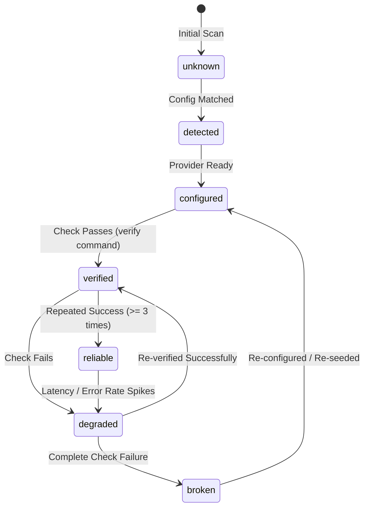
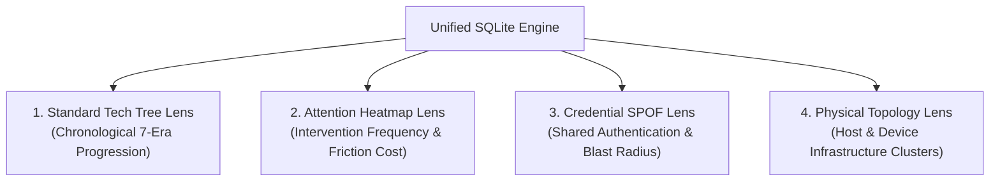
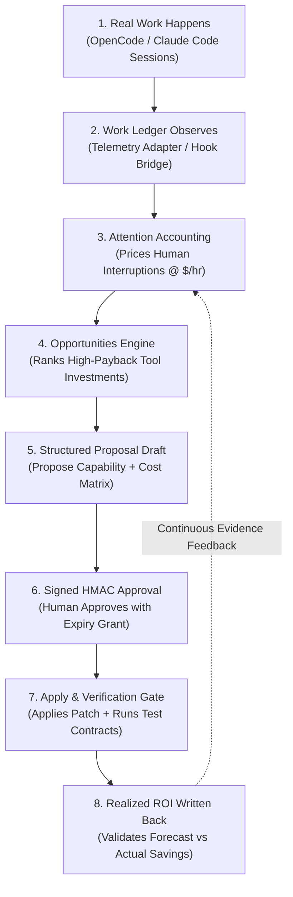

# Ambit, in depth

This is the long-form reference for how Ambit models capability. The [README](../README.md) covers getting started; this covers the model underneath — what a node is, how verification and authority work, the ledger, the economic loop, and the full CLI and MCP surface.

## The core idea

Configuration tells you what is declared. Ambit tries to tell you what those declarations amount to.

A capability in a tool registry looks like *"GitHub access: yes."* The useful form is closer to:

> Can diagnose a failing service, modify its repository, deploy a fix, verify recovery, and report the intervention — because the system currently has repository write access, shell execution, deployment credentials, monitoring visibility, network reachability, persistent execution, and the required human authorisation.

That second description is **effective capability**, and it is the object Ambit is built around. Getting there means keeping apart seven things that ordinary registries collapse into one:

| | | today |
|---|---|---|
| **Available** | something appears to exist | ✅ |
| **Reachable** | all necessary dependencies are currently accessible | ✅ |
| **Composed** | several lower-level capabilities together make a higher-order action possible | ✅ |
| **Verified** | the capability has actually succeeded | ✅ a passing check; a failing one reads as `degraded`/`broken` and stops being available |
| **Authorized** | the system has permission to use it | ✅ per action, declared, and enforced by `canExecute` on apply |
| **Delegated** | a human or another agent supplies a missing step | ✅ people are nodes; a plan names the person a step needs |
| **Persistent** | it can operate beyond the current interaction | roadmap |

Capability *change* is recorded over time — see [the ledger](#the-ledger) — which is the accounting half of that table rather than a seventh state.

Six of seven, with the caveats stated in the table rather than hidden: checks exist for eight capabilities — and for individual contract actions, so `ambit verify act:version-control/commit_changes` proves the action rather than the capability that confers it — a check that last failed **gates** the capability out of everything that decides availability, and authority is enforced where it matters most: nothing applies without a signed approval artifact and a per-step `canExecute` pass. [The roadmap](./roadmap.md) is the rest.

```console
$ ambit verify            # run the declared checks, record what happened
  checked: 8 · verified: 8 · failed: 0
  Local Runtime   verified   23ms   reliability 4/4

$ ambit authority         # reached is not the same as permitted
  autonomous      File Editing · Parallel Execution
  needs approval  Shell Execution · Version Control · Continuous Delivery
  forbidden       Secret Management

$ ambit authority version-control    # and permission is finer than a capability
  exercisable     read_repository · commit_changes
  needs approval  push_branch · merge_to_default

$ ambit goal offline-capable
  goal: Offline Capable · steps: 2 · estimated setup: 25m
  1. Embeddings   2. Local Embeddings
```

The compressed form of the same point:

```
installed ≠ callable ≠ working ≠ reliable ≠ authorized ≠ appropriate
```

## What a node is

Every node says what kind of thing it is, and every edge says what the relation means:

```
capability   an action the system can bring about — the curated model's nodes
action       one concrete thing a capability confers, or that a person supplies
provider     what supplies a capability — an MCP server, a skill, a tool
resource     what a provider needs — a model, an inference endpoint, a machine
actor        a person: authority, money, judgement, physical access
runtime      an agent runtime, which contributes providers rather than owning them
credential   what a provider authenticates with — the identity of one, never the secret

provides · contributes · requires · optional · authorizes · runs_on · uses
```

**Redundancy is counted by what fails together.** A capability with three providers survives losing one — unless all three present the same token. Counting providers assumes they fail independently, and providers sharing a credential do not: one revocation takes all of them at once, and the capability reads as robust the whole time. Worse, having several providers is what *excluded* it from the single-point-of-failure report.

A `credentials` block declares the sharing:

```json
{ "credentials": {
    "github/user-token": { "name": "GitHub user token",
                           "used_by": ["mcp:github", "tool:bash"] } } }
```

`ambit status` then lists the capability among its spofs, `ambit impact` calls what survives `nominal` rather than `redundant`, and `ambit credentials` answers the question you have before rotating a token — what stops working. Only a credential *every* provider presents counts: given providers holding `{A}`, `{A,B}` and `{B}`, losing either leaves one standing, and calling that fragile would be the same overstatement inverted.

**No secret is read or stored.** Only the name, the holders and a note are consulted, so there is no field a value could arrive in and no column it could be written to. Sharing is declared, never inferred — guessing it from environment variable names would produce a redundancy claim nobody made, and a wrong one is worse than none.

Ten capabilities declare a `contract.can` — the actions they confer — and each becomes a node with its own authority. That is what lets the model say *may read the repository, may not merge to its default branch*, which the coarse node cannot. `ambit authority <cap>` reports them; the visualizer leaves them out of the era columns on purpose, because legibility is the point of that view.

Alongside `state`, each capability carries a **lifecycle** derived from its providers and its recorded evidence:



> [!IMPORTANT]
> `state` is structural (what is configured in files); `lifecycle` is empirical (what actually passes verification). A capability whose lifecycle is `degraded` or `broken` is strictly gated out of availability and cannot be used by planning or execution tools until re-verified.

## The full CLI surface

Run `ambit` with no arguments and it shows the surface. The whole CLI is a handful of verbs; everything else is a view inside them:

```
Operate    status · graph [surface|combos|affordances] · history [since <when>]
Decide     goal <cap-or-sentence> [--paths|--simulate|--prefs] · attention [days]
           notify <topic> · notify-approvals <topic> · work [limit] · usage [days]
           economics · opportunities [--by=…] [--budget=N] · opportunity <id>
           roi [proposal-id] · catalog <cap> · audit [run|prop|human|days]
           incidents · incident resolve <svc> <outcome> · portfolio [--budget=N]
           impact <id> · verify [cap] [--history]
           authority [cap] [scope <target>] · can <cap> [--target X] [--spend N]
           · propose <cap> [n] · proposals · proposal <id>
Govern     approve <id> <who> · apply <id> · rollback <id>
Record     record <cap> [class] [note] · federation export|import
           · seed · where · help [term]
```

| | asks |
|---|---|
| `ambit status` | How are we doing — reached, verified, failing, degraded, SPOFs, recurring deficits, pending approvals, all in one report |
| `ambit graph` | The whole graph as JSON; `graph surface` is the runtime-owned vocabulary a runtime would publish, `graph combos` the near-reachable ones, `graph affordances` the structural domains |
| `ambit impact <id>` | What becomes unavailable if this disappears — and what survives on another provider? |
| `ambit goal <sentence>` | Route a free-form goal — "deploy without me" — to the capabilities whose words cover it, each with its plan delta |
| `ambit goal <cap> --paths` | The alternative ways to reach a capability, compared by setup time, risk and lock-in |
| `ambit goal --prefs [who]` | Who prefers what, and where a plan's default choice would fight them |
| `ambit authority <cap>` | Which concrete actions does this confer, and which of them may run unattended? |
| `ambit authority scope <target>` | What a scope actually covers and what it does not — a grant scoped elsewhere is named as excluded |
| `ambit history since <when>` | What became reachable since a past date — and what emerged rather than being added? |
| `ambit attention [days]` | How much of the work still runs through the human, and which interventions are likely reducible |
| `ambit notify <topic>` | Push the attention digest to ntfy — nothing is sent without a topic |
| `ambit opportunities` | Ranked structural changes worth making — observed middleware burden priced by attention value, acquisition cost, expected effect, payback, confidence. `--by=attention|cash|roi|reliability|frontier`; `--budget=N` allocates the best combination within $N |
| `ambit catalog <cap>` | The ways to acquire a capability — build, buy, subscribe, delegate, hire — compared by setup, one-time and recurring cost, privacy, verification and rollback |
| `ambit roi [proposal]` | One proposal's before/after verdict, or — with no argument — the cumulative headline: hours and dollars saved per year and forecast accuracy |
| `ambit audit <run\|prop\|human>` | The trail: who approved what, what ran, against what target, under which grant, and whether it held |
| `ambit incidents` | Probe the infrastructure manifest; open an incident run for every offline service with the authority decision for its recovery. `incident resolve <svc> <outcome>` closes it with MTTR |
| `ambit portfolio [--budget=N]` | Across imported environments: the same human burden recurring in several places, person-specific SPOFs, and where capex would produce the most |
| `ambit federation export\|import` | The signed summary a portfolio layer reads — aggregates only, no credentials, no raw sessions |

Every command prints for a person by default and takes `--json` for scripts.

Real output — one dependency away, and the dependency it names gates four further capabilities:

```console
$ ambit goal local-embeddings

  Local Embeddings
    missing: 1
    steps: 2 · estimated setup: 25m
    order: Embeddings → Local Embeddings
```

More useful is where composition *fails*. Capabilities you have already half-built carry the reason:

```
Retrieval          configured, but Vector Store is not in place yet
Offline Capable    configured, but Local Embeddings is not in place yet
Self-Hosted Stack  configured, but Observability is not in place yet
```

Nothing declared those. They fall out of the dependency structure, and they are invisible in every file you own.

## People in the graph

Humans supply what machines cannot — legal authority, money, physical access, judgement — so they are nodes rather than users of the graph. An `actors` block declares them:

```json
{ "actors": { "kanav": {
    "provides": ["physical-access", "approve-purchases"],
    "authorizes": ["combo:continuous-delivery"] } } }
```

`provides` becomes a capability only that person supplies. `authorizes` becomes a hard prerequisite, so a plan says whose step it is:

```console
$ ambit goal continuous-delivery
  goal: Continuous Delivery
  requires a person: Kanav
  steps: 1 · estimated setup: 30m
```

A plan that hides the human step reads as autonomous when it is not. A capability chain can therefore run:

```
diagnose hardware failure → request replacement → human approves expenditure
→ vendor ships component → human installs it → agent configures it
→ monitoring verifies recovery
```

The capability belongs to the human-machine system, not to either half — which lets partial, structured autonomy be described as it actually is, rather than forced into "fully autonomous" or "human controlled".

Every intervention is recorded. `ambit attention` counts the human acts in a window — approvals, applications, permission blocks, failed checks — and names the reducible ones: an approval given three times for the same capability is infrastructure shaped like a person, and the fix is a grant, not another reminder.

```console
$ ambit attention 30
  interventions: 12
  3× approval: deploy to production
  2× permission block: restart svc:ollama
  2× failed: local embeddings
  reducible: deploy to production — grant bounded authority rather than approving each time
```

`ambit notify <topic>` pushes that digest to [ntfy](https://ntfy.sh) — and only when a topic is given. Nothing leaves the machine otherwise; the push is a single HTTP POST of the digest text, no graph data.

## Work telemetry

The same ledger that `attention` reads is written by observation, not by hand. The visualizer API exposes a loopback `POST /api/telemetry` that speaks the ledger's own verbs — `run`, `end`, `event`, `use`, `intervention`, `resource`, `outcome` — so a runtime adapter records actual work without knowing the schema:

```console
$ echo '{"run":{"goal":"recover production service","runType":"incident"}}' \
    | node --experimental-strip-types scripts/adapters/telemetry.ts
```

`scripts/adapters/telemetry.ts` is the ingestion client (stdin → one JSON object per line → `POST /api/telemetry`). A plugin bridge ships at `plugins/tech-tree-telemetry.js`: copy it to `~/.config/opencode/plugins/` and every tool execution in an OpenCode session lands in the ledger as a work event, and every permission prompt as an `authority` intervention. The endpoint is loopback-only and origin-allowlisted like every other route, and a telemetry payload is structured data — never a command.

`ambit work` reads the ledger back: each run with its elapsed time, events, capabilities exercised, interventions, resources, and outcome. `ambit usage <days>` aggregates where effort went per capability — the raw material the opportunity engine ranks.

## Previewing a change

`ambit goal <cap> --simulate` computes the frontier as it would be, without touching anything. What makes it worth reading is the second line:

```console
$ ambit goal vector-store --simulate
  frontier: 21 → 23
  acquired:  Vector Store
  unblocked: Retrieval          # already provided, waiting on the prerequisite
```

`ambit propose` turns that into a reviewable draft — ordered steps, the alternative chosen, and what it costs beyond time:

```console
$ ambit propose retrieval
  Retrieval · 25m
    Embeddings     nomic-embed via local runtime      none / local
    Vector Store   pgvector on existing Postgres      none / local
  simulated frontier: 21 → 24
  executable: false
```

Choosing the hosted alternatives (`ambit propose retrieval 1`) takes it to 13 minutes, at a per-token bill and a data boundary.

Where an acquisition genuinely *is* a config change, the step carries a declarative patch and Ambit derives its undo — removing what it adds, or restoring what it overwrites. Anything needing an installer gets no inverse, and a proposal is `applicable` only when every step has one.

```console
$ ambit approve prop-msrrv9c2 kanav
  proposal: prop-msrrv9c2 · goal: Web Research
  approved by: Kanav · applicable: true
  note: Approved. Every step has an inverse. The approval artifact is signed and expires in 24 hours.
```

Approval mints a **signed artifact** — proposal hash, actor, budget, scope, expiry, timestamp, HMAC-signed with a machine-local key (`AMBIT_APPROVAL_KEY`, default `~/.config/opencode/ambit-approval.key`). It is also minted by the browser broker, `POST /api/proposals/:id/approve` (loopback, origin-allowlisted), which approves and signs but never applies. The visualizer's AG-UI stream surfaces the approval as a toast telling you exactly which terminal commands to run.

```console
$ ambit apply prop-msrsqzij
  applied: true · keys: mcp.fetch
  backup: opencode.json.ambit-prop-msrsqzij.bak

$ ambit rollback prop-msrsqzij
  removed: mcp.fetch          # git survives — the inverse reverses only this
```

Approval and apply stay off the MCP surface — an agent may draft, preview, and ask, but never approve or apply. Proposing more capability and granting more authority are different acts, and the artifact is what keeps them apart.

## The Interactive Visual Canvas & Decision Lenses

The Ambit frontend (`./bootstrap.sh web`) connects directly to the engine and `/api/events` to project graph theory and economics into an interactive operational surface:

### 1. Multi-Hop Graph Simulation Engine
The canvas provides real-time "what-if" modeling without touching host configuration:
* **Outage & Blast Radius Simulation:** Traverses the full transitive downstream closure ($T \subseteq V$ where $v \in T$ if there exists a directed dependency path from root $R \to v$). Renders affected nodes in pulsing red and counts disabled downstream capabilities.
* **Frontier Acquisition Simulation:** Evaluates all locked capabilities where the candidate node is a hard requisite. If all other hard requisites are satisfied, the node transitions into the simulated frontier in glowing emerald green.

### 2. Four Operational Decision Lenses
The visualizer includes a sticky lens switcher to project different dimensions of the environment:



* **Standard Tree Lens:** Groups capabilities by their chronological evolutionary era (Foundation $\to$ Model Access $\to$ Tool Use $\to$ Memory $\to$ Autonomy $\to$ Assurance $\to$ Sovereignty).
* **Attention Heatmap Lens:** Reads `/api/attention` and colors nodes by developer cognitive friction. Nodes requiring frequent human confirmations glow amber/crimson with cost badges (`42× ($/mo)`).
* **Credential SPOF Lens:** Highlights shared authentication tokens where revoking a single secret risks cascading failures across independent MCP servers.
* **Physical Topology Lens:** Reorganizes capabilities by host machine (`Local Host`, `Physical Nodes`, `Cloud / Edge`) to diagnose network reachability and hardware-level failures.

### 3. Web Approval Broker API Contracts
The local server provides loopback endpoints for web-based governance:
* `GET /api/proposals`: Retrieves active and historical change proposals.
* `POST /api/proposals/:id/approve`: Mints an HMAC-signed approval token with configurable actor and TTL.
* `GET /api/attention`: Aggregates human-in-the-loop interventions per capability from `session_learning`.

## The ledger

`capabilities` holds the present state and is overwritten on every seed, so on its own the graph can only say what the system can do *now*. Every seed also records the whole frontier, which lets it answer what was reachable at a past date:

```console
$ ambit history since
  frontier then: 13
  frontier now:  19
  gained:    Embeddings · Local Embeddings · nomic-embed-text
  emergent:  Model Routing · Offline Capable · Subagents
```

One embedding model was added. Six capabilities moved. The three under `emergent` became reachable although **nothing providing them was added** — their prerequisites were satisfied by something else entirely. Offline Capable was already provided by an agent that did not change.

That is the entry a per-component changelog structurally cannot produce, because no single change explains it. Accumulated capacity to act is a graph property, and this is where it shows up.

A fourth class, **vocabulary**, exists to keep the first three honest. When Ambit starts modelling a part of your system it did not model before — a new action on a contract, or a capability added to the curated tree that your existing tools already provide — the node is new and nothing about the machine changed. Those are described and not counted, so `frontier_now` stays comparable with `frontier_then`:

```console
$ ambit history since
  frontier then: 21
  frontier now:  21
  vocabulary: 12   act:shell-execution/run_command · act:file-editing/write_file · …
```

Without it, upgrading Ambit would read as a dozen capabilities acquired on a machine where nothing happened — which is exactly what this table exists not to do.

## The economic loop

The graph half answers *what can this system do*. The loop that pays for it answers *where is the scarce resource going, and which durable fix is worth the next dollar or hour*:



> [!NOTE]
> The loop distinguishes **clerical & repetitive friction** (which is reducible and should be automated) from **judgment & creative oversight** (which are permanent human keepers).

- `ambit attention` prices the human half of the ledger and, critically, **classifies agency**: clerical, exception, physical and authority-as-repeated-gate are reducible — *the human is the duct* — while judgment and knowledge are keepers, never proposed for removal however often they recur.
- `ambit economics` is the declared model: attention value per hour, purchase and recurring costs, goal values. Dollars declare, cents store. An undeclared actor's attention defaults to $250/hr and is reported as such.
- `ambit opportunities` ranks the durable fixes — observed middleware burden priced by attention value, acquisition cost, expected effect, payback, confidence (high = observed five-plus times, low = deficits only). Rank by `--by=attention|cash|roi|reliability|frontier`, or allocate a budget: `--budget=N` returns the best combination of investments within $N. Each opportunity carries its acquisition options from the catalog, so it is a purchase decision, not a report.
- `ambit roi` closes the loop. With a proposal id it measures before/after on the affected capability — interventions, human hours, attention dollars, verification failures — and returns a verdict (performing near forecast, above, below, too early). With no argument it is the cumulative headline: hours and dollars saved per year and forecast accuracy, written back so the next prediction has evidence to learn from.
- `ambit incidents` is the managed-ops vertical's first turn: probe the infrastructure manifest, open an incident run for every offline service, record detection, resolve the recovery against authority, and close it with MTTR from the ledger's own timestamps.
- `ambit audit` is the governance trail: a run end to end, a proposal's steps/approval/enforcement/result, or one person's approvals and interventions.
- `ambit portfolio` reads `federation` imports across environments: the same human burden recurring in several places, person-specific SPOFs, and where capex would produce the most. A portfolio layer reads signed receipts; it never merges graphs, and the receipts carry aggregates only — no credentials, no raw sessions.

The graph half is useful the moment you seed — `status`, `plan`, `verify` and `authority` need no telemetry at all. The economic loop fills in as you use it: `ambit attention` starts counting your interventions immediately, and the plugin bridge makes every OpenCode session feed the ledger automatically, so `opportunities` stops saying "nothing observed" within days, not months.

## The full MCP surface

```
Graph      ambit_stats ambit_context ambit_cap   ambit_combos ambit_diff ambit_health
           ambit_decay ambit_near   ambit_bottlenecks        ambit_spof ambit_impact ambit_credentials

Lifecycle  ambit_verify ambit_evidence ambit_authority ambit_actions ambit_plan ambit_goal
           ambit_paths  ambit_preferences ambit_scope  ambit_affordances ambit_since ambit_ledger

Operate    ambit_work ambit_usage ambit_run_begin ambit_run_end ambit_work_event ambit_digest
           ambit_economics ambit_goal_value ambit_opportunities ambit_opportunity
           ambit_catalog ambit_roi ambit_roi_summary ambit_audit ambit_incidents
           ambit_incident_resolve ambit_portfolio ambit_can

Propose    ambit_blocked ambit_deficits ambit_simulate ambit_propose ambit_proposals ambit_proposal
```

The lifecycle group is "is this real, may I act, what is missing" — and when the answer is *nothing here can do that*, recording it so a deficit hit repeatedly becomes visible as infrastructure that should exist rather than a wall to work around again. The operate group is the economic loop read and written by an agent: report work, record what it did, ask which investments rank, and — via `ambit_can` — *ask* whether an action is permitted. An agent can ask; it can never approve or apply.

## Runtimes are nodes, not owners

Ambit represents agent runtimes rather than being one. A runtime becomes a node, and everything it contributes hangs off it — so two runtimes configuring the same MCP server produce **one capability with two providers**, not two capabilities.

```bash
node --experimental-strip-types scripts/adapters/claude-code.ts          # what Claude Code provides
node --experimental-strip-types scripts/adapters/claude-code.ts --seed   # add it to the graph
node --experimental-strip-types scripts/adapters/hermes.ts               # the same for Hermes
```

The Claude Code adapter reads `~/.claude.json` and `~/.claude/` — MCP servers global and per project, skills, subagents, a pinned model — plus the authority the runtime states outright: permission mode, and how many allow, deny and ask rules are in force. Rule *names* only; an allow rule can name a path, and those are not Ambit's to copy into a graph you may export.

Against a real install, that yields:

```
runtime:opencode — contributes 127 capabilities
runtime:hermes   — contributes 32 capabilities
shared by both   — mcp:fetch · mcp:filesystem · mcp:git · mcp:sequential-thinking
```

`ambit impact runtime:hermes` then answers what would be lost if that runtime went away — and the answer is smaller than its capability count, because the shared four survive.

The adapter also reads what a config file cannot infer but the runtime states outright: Hermes reports `approvals: manual`, `cron_mode: deny`, eight messaging surfaces, a policy engine, and zero scheduled jobs — which is the difference between a capability that persists and one that lasts a session.

Hermes has no machine-readable config export today, so the adapter reads its documented paths. That is a stopgap: the durable contract is for runtimes to publish their capability surface and for Ambit to consume it.

## Infrastructure belongs in the graph

Agent capabilities do not stop at the model boundary. A local GPU, NAS, browser worker, Proxmox host, database, or cloud account can all contribute to what the system can accomplish.

Ambit scans infrastructure from an explicit local manifest (`INFRA_MANIFEST`, default `~/.config/opencode/infrastructure.json`). With no manifest it returns an empty scan rather than an error — no host addresses are baked in.

The manifest is not specific to servers. A device is anything that can act — a Pi, a GPU host, a robot arm, a sensor, a decoder — and they seed as first-class nodes in a `physical` domain. Devices and services seed into the engine graph itself: a device is a `resource` with a `runs_on` edge to every service hosted on it, so `ambit impact device:nuc` answers what actually breaks when the machine disappears, and a plan can point at capacity the graph counts. Whether that generalisation is the right one is argued in [the affordance frontier](./affordance-frontier.md); what is implemented is that the model does not assume software.

The goal is not another homelab inventory. It is to treat infrastructure as capability-bearing:

```
GPU node
  ├─ local inference
  ├─ embeddings
  ├─ batch evaluation
  └─ private processing
```

A machine matters because of the actions it makes reachable.

## From configured to demonstrated

Detection is a first approximation. Today Ambit infers capability from configuration and naming patterns. The deeper model is empirical:

```
unknown → detected → configured → demonstrated
        → repeatedly verified → degraded → unavailable
```

A capability should mean more than "something with the right name exists". It should mean the system has evidence the action can be performed under known conditions. That distinction matters more as agents gain authority.

That lifecycle is a stored column rather than an aspiration — see [what a node is](#what-a-node-is) — and it **gates**. A capability whose lifecycle is `degraded` or `broken` stops reading as available wherever availability is decided: `ambit goal` refuses to route through it (and says "re-verify" rather than "add"), `ambit goal <cap> --simulate` reports it as `blocked_by_degraded`, `ambit authority` stops listing it as reachable, and `ambit status` reports it in a `failing` count. `ambit verify` changes the lifecycle immediately; a re-seed reconciles it from the recorded evidence, and nothing verifies on seed.

## Capability and authority are different things

Being technically capable of an action should not imply permission to perform it.

```
CAN OBSERVE    autonomous
CAN PLAN       autonomous
CAN SIMULATE   autonomous
CAN EXECUTE    approval required
CAN VERIFY     autonomous
CAN ESCALATE   autonomous
```

This lets technical capability accumulate without silently broadening delegated authority. It is not a restriction on the capability model — it is what makes a larger capability surface governable.

Authority is recorded per action, and from two sources. The curated model says what an action is like in general; the runtime that would execute it says what it permits here — Hermes publishes `approvals.mode` and `approvals.cron_mode`, Claude Code publishes `permissions.defaultMode`, and both adapters pass them through. Where the two disagree the narrower wins, and `ambit authority` names which source narrowed it.

Enforcement lands where it matters. `ambit can <cap> [--target X] [--spend N]` is the decision API: it returns ALLOW, CONFIRM or DENY with the governing grant, the scope, and the remaining budget. `apply` gates every step through it, and nothing applies without a signed, unexpired approval artifact. The one limit worth stating: enforcement is on Ambit's own apply path, not yet interposed between every runtime and every tool — the runtime adapters are the next boundary.

## Exemplary Use Cases & Real-World Walkthroughs

To understand how Ambit functions in day-to-day engineering workflows, here are five demonstrative, end-to-end scenarios:

---

### Scenario 1: Blast Radius & Shared Credential SPOF Analysis

**Context:** A developer is preparing to rotate a legacy GitHub Personal Access Token (`github-user-token`) that was created 6 months ago.

**The Problem Without Ambit:** The developer assumes the token is only used by a local git hook. In reality, two MCP servers (`mcp:github`, `mcp:linear-sync`) and an autonomous PR-review agent silently reuse that same credential. Revoking it immediately causes silent background failures across multiple projects.

**With Ambit:**
Before revoking the credential, the developer runs `ambit credentials` and `ambit impact`:

```console
$ ambit credentials

  github/user-token (GitHub User Token)
    used by: mcp:github · mcp:linear-sync · tool:git
    redundancy: 0 (Single Point of Failure)
    status: active

$ ambit impact credential:github/user-token

  Impact of credential:github/user-token:
    direct dependents: 3 providers
    capabilities lost: 8
      - Version Control (Push / PR Creation)
      - Issue Synchronization (Linear <-> GitHub)
      - Codebase CI Inspection
      - Subagent PR Review Automation
    cascade risk: CRITICAL
    safe alternative: Mint scoped granular PATs for mcp:github before revoking.
```

**The Outcome:** The developer identifies the blast radius *before* making the change, creates scoped tokens for each service, and prevents an outage across their agent toolchain.

---

### Scenario 2: Unlocking Emergent "Combos" (Zero-Cloud Offline Semantic Search)

**Context:** A developer has a local Postgres database running and an Ollama instance with `llama3`. They want their AI agent to perform semantic search over a private 500,000-line codebase without sending proprietary code to third-party embedding APIs.

**The Problem Without Ambit:** The developer struggles through manual configuration across multiple disparate tools, unsure which vector store extension, embedding model, and adapter are mutually compatible.

**With Ambit:**
The developer asks Ambit for reachable frontier capabilities:

```console
$ ambit graph combos

  Near-Miss Combos (1-2 prerequisites away):
    1. Offline Semantic Search (id: combo:offline-semantic-search)
       missing: 1
       missing_prereqs: pgvector extension (resource:postgres-pgvector)
       already met: Local LLM (Ollama) · Local Embeddings (nomic-embed) · SQL Client
       readiness: 75% met
       action: Enable pgvector on existing Postgres instance (5m)

$ ambit goal offline-semantic-search --simulate

  Simulated Frontier Expansion:
    frontier: 156 → 162 (+6 capabilities unlocked)
    newly reachable:
      - combo:offline-semantic-search
      - capability:codebase-rag
      - capability:private-symbol-retrieval
      - capability:offline-refactor-agent
    setup order:
      1. Enable pgvector (`CREATE EXTENSION vector;`)
      2. Configure mcp:postgres-vector endpoint
    estimated setup time: 8 minutes
```

**The Outcome:** By making one 5-minute configuration change to an existing component, the developer unlocks 6 higher-order compound capabilities across their entire agent fleet.

---

### Scenario 3: In-Session Agent Self-Introspection via MCP

**Context:** An autonomous agent running in **Claude Code** or **OpenCode** receives a broad instruction from a user: *"Deploy the latest commit of the billing service to the staging cluster and run the smoke tests."*

**The Problem Without Ambit:** The agent blindly executes shell commands (`kubectl apply -f ...`), hits an unauthenticated cluster error, attempts to guess credentials, writes invalid config files, wastes 15,000 context tokens in retry loops, and leaves the repository in a broken state.

**With Ambit (Agent Flow over MCP):**
1. The agent calls `ambit_authority` to check its execution permissions:
   ```json
   {
     "name": "ambit_authority",
     "arguments": { "capability": "act:continuous-delivery/deploy_staging" }
   }
   ```
2. Ambit returns the exact authority gate:
   ```json
   {
     "action": "act:continuous-delivery/deploy_staging",
     "authority": "confirm",
     "status": "blocked",
     "missing_prerequisites": ["credential:k8s-staging-kubeconfig"],
     "can_execute": false,
     "resolution": "Request human approval with signed proposal"
   }
   ```
3. The agent calls `ambit_propose` to generate a structured proposal:
   ```json
   {
     "name": "ambit_propose",
     "arguments": { "capability": "deploy-staging" }
   }
   ```
4. Instead of hallucinating, the agent stops cleanly and outputs a concise message to the user:
   > *"I have drafted proposal `prop-deploy-staging-42` to deploy the billing service. Staging deployment requires confirmation and a valid kubeconfig credential. Please run `ambit approve prop-deploy-staging-42` to authorize this deployment."*

---

### Scenario 4: The Attention Ledger & ROI-Driven Tooling Investment

**Context:** A solo developer or engineering team lead feels overwhelmed by constant interactive prompts from agents asking to run routine bash commands.

**The Problem Without Ambit:** The developer does not know where their time is being lost or which specific permission boundaries are worth relaxing.

**With Ambit:**
Ambit’s background telemetry continuously tracks human-in-the-loop interventions:

```console
$ ambit attention 30

  Attention Audit (Last 30 Days):
    total human interventions: 84
    hours spent in interruptions: 7.2 hours
    estimated attention cost: $1,800 (at declared $250/hr rate)

  Intervention Breakdown:
    - 42× confirmation: `git status` / `git diff` (Clerical / Reducible)
    - 28× confirmation: `npm test` / `pytest` (Clerical / Reducible)
    - 14× confirmation: `git push origin main` (Judgment / Keep)

$ ambit opportunities --by=roi

  Top Recommended Capability Investments:
    1. Read-Only Git & Test Execution Grant (id: grant:safe-dev-loop)
       type: Authority Policy Adjustment
       cost: $0 (0m setup)
       attention saved: 5.8 hours/month (~$1,450/mo value)
       payback period: Immediate (0 days)
       confidence: High (Observed 70+ repetitive prompts)
```

**The Outcome:** The developer applies a bounded authority grant for read-only git and local testing, cutting interruptions by **83%** while keeping high-stakes actions (`git push origin main`) strictly gated behind manual confirmation.

---

### Scenario 5: Multi-Host & Edge Infrastructure Resilience

**Context:** An engineer works across three machines: an Apple Silicon MacBook (laptop), a Linux workstation with an RTX 4090 (local GPU server), and a Raspberry Pi (edge automation runner).

**The Problem Without Ambit:** The agent runs on the laptop and assumes all tools and compute run locally. When the engineer takes the laptop to a cafe (disconnecting from the local LAN), agent workflows that rely on the RTX 4090 fail unpredictably.

**With Ambit:**
The engineer defines their physical topology in `~/.config/opencode/infrastructure.json`:

```json
{
  "devices": {
    "workstation-rtx4090": { "domain": "physical", "ip": "192.168.1.150" },
    "laptop-m3": { "domain": "physical", "ip": "127.0.0.1" },
    "pi-edge": { "domain": "physical", "ip": "192.168.1.200" }
  },
  "services": {
    "svc:deepseek-r1-32b": { "runs_on": "device:workstation-rtx4090", "fallback": "svc:openrouter" },
    "svc:cron-scheduler": { "runs_on": "device:pi-edge" }
  }
}
```

When disconnected from the LAN, Ambit’s synthetic probe marks `device:workstation-rtx4090` as `degraded`:

```console
$ ambit status

  Infrastructure Health:
    [!] device:workstation-rtx4090  OFFLINE (Host unreachable)
        degraded: svc:deepseek-r1-32b (Local Heavy Inference)
        active fallback: svc:openrouter (Cloud Provider)
    [✓] device:laptop-m3            ONLINE  (Local Runtime)
    [!] device:pi-edge              OFFLINE (Scheduled Tasks Paused)

  Available Frontier: 142 capabilities (14 running on cloud fallbacks)
```

**The Outcome:** The agent seamlessly falls back to cloud providers for heavy reasoning without crashing, and alerts the developer that scheduled edge tasks are paused until LAN reconnection.

---

## Why an AI might ask you to install Ambit

The interesting case is not *"you should install another developer tool."* It is an agent recognising:

> I keep encountering environmental limitations that neither of us can represent or fix systematically.

That happens when every session rediscovers the same machines and permissions, when unrelated tasks fail on the same missing primitive, when capabilities exist but their composition is unclear, or when the distinction between *possible* and *permitted* lives only in conversation.

The point is not to make the agent indiscriminately more powerful. It is to give the joint system a durable representation of the environment it is already building.

## Why this may matter beyond developer tooling

As AI systems acquire more persistent means of action, capability increasingly becomes a **systems property** rather than a model property. Effective agency can grow through thousands of small integrations without any dramatic increase in model intelligence — credentials, persistence, schedulers, tools, machines, memory, delegation, and network reach all contribute.

A useful design norm follows:

> **No increase in effective capability without a corresponding increase in legibility, verification, and governability.**

Ambit does not attempt to solve alignment. It addresses a narrower problem: the growth of effective agency outpacing our ability to represent, bound, verify, and revoke it.

A mature capability graph could make several invariants explicit — no autonomous acquisition of new authority; no delegation beyond the delegator's; no persistent worker without an owner and a kill path; no capability promotion without verification; no irreversible action without a recovery path.

The larger idea is simple: **make capability accumulation explicit rather than accidental.**

There is a longer version of this argument in [why-ambit.md](./why-ambit.md), and the theory it rests on — affordances as relational, robotics and BCIs as the cases that test the abstraction, and the intellectual genealogy — in [affordance-frontier.md](./affordance-frontier.md).
