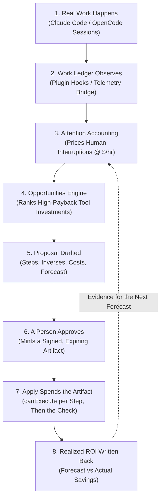

# Ambit reference

This is the long-form reference for how Ambit models capability. The [README](../README.md) covers getting started and the three surfaces; this covers the model underneath, every command and tool, and the map in full. The argument for building it is [why-ambit.md](./why-ambit.md); the theory under that is [the affordance frontier](./affordance-frontier.md).

<details>
<summary><b>Contents</b></summary>

**The model**

[The core idea](#the-core-idea) · [What a node is](#what-a-node-is) · [Reaching further](#reaching-further) · [People in the graph](#people-in-the-graph) · [Runtimes are nodes, not owners](#runtimes-are-nodes-not-owners) · [Infrastructure belongs in the graph](#infrastructure-belongs-in-the-graph) · [Capability and authority are different things](#capability-and-authority-are-different-things) · [The frontier ledger](#the-frontier-ledger)

**What gets recorded, and what it buys**

[The work ledger](#the-work-ledger) · [The economic loop](#the-economic-loop) · [Previewing a change](#previewing-a-change) · [Delegation records](#delegation-records)

**The surfaces**

[The full CLI surface](#the-full-cli-surface) · [The full MCP surface](#the-full-mcp-surface) · [The map, and what it is allowed to do](#the-map-and-what-it-is-allowed-to-do)

</details>

---

## The model

### The core idea

Configuration tells you what is declared. Ambit tries to tell you what those declarations amount to: what the setup can do, composed from its pieces, proven by checks, and kept apart from what it is allowed to do. [The ideas behind Ambit](./ideas.md) is that claim in one page, with what is new in it.

A capability in a tool registry looks like *"GitHub access: yes."* The useful form is closer to:

> Can diagnose a failing service, modify its repository, deploy a fix, verify recovery, and report the intervention, because the system currently has repository write access, shell execution, deployment credentials, monitoring visibility, network reachability, persistent execution, and the required human authorization.

That second description is **effective capability**, and it is the object Ambit is built around. Getting there means keeping apart three things that ordinary registries collapse into one:

```
installed ≠ working ≠ authorized
```

- **Reached** is installed: something in a config provides the capability, and every one of its required prerequisites is reached too. A capability can be provided and still blocked, and when its last prerequisite arrives it is reached with nothing new added for it. That is how composition shows up. Reached is the capability's `state`.
- **Proven** is working: reached, and its declared check last passed with a clean record (lifecycle `verified` or `reliable`). A capability never checked, or with no check declared, is reached and unproven: it still counts and stays usable. A failed last check (`broken`) takes it out of every plan, permission and ranking, and the next pass puts it back. Checks only ever take away; nothing waits for a check before it counts.
- **Permitted** is authorized: a grant says whether an action may run without asking, after asking, or not at all ([Capability and authority are different things](#capability-and-authority-are-different-things)).

Your ambit is everything reached. Proven is the part of it there is evidence for, and permission is a separate layer over both. Ambit records the first two per capability, as `state` and `lifecycle`, and resolves the third from grants each time it is asked.

The roadmap argues for finer distinctions along the same chain: callable apart from installed, appropriate apart from authorized, delegated when another party supplies a step, persistent when it can act beyond one session. They are directions, not states the product records; what it records is `state` and `lifecycle`. Two pieces exist already: `lifecycle` tells `reliable`, five passing runs in a row, apart from `verified`, and a step a person supplies is modelled as a Joint capability ([People in the graph](#people-in-the-graph)).

Not every capability declares a check. Those that do are proven by it, and an action can declare one too: `ambit verify act:version-control/commit_changes` proves the action and not the capability that confers it. A device or service the infrastructure manifest names is checked by `ambit incidents` asking the URL the manifest gives it ([Infrastructure belongs in the graph](#infrastructure-belongs-in-the-graph)). Nothing applies without a signed approval artifact and a per-step `canExecute` pass, and how the reached set changes over time is recorded in [the frontier ledger](#the-frontier-ledger).

```
ambit verify            # run the declared checks, record what happened
  checked: 8 · verified: 8 · failed: 0
  Local Runtime   verified   23ms   reliability 4/4

ambit authority         # reached is not the same as permitted
  autonomous      File Editing · Parallel Execution
  needs approval  Shell Execution · Version Control · Continuous Delivery
  forbidden       Secret Management

ambit authority version-control    # and permission is finer than a capability
  exercisable     read_repository · commit_changes
  needs approval  push_branch · merge_to_default

ambit goal offline-capable
  goal: Offline Capable · steps: 2 · estimated setup: 25m
  1. Embeddings   2. Local Embeddings
```

### What a node is

Every node says what kind of thing it is, and every edge says what the relation means:

```
capability   an action the system can bring about: the curated model's nodes
action       one concrete thing a capability confers, or that a person supplies
provider     what supplies a capability: an MCP server, a skill, a tool
resource     what a provider needs: a model, an inference endpoint, a machine
actor        a person: authority, money, judgment, physical access
runtime      an agent runtime, which contributes providers and does not own them
credential   what a provider authenticates with: the identity of one, never the secret

provides · contributes · requires · optional · authorizes · runs_on · uses
```

The graph holds every entry your configs declare and every capability as a node. The map draws the curated part of it, the tree, with your position on it, and My Setup lists the entries ([the map](#the-map-and-what-it-is-allowed-to-do)).

**Actions.** A capability can declare a `contract.can`, the actions it confers, and each becomes a node with its own authority. That is what lets the model say *may read the repository, may not merge to its default branch*, which the coarse node cannot. `ambit authority <cap>` reports them; the map leaves them out of its era columns on purpose, because legibility is the point of that view.

**Lifecycle.** Alongside `state`, each capability carries a lifecycle derived from its providers and its recorded evidence. The argument for keeping the two apart is in the README, under [Configured is not working](../README.md#configured-is-not-working); what follows here is where the lifecycle values come from.

| Lifecycle | When it holds |
| :--- | :--- |
| `unknown` | nothing supplies it |
| `detected` | something supplies it, but it is not reachable yet |
| `configured` | reachable, with no check run against it |
| `verified` | its check passed, and has not been run often |
| `reliable` | five runs or more, and the last five all passed |
| `degraded` | the last run passed, and recent ones did not: recovering |
| `broken` | the last run failed |

`verified` and `reliable` are proven. `configured` is reached and unproven, and counts. `broken` is failing: still reached in `state`, and left out of everything that decides availability. The latest check decides, so `degraded` is recovering: usable, counted with the unproven because its record is mixed, and named wherever a summary would otherwise read as fixed, with how its recent runs went ("2 of the last 5 passed"). Nothing writes the column directly. It is recomputed from the evidence on seed and after verification, which are the two moments the inputs can change. A failing capability comes back the same way it left, on a check: `ambit verify <id>` re-runs one, and `ambit verify --failing` re-runs every check that is failing or recovering now, which is the command to type after fixing a shared token or a server. One pass brings a capability back into every plan, permission and ranking. It reads as proven once its last five runs pass, and a grant waiting on a threshold still widens only on a window with no failure in it. Nothing re-runs a check on its own, since a check is a command.

**Credentials.** A credential is declared, never read. A `credentials` block names one and the providers that present it:

```json
{ "credentials": {
    "github/user-token": { "name": "GitHub user token",
                           "used_by": ["mcp:github", "tool:bash"] } } }
```

No secret is read or stored. Only the name, the holders and a note are consulted, so there is no field a value could arrive in and no column it could be written to. Sharing is declared, never inferred: guessing it from environment variable names would produce a redundancy claim nobody made, and a wrong one is worse than none. What the declaration changes is under [Reaching further](#reaching-further), in what the reach rests on.

### Reaching further

Your ambit widens one capability at a time, and the graph says which one to reach next and what would come with it.

The curated tree is authored content, the same for everyone: each node names the capabilities it requires, and a machine differs only in where it stands on the tree. Every curated node is a **combo**, a capability the tree defines as composed from others, which is why every curated id is in the `combo:` namespace (`combo:shell-execution`). A `combos` block in your own config defines more, for compositions specific to your work. Ambit never infers one from a config, since a combo is a judgment about what composes. The tree's nodes sit in eras, and later eras depend on earlier ones. Eras describe ordering, not importance.

- **Frontier**: the edge of your ambit, everything reached with the next steps just past it. Every seed records it, so it has a history ([the frontier ledger](#the-frontier-ledger)).
- **Next step**: unreached, with every required prerequisite reached and nothing in a config providing it yet. One acquisition reaches it.
- **Blocked**: a required prerequisite is missing. Usually the most informative state, because it names what to add: Retrieval configured with no vector store.
- **Near miss**: one or two required prerequisites short, so one or two acquisitions reach it and whatever waits on it. `ambit_near` lists them over MCP, each with what to add, or what to re-verify where the missing prerequisite is configured but failing.
- **Keystone**: a capability many others depend on. The map marks one with three or more dependants; `ambit status` lists the same idea as bottlenecks, counting only the combos it unlocks, so the two lists overlap without being identical.

`ambit next` names a few capabilities worth reaching, each with why and a price. It ranks by what has actually blocked work first, from the deficits the ledger holds, then by how much each opens per hour of setup, and it says which basis it used. `ambit graph combos` lists the combos not yet reached whose required prerequisites all are: compositions you already hold every piece of. `ambit goal <cap>` routes the longer way to one capability, step by step, and `--simulate` shows what reaching it would bring with it ([Previewing a change](#previewing-a-change)).

**A spec asks the same question once per task.** `ambit goal --spec specs/001-team-billing` reads a [Spec Kit](https://github.com/github/spec-kit) feature (its `tasks.md`, and the tools its `plan.md` names under Technical Context) or an [OpenSpec](https://github.com/Fission-AI/OpenSpec) change, and answers before an agent starts on it. Each task line goes through the words `ambit goal "<sentence>"` matches and counts toward the capability those words recommend; the plan's Primary Dependencies, Storage and Testing go through the patterns a seed matches config entries with, so `Stripe` reaches Payments. The answer lists what is reached, what is failing its check, and the steps left in the order one plan would close them, a prerequisite several needs share listed once, ahead of them all. A task no words cover is listed as routed nowhere, never guessed; `--judge` puts those to a judgment model on this machine. The spec is read as data: no command in it runs, no link is followed, a fenced block is skipped, and only markdown is opened. `ambit_goal` takes the same path as `spec`.

**What the reach rests on.** A wider reach is worth what holds it up. Fragility is the guardrail on widening, not its purpose: it says which reach is safe to lean on. `ambit impact <id>` follows dependencies all the way down and names what would stop if one piece went, and what survives on another provider. `ambit status` lists the single points of failure, reached capabilities with one provider, and the map's outage simulation draws the same cascade.

**Redundancy is counted by what fails together.** A capability with three providers survives losing one, unless all three present the same token. Counting providers assumes they fail independently, and providers sharing a credential do not: one revocation takes all of them at once, while the capability reads as robust and, having several providers, stays off the single-point-of-failure report. Once a [`credentials` block](#what-a-node-is) declares the sharing, `ambit status` lists the capability among its spofs, `ambit impact` calls what survives `nominal` and not `redundant`, and `ambit credentials` answers the question you have before rotating a token: what stops working. Only a credential *every* provider presents counts: given providers holding `{A}`, `{A,B}` and `{B}`, losing either leaves one standing, and calling that fragile would be the same overstatement inverted.

### People in the graph

Humans supply what machines cannot (legal authority, money, physical access, judgment), so they are nodes, not users of the graph. An `actors` block declares them:

```json
{ "actors": { "kanav": {
    "provides": ["physical-access", "approve-purchases"],
    "authorizes": ["combo:continuous-delivery"] } } }
```

`provides` becomes a capability only that person supplies. `authorizes` becomes a required (hard) prerequisite, so a plan says whose step it is:

```
ambit goal continuous-delivery
  goal: Continuous Delivery
  requires person: Kanav
  steps: 1 · estimated setup: 30m
```

A plan that hides the human step reads as autonomous when it is not. A capability chain can therefore run:

```
diagnose hardware failure → request replacement → human approves expenditure
→ vendor ships component → human installs it → agent configures it
→ monitoring verifies recovery
```

A capability a person approves or supplies is a **Joint capability**, one the agent cannot supply alone, and so is one that runs on your machines. It belongs to the human-machine system, not to either half, which lets partial, structured autonomy be described as it actually is instead of forced into "fully autonomous" or "human controlled". The map marks a joint capability with a person or a device, and the detail panel names who.

Every intervention is recorded. `ambit attention` counts the human acts in a window (approvals, applications, permission blocks, failed checks) and names the reducible ones: an approval given three times for the same capability is infrastructure shaped like a person, and the fix is a grant, not another reminder.

```
ambit attention 30
  interventions: 12
  3× approval: deploy to production
  2× permission block: restart svc:ollama
  2× failed: local embeddings
  reducible: deploy to production — grant bounded authority rather than approving each time
```

`ambit notify <topic>` pushes that digest to [ntfy](https://ntfy.sh), and only when a topic is given. Nothing leaves the machine otherwise; the push is a single HTTP POST of the digest text, no graph data.

### Runtimes are nodes, not owners

Ambit represents agent runtimes instead of being one. A runtime becomes a node, and everything it contributes hangs off it, so two runtimes configuring the same MCP server produce **one capability with two providers**, not two capabilities.

`ambit seed` finds the runtimes on this machine by itself: OpenCode, Claude Code, and the MCP config of every other client it has a reader for, Cursor and Windsurf among them. [Where each AI agent keeps its MCP config](./mcp-config-locations.md) lists the files it reads. From Claude Code it takes more than servers: `~/.claude.json` and `~/.claude/` give MCP servers global and per project, skills, subagents and a pinned model, plus the authority the runtime states outright, its permission mode and how many allow, deny and ask rules are in force. It counts the rules and never copies them: an allow rule can name a path, and that is not Ambit's to put in a graph you may export.

The models on this machine come from the folders their servers keep them in, not from asking a running server, so discovery opens no socket. Ollama's manifests (`~/.ollama/models/manifests`, or under `$OLLAMA_MODELS`) give each model its name as `ollama list` prints it, and LM Studio's `<publisher>/<model>` folders (`~/.lmstudio/models`, or `~/.cache/lm-studio/models`; `AMBIT_LMSTUDIO_MODELS` for a moved one) give each a name when a weight file is inside. They seed as `model:local-ollama/qwen3-coder:30b` under `provider:local-ollama`, and the same for `local-lmstudio`. The `local` prefix is the one the tree already reads a local provider by: Local Runtime, Local Tool Calling and Local Embeddings recognise them, Hosted Inference does not, and the spend meter never prices one as hosted. A model deleted from disk is retired by the next seed.

`ambit impact runtime:<name>` then answers what would be lost if that runtime went away. Where another runtime configures the same servers, the answer is smaller than the runtime's capability count, because what they share survives.

**From a checkout.** The readers in `scripts/adapters/` print what a runtime provides before anything is written, and add it with `--seed`. One of them reads Hermes, which `ambit seed` does not:

```bash
node --experimental-strip-types scripts/adapters/claude-code.ts          # what Claude Code provides
node --experimental-strip-types scripts/adapters/claude-code.ts --seed   # add it to the graph
node --experimental-strip-types scripts/adapters/hermes.ts               # the same for Hermes
```

On one machine running both, that yields:

```
runtime:opencode — contributes 127 capabilities
runtime:hermes   — contributes 32 capabilities
shared by both   — mcp:fetch · mcp:filesystem · mcp:git · mcp:sequential-thinking
```

and `ambit impact runtime:hermes` leaves the shared four standing. The Hermes adapter also passes through what the runtime states about itself, such as `approvals: manual` and `cron_mode: deny`, and whether it has scheduled jobs, which is the difference between a capability that persists and one that lasts a session. Hermes has no machine-readable config export today, so the adapter reads its documented paths. That is a stopgap: the durable contract is for runtimes to publish their capability surface (`ambit graph surface` is that vocabulary) and for Ambit to consume it.

### Infrastructure belongs in the graph

Agent capabilities do not stop at the model boundary. A local GPU, NAS, browser worker, Proxmox host, database, or cloud account can all contribute to what the system can accomplish.

Ambit scans infrastructure from an explicit local manifest (`INFRA_MANIFEST`, default `~/.config/opencode/infrastructure.json`) and from the local Docker socket when one exists (`DOCKER_HOST=unix://…`, `/var/run/docker.sock`, or the per-user socket Docker Desktop, OrbStack, Colima and Rancher Desktop leave). The socket is read with one `GET /containers/json`: every container, running or not, becomes a service on a `device:docker` node, with its image, state, published ports and compose project. A TCP `DOCKER_HOST` is never probed, and nothing here can start or stop a container. With no manifest and no socket it returns an empty scan, not an error: no host addresses are baked in.

The Infra tab in My Setup draws that scan as a table: a status, a name, how old the reading is, and for each machine what an agent may do there. The modes are the gate's answer with the machine as the target (`device:nuc`), for the actions the tree gives Shell Execution, so they differ between machines only where a grant is scoped to one. They come from this machine's own grants, and a forbidden grant wins at any scope, as it does for `apply`. The gate does not apply a capability's grants to the actions it confers, so the tab also asks about Shell Execution itself and shows the stricter answer wherever that one speaks to the machine. Two times sit on a row and are never the same one. Probed is the age of the scan in front of you, and a row the scan had nothing to probe says so. Last seen is when `ambit incidents` last got an answer from it, read from the graph, so a machine that has gone quiet reads as days old and never as just now; a row with no answer recorded shows a dash. The scan itself records nothing.

The manifest is not specific to servers. A device is anything that can act (a Pi, a GPU host, a robot arm, a sensor, a decoder), and they seed as first-class nodes in a `physical` domain. Devices and services seed into the engine graph itself: a device is a `resource` with a `runs_on` edge to every service hosted on it, so `ambit impact device:nuc` answers what actually breaks when the machine disappears, and a plan can point at capacity the graph counts. Whether that generalization is the right one is argued in [the affordance frontier](./affordance-frontier.md); what is implemented is that the model does not assume software.

```json
{
  "devices":  [{ "id": "nuc", "name": "NUC", "statusUrl": "http://nuc:9000/health", "tags": ["gpu", "always-on"] }],
  "services": [{ "key": "ollama", "label": "Ollama", "host": "nuc", "url": "http://nuc:11434/api/tags", "tags": ["inference"] }]
}
```

A device or service may carry `tags`, the person's own labels for it. They seed onto its node, are written again on every seed so a tag taken out of the manifest leaves the graph too, and show under its name on the Infra tab and in the `ambit incidents` report.

Reachability is evidence. `ambit incidents` probes each device's `statusUrl` and each service's `url`, only when typed or when an agent calls `ambit_incidents`, and records every probe as a check run on that node, the same row `ambit verify` writes. A 2xx passes; no answer, or any other status, fails. So a service that stops answering reads `broken` and is left out of every plan, permission and ranking, and its probes passing again bring it back by the rule every check follows. An answer of any status also stamps when the node was last seen, and the machine a service runs on with it, since the reply came from there; a probe with no answer leaves both times as they were. What rests on a failing device or service is not taken away. A capability it provides (a service named for a local runtime provides Local Runtime, and any device provides Self-Hosted Stack) stays reached and keeps its own lifecycle, while a grant that would run it unattended asks a person until the probe passes, which is what any failing hard prerequisite already does to a grant, and the narrowing is written to the delegation records `ambit delegation` reads. A service on a device whose status URL stops answering is narrowed the same way. `ambit verify` has no command to run for these, so `ambit status` and `ambit verify --failing` name `ambit incidents` for them. `ambit sync export` leaves out when each one was last seen, a reading of this machine's network, and its tags, which each machine seeds from its own manifest; the check runs travel as every check run does.

The goal is not another homelab inventory. It is to treat infrastructure as capability-bearing:

```
GPU node
  ├─ local inference
  ├─ embeddings
  ├─ batch evaluation
  └─ private processing
```

A machine matters because of the actions it makes reachable.

### Capability and authority are different things

Being technically capable of an action should not imply permission to perform it. Each action has a grant in one of three modes, and an action no grant covers is refused:

```
autonomous   runs without asking
confirm      runs once a person says yes; for apply, a signed approval
forbidden    refused, and no narrower scope reaches it
no grant     refused until someone grants one
```

This lets technical capability accumulate without silently broadening authority. It is not a restriction on the capability model; it is what makes a larger capability surface governable. Proposing more capability and granting more authority stay separate acts: approving a proposal mints an artifact that `ambit apply` spends, and never writes a grant.

Authority is recorded per action, and from two sources. The curated model says what an action is like in general; the runtime that would execute it says what it permits here: Claude Code's `permissions.defaultMode`, which `ambit seed` reads, and Hermes's `approvals.mode` and `approvals.cron_mode`, which its adapter passes through. Where the two disagree the narrower wins, and `ambit authority` names which source narrowed it. A runtime's setting is stored once against the runtime and reaches every capability it contributes and every action those confer; `ambit authority` and the gate behind `ambit can`, `apply` and the control plane resolve it through the same reach, so the report can never be stricter than what is enforced.

**How grants resolve.** A forbidden grant wins outright, at any scope: a narrower scope is never a way to reach something refused. It covers what it names, though, and at the gate a forbidden grant on a capability does not by itself cover the actions that capability confers. After `ambit authority grant shell-execution forbidden --scope=device:nuc`, the gate still answers `act:shell-execution/read_output` on that device from the action's own grants; [the interface specs](./interface-specs.md) keep this on their Open list. Among the grants left, the most specific scope that covers the target decides, ties going to the narrower mode, so "autonomous on staging" can beat a standing "confirm everywhere" on staging and nowhere else. A question that names no target is inside no scope, so a scoped grant may narrow it and never widen it.

**Where it is enforced.** `ambit can <cap> [--target=X] [--spend=N]` is the decision API, with the spend in dollars as a budget is set in them: it returns ALLOW, CONFIRM or DENY with the governing grant, the scope, and the remaining budget. Three places act on that answer:

- `ambit apply`, always. It needs a signed, unexpired approval artifact and refuses any step `canExecute` denies.
- The control plane interceptor, when execution is routed through it. Behind it sits `simulatedAdapter`, a fixture, unless the person starting it chose the Docker adapter (`AMBIT_ADAPTER=docker`), which runs an approved step's command in a throwaway container with no network and no host mount. The gate decides before either is reached, and whether a step may use the network is a grant of its own: the `network` action on the step's capability has to answer ALLOW, which neither the approval nor break-glass supplies.
- Claude Code, if you opt in with the `ambit-gate` plugin or the same hook added by hand. `ambit gate` is a PreToolUse hook that finds the capability a call exercises (by the tree's own `detect` patterns, the matching failures use) and answers. It can only narrow. Forbidden or over budget is a deny; no grant yet, a failing check, or asking first is put to the person; allowed, or a tool the graph does not know, is no answer, so Claude Code's own permission settings decide. It never answers allow, and a call it cannot read is no answer. It adds about an eighth of a second to each call.

No other runtime is interposed yet: one that never calls `ambit can` is unaffected by any grant here.

Whether an action may run comes from a grant a person set in advance, and nothing an agent reads can widen it. A calibrated classifier's probability is read from state an agent fetched, and whoever wrote that state can steer it, so a classifier may help decide what to try and never stands in for a grant. [Ambit and Jev](./jev.md) says where a typed judgment model fits.

### The frontier ledger

`capabilities` holds the present state and is overwritten on every seed, so on its own the graph can only say what the system can do *now*. Every seed also records the whole frontier, which lets it answer what was reachable at a past date:

```
ambit history since
  moved:     reached 13 to 19, 3 emergent
  frontier then: 13
  frontier now:  19
  gained:    Embeddings · Local Embeddings · nomic-embed-text
  emergent:  Model Routing · Offline Capable · Subagents
```

One embedding model was added. Six capabilities moved. The three under `emergent` became reachable although **nothing providing them was added**: their prerequisites were satisfied by something else entirely. Offline Capable was already provided by an agent that did not change.

That is the entry a per-component changelog structurally cannot produce, because no single change explains it. Accumulated capacity to act is a graph property, and this is where it shows up.

A fourth class, **vocabulary**, exists to keep `gained`, `emergent` and `lost` honest. When Ambit starts modeling a part of your system it did not model before, such as a new action on a contract or a capability added to the curated tree that your existing tools already provide, the node is new and nothing about the machine changed. Those are described and not counted, so `frontier_now` stays comparable with `frontier_then`:

```
ambit history since
  moved:     reached 21
  frontier then: 21
  frontier now:  21
  vocabulary: 12   act:shell-execution/run_command · act:file-editing/write_file · …
```

Without it, upgrading Ambit would read as a dozen capabilities acquired on a machine where nothing happened, which is exactly what the ledger exists not to say.

The map reads the same ledger as a timeline under it, opened from its History button or by a link that names a moment. `GET /api/frontier` serves one tick per second in which a snapshot was taken; two snapshots inside one second are one tick showing the later, because a second is all a timestamp can name. Each tick carries what the snapshot holds, state, kind and lifecycle per capability, and the step since the tick before in the words `ambit history since <then> <now>` prints for the same two observations, since the terminal, MCP and the page share one comparison. Scrubbing redraws the map from the snapshot's states over today's names, eras and edges, which no snapshot stores. Grants, providers and attention are not stored either, so while the playhead is in the past the lenses that read them and the simulations stay off, never drawn from today. The playhead travels in the link as `at`, a timestamp and not a snapshot id, and a second the ledger does not hold opens on now.

---

## What gets recorded, and what it buys

### The work ledger

The work ledger that `attention` reads is written by observation, not by hand. Three bridges write it once installed:

- **Claude Code.** The `ambit` plugin's hooks record which tools a session ran, which failed and with what error, and when a person was asked, never a tool's input or output. The next `ambit` command reads that into the ledger, with each ended session's token counts per model, and `AMBIT_NO_LEDGER=1` turns it off. The transcript states no price, so the counts carry none until a person declares one for the model; from then on each session's new tokens on it are priced when they are recorded, never twice, and the cost is a spend on Hosted Inference's budget when one is set.
- **OpenCode.** Copy `plugins/ambit-telemetry.js`, which ships with the package, to `~/.config/opencode/plugins/`, and every tool execution in an OpenCode session lands in the ledger as a work event, each one that worked as a use of what the tool exercises, and every permission prompt as an `authority` intervention.
- **Cursor.** `ambit connect cursor --ledger` adds `plugins/cursor/ambit-ledger.mjs` to `~/.cursor/hooks.json` on `afterShellExecution`, `afterMCPExecution`, `postToolUseFailure` and `sessionEnd`, and it appends to the Claude Code spool, each line marked `src: "cursor"`. A conversation is one run. A shell command is a use of the shell entry (`tool:bash`) and an MCP call is named `mcp__<server>__<tool>`, as Claude Code names one, so the gate's one rule says what each exercises. A failure carries Cursor's `failure_type` as the error kind it stated, and the engine classifies it; one Cursor marks as an interrupt is recorded as stopped. Cursor's hooks report neither tokens nor a person being asked, so a Cursor run holds neither, and none of its hooks is a permission hook, so it never stands between a call and Cursor's own settings.

Token counts also come from the session logs Codex, OpenCode and Amp keep, with nothing installed: Codex's JSONL rollouts in `~/.codex` (or `CODEX_HOME`), OpenCode's SQLite database in `~/.local/share/opencode` (or `OPENCODE_DATA_DIR`), opened read-only, and Amp's thread files in `~/.local/share/amp` (or `AMP_DATA_DIR`), the same records [ccusage](https://github.com/ryoppippi/ccusage) reports from. Each session is a run whose source names its runtime (`codex-log`, `opencode-log`, `amp-log`), holding its tokens per model as fresh input with cache writes, cache reads, output, and reasoning where OpenCode counts it apart, priced at the declared output price as OpenCode prices it. Codex writes a cumulative total beside each turn's own count; a turn is counted once, from its own count or the difference of the totals, and a forked session's replayed history is skipped. OpenCode's tokens are summed over each model call, since a message holds only its last call's, and a fork's copied messages are left out. A session's log is read again as it grows, and only what its run does not hold yet is recorded, so the same tokens are never counted twice. A cursor per file makes a read that finds nothing new cost a `stat` per log, and it stays out of `ambit sync`, which carries the runs and their tokens. `AMBIT_NO_LEDGER=1` stops the reading, and `ambit usage --refresh` reads every log again from the top. The price rule is the one the Claude Code read uses; a session older than a budget's period is priced and spends nothing against it, so a first read of last year's sessions cannot exhaust this month's ceiling.

The Claude Code and OpenCode bridges time a call from the hook before it to the hook after it, pairing the two by the runtime's id for the call, and the use starts where the call did. A call whose start was not seen has no length. Neither does a call a person was asked to approve while it ran, since the runtime asks after that first hook and the span holds the person's wait; when the ask does not name its call, every call open in that session at the time goes untimed. Cursor states each shell command's and MCP call's length itself, with the wait for approval left out, so its bridge pairs nothing and dates the use that long before the hook ran. `ambit work` and `ambit usage` sum the lengths that exist and say how many uses that sum covers. The control plane still writes a fixed length for the execution it gates.

Anything else can post to the visualizer API's loopback `POST /api/telemetry`, which speaks the ledger's own verbs (`run`, `end`, `event`, `use`, `intervention`, `resource`, `outcome`, `failure`), so a runtime adapter records actual work without knowing the schema. A `use` may name the `tool` that ran in place of a capability, and the engine records it against whatever that tool exercises, as the gate would find it. From a checkout, `scripts/adapters/telemetry.ts` is the ingestion client: stdin, one JSON object per line, each posted there.

```bash
echo '{"run":{"goal":"recover production service","runType":"incident"}}' \
    | node --experimental-strip-types scripts/adapters/telemetry.ts
```

The endpoint is loopback-only and origin-allowlisted like every other route, and it needs the API token, because work recorded there counts toward promotion. The server writes the token to `~/.config/opencode/ambit-api.token` when it starts, and the adapter and the OpenCode plugin read it from there or from `AMBIT_API_TOKEN`. A telemetry payload is structured data, never a command.

Failures land in the ledger too, classified from what a runtime states outright: a shell's own message for a missing binary, an MCP error kind, a permission refusal. Nothing reads what the failure was *about*. So `deficits` and `opportunities` stop saying "nothing observed" within a day of real work, without anyone remembering to record anything, and `ambit signals` is the raw view, including the failures no capability could be attributed to. Those are a gap in the model, not in the environment.

`ambit work` reads the ledger back: each run with its elapsed time, events, capabilities exercised, interventions, resources, and outcome. `ambit usage <days>` aggregates where effort went per capability, the raw material the opportunity engine ranks.

### The economic loop

The graph half answers *what can this system do*. The loop that pays for it answers *where is the scarce resource going, and which durable fix is worth the next dollar or hour*:


```mermaid
flowchart TD
    WORK["1. Real Work Happens\n(Claude Code / OpenCode Sessions)"] --> TELEM["2. Work Ledger Observes\n(Plugin Hooks / Telemetry Bridge)"]
    TELEM --> ATTN["3. Attention Accounting\n(Prices Human Interruptions @ $/hr)"]
    ATTN --> OPP["4. Opportunities Engine\n(Ranks High-Payback Tool Investments)"]
    OPP --> PROP["5. Proposal Drafted\n(Steps, Inverses, Costs, Forecast)"]
    PROP --> APP["6. A Person Approves\n(Mints a Signed, Expiring Artifact)"]
    APP --> APPLY["7. Apply Spends the Artifact\n(canExecute per Step, Then the Check)"]
    APPLY --> ROI["8. Realized ROI Written Back\n(Forecast vs Actual Savings)"]
    ROI -.->|"Evidence for the Next Forecast"| ATTN
```

- `ambit attention` prices the human half of the ledger and **classifies agency**: clerical, exception, physical and authority-as-repeated-gate are reducible (*the human is the duct*), while judgment and knowledge are keepers, never proposed for removal however often they recur.
- `ambit economics` is the declared model: attention value per hour, purchase and recurring costs, goal values, and what a model's tokens cost. Dollars declare, cents store. An undeclared actor's attention defaults to $250/hr and is reported as such; a model's price has no default. `ambit economics price <model> --input=5 --cache-read=0.5 --output=25` declares one in dollars per million tokens, all three parts, under the exact name a Claude Code transcript records, and a config's `economics.models` block takes the same three as `input_per_mtok`, `cache_read_per_mtok` and `output_per_mtok`. Cache writes are counted with fresh input, so the input price covers both.
- `ambit opportunities` ranks the durable fixes: observed middleware burden priced by attention value, acquisition cost, expected effect, payback, confidence (high = observed five-plus times, low = deficits only). Rank by `--by=attention|cash|roi|reliability|frontier`, or allocate a budget: `--budget=N` returns the best combination of investments within $N. Each opportunity carries its acquisition options from the catalog, so it is a purchase decision, not a report.
- `ambit roi` closes the loop. With a proposal id it measures before/after on the affected capability (interventions, human hours, attention dollars, verification failures) and returns a verdict (performing near forecast, above, below, too early). With no argument it is the cumulative headline: hours and dollars saved per year and forecast accuracy, written back so the next prediction has evidence to learn from.
- `ambit incidents` probes the infrastructure manifest, records each answer as a check run on the device or service it asked, opens an incident run for every offline service, records detection, resolves the recovery against authority, and closes it with MTTR from the ledger's own timestamps.
- `ambit audit` is the governance trail: a run end to end, a proposal's steps/approval/enforcement/result, or one person's approvals and interventions.
- `ambit portfolio` reads `federation` imports across environments: the same human burden recurring in several places, person-specific SPOFs, and where capex would produce the most. A portfolio layer reads signed receipts; it never merges graphs, and the receipts carry aggregates only, no credentials and no raw sessions.

The graph half is useful the moment you seed. `status`, `briefing`, `next`, `plan`, `verify` and `authority` need no telemetry at all.

### Previewing a change

`ambit goal <cap> --simulate` computes the frontier as it would be, without touching anything. What makes it worth reading is the `unblocked` line:

```
ambit goal vector-store --simulate
  frontier before: 21
  frontier after:  23
  acquired:  Vector Store
  unblocked: Retrieval          # already provided, waiting on the prerequisite
```

`ambit propose` turns that into a reviewable draft (ordered steps, the alternative chosen, and what it costs beyond time):

```
ambit propose retrieval
  Retrieval · 25m
    Embeddings     nomic-embed via local runtime      none / local
    Vector Store   pgvector on existing Postgres      none / local
  simulated:
    frontier before: 21
    frontier after:  24
  applicable: false
```

Choosing the hosted alternatives (`ambit propose retrieval 1`) takes it to 13 minutes, at a per-token bill and a data boundary.

Where an acquisition genuinely *is* a config change, the step carries a declarative patch and Ambit derives its undo, removing what it adds or restoring what it overwrites. Anything needing an installer gets no inverse, and a proposal is `applicable` only when every step has one.

```
ambit approve prop-msrrv9c2 kanav
  proposal: prop-msrrv9c2 · goal: Web Research
  approved by: Kanav · applicable: true
  note: Approved. Every step has an inverse. The approval artifact is signed and expires in 24 hours.
```

Approval mints a **signed artifact**: proposal hash, actor, budget, scope, expiry, timestamp, HMAC-signed with a machine-local key (`AMBIT_APPROVAL_KEY`, default `~/.config/opencode/ambit-approval.key`). It is also minted by the browser broker, `POST /api/proposals/:id/approve` (loopback, origin-allowlisted), which approves and signs but never applies. The visualizer's AG-UI stream surfaces the approval as a toast telling you exactly which terminal commands to run.

```
ambit apply prop-msrsqzij
  applied: true · keys: mcp.fetch
  backup: opencode.json.ambit-prop-msrsqzij.bak

ambit rollback prop-msrsqzij
  removed: mcp.fetch          # git survives — the inverse reverses only this
```

`apply` checks the artifact and each step's `canExecute`, writes the patch, and runs the goal's check when it declares one; a check that fails there reverses the change. Approval and apply stay off the MCP surface: an agent may draft, preview, and ask, but never approve or apply. Proposing more capability and granting more authority are different acts, and the artifact is what keeps them apart.

### Delegation records

A grant that stopped running unattended because what it rests on started failing leaves a record: which capability failed, which grant rested on it, and what the grant became. `ambit delegation` writes those records, lets a person contest one, and reads the same kind of record from other systems as evidence. The format is [STD-07 Revisable Delegation Records](https://ethotechnics.org/standards/std-07-revisable-delegation-record): an append-only, hash-chained stream that another system can read as evidence and never as an instruction, without sharing Ambit's database.

The standard describes the loop an institution runs when it delegates consequential work to machines: believe, know what can be done, decide what authority is justified, act, detect mismatch, revise. Five systems each hold a step of it. Ambit holds two, capability and authorization. The siblings are [Whether](https://github.com/zz-plant/whether) (act), [Refract](https://github.com/refract-org/refract) (discrepancy), [NextConsensus](https://nextconsensus.com) (belief), and [Ethotechnics](https://ethotechnics.org) (the record shape).

**The grant holds only while what it rests on does.** A capability whose hard prerequisite has started failing no longer runs unattended: `ambit can <capability>` returns CONFIRM instead of ALLOW and names what took it down. The declared grant is not rewritten, since what a person wrote down stays written down; the narrowing is a property of the decision, so it lifts by itself when the check passes again. A declared sandbox is exempt, because consequences are contained there.

**The export.** `ambit delegation --export` writes newline-delimited records. Four kinds are written automatically for every grant currently narrowed: the `capability` that broke, the `authorization` that rested on it with `depends_on` and `invalidated_by` populated, the `discrepancy`, and the `revision` superseding the authorization. The stream is append-only and hash-chained; `ambit delegation verify` recomputes it. Conformance level 2, declared in [`server.json`](../server.json) and measurable with the [record conformance checker](https://ethotechnics.org/diagnostics/record-conformance).

**A record can be argued with.** Every record names who may contest it: an exercise of authority names the people it binds, and an observation names anyone who can re-run the check. `ambit delegation object <record> --by --basis` writes the challenge as an `objection`; `ambit delegation answer <objection> --by --because [--refuse]` writes the answer it is owed; `ambit delegation objections` lists the unanswered. Neither widens authority: an objection that reopened an unattended grant would make the gate negotiable, so widening still costs what it costs, which is fixing the capability or re-declaring the grant. A stream containing an objection and its answer measures at level 3.

**Reading another system's records.** `ambit delegation ingest <file>` takes an STD-07 stream and records its `discrepancy` records about capabilities this graph knows, as evidence attributed to the sender. Three limits, each deliberate. It never moves a lifecycle, so no remote system can narrow a grant here by sending a file. Only `discrepancy` records are read, because a foreign `authorization` is that system's account of its own grants, and importing it would import authority, not evidence. A subject this graph has never heard of is reported as unmatched, not dropped, since a sender and receiver disagreeing about what exists is the most useful thing a first integration can tell you.

**Sources are read without being asked.** `ambit delegation source add <id> --system --instance --from --by` declares where a system's records arrive, and a full `ambit verify` reads every enabled source from then on. A local path, deliberately: an outbound read on the verification path would put a remote host between this graph and its own evidence. A source that cannot be read records why and verification continues. `ambit delegation sources` shows when each was last read and what happened. `server.json` names no peer: its `upstream` points at these declarations, and there are none until you add one.

**The source that works is another Ambit.** A peer runs the same tech tree, so it names capabilities identically, which is the whole reason its discrepancies are legible here; nothing else in the loop shares the vocabulary. A source must say which environment it is (`--instance`), because two graphs on the same tree produce identical record ids, and declaring this environment as a source is refused. When the laptop reports `combo:shell-execution` broken, the server records that as evidence attributed to `std07:ambit/laptop` and its own grant on `act:shell-execution/read_output` still returns ALLOW; on the laptop, where the check actually failed, the same grant returns CONFIRM. A peer can tell this graph something. It cannot revoke anything in it.

**What is not there yet.** `action` and `outcome` records: the environment adapter is simulated by default, and the opt-in Docker one runs a step in a container on this machine that nothing else depends on, so an action record from either would attest to no change in a system anyone relies on. Only Claude Code can be made to consult the gate, through the `ambit gate` hook; any other runtime that never calls `ambit can` is unaffected by any of this. And no sibling yet consumes what Ambit emits; the reading edge runs one way.

---

## The surfaces

### The full CLI surface

Run `ambit` with no arguments and it shows where the environment stands; `ambit help --all` shows the surface. The commands group under five nouns, and the grouping is presentation only: every verb also works flat, so `ambit impact x` and `ambit graph impact x` are the same command:

```
           seed · briefing [--json|--peek] · status · next [n] · help [term]
graph      impact <id> · catalog <cap> · where · skills · objects [target]
           share [--redact] [--out=path] · sync export|import <path>
           graph [surface|combos|affordances|unmapped|capacity]
plan       goal <cap-or-sentence> [--paths|--simulate|--prefs|--judge[=url]] · next [n]
           goal --spec <dir|tasks.md> [--judge[=url]]
           reversible
           opportunities [--by=…] [--budget=N] · opportunity <id>
           propose <cap> [option] [--for="…"] [--by=<who>] · roi [proposal-id]
           portfolio [--budget=N]
check      verify [cap] [--history] [--target=<object>] · verify --failing
           authority [cap] [scope <target>]
           authority promote [<cap> <action> --after=N --window=30d --scope=X --by=<person>]
           authority grant <cap> <mode> [--ttl=30m] [--scope=X] [--by=<person>]
           authority sandbox [<target> --by=<person>] · budget [set|clear]
           can <cap> [--target=X] [--spend=N] · gate (the Claude Code hook) · credentials
           incidents · incident resolve <svc> <outcome>
           doctor · connect [runtime] [--ledger] [--statusline] [--dry-run]
           init-rules [target] [--dry-run]
           receipt [hours] · ci [--strict] [--markdown]
govern     people [add <id> ["Name"]]
           proposals [--pending] · proposal <id> · approve <id> [<id>…] <person>
           reject <id> <person> ["why"]
           apply <id> · rollback <id> · dispatch <id> [--to=<url>]
           history [since <when> [<until>]]
           audit [run-…|prop-…|human:name|days]
           delegation [verify] [--record] [--export] · delegation ingest <file>
           delegation object|answer|objections · delegation source add|sources|pull
report     work [limit] · usage [days] · economics [price <model>] · attention [days]
           digest [days] · notify <topic> · notify-approvals <topic>
           record <cap> [class] [note] · record skill:<name> --provides= --verify=
           signals [days] · preferences [--observed] · federation export|import
           statusline [--json] (the Claude Code status line)
```

Two more sit outside the groups because they start a process instead of answering a question: `ambit web` opens the visualizer (Vite in a checkout, and the built page with the loopback API server in an installed copy) and `ambit mcp` runs the MCP server. `ambit --version` prints the installed version and starts nothing.

| Command | The question it answers |
| :--- | :--- |
| **first session** — *the commands listed above the groups* | |
| `ambit briefing` | What an agent should know before its first tool call — reached and proven, configured but failing, waiting on a person, blocked recently, worth reaching next, and what changed since the last briefing. Prose, capped near 1,200 tokens, also served as the MCP resource `ambit://briefing` |
| `ambit status` | How are we doing — reached, verified, failing, recovering, SPOFs, recurring deficits, pending approvals, all in one report that ends on the one command to type next. `--json` carries that as `next`, a command and the reason for it |
| `ambit next [n]` | What to reach next and why — ranked by what has actually blocked work once the ledger has observations, and by leverage per hour of setup before then. The answer says which basis it used |
| **graph** — *the structure, and what it would cost to lose a piece* | |
| `ambit impact <id>` | What becomes unavailable if this disappears — and what survives on another provider? |
| `ambit catalog <cap>` | The ways to acquire a capability — build, buy, subscribe, delegate, hire — compared by setup, one-time and recurring cost, privacy, verification and rollback |
| `ambit objects [target]` | What may be done to a particular thing, and what has been proved about doing it *there*. Evidence about one repository is not a claim about another |
| `ambit sync export\|import <path>` | The graph and the ledger as one file, so a container rebuilt from nothing gets its history back. No authority grants, no skill check commands, no credentials — a command in a data file is a command that runs on import |
| `ambit graph` | The whole graph as JSON; `graph surface` is the runtime-owned vocabulary a runtime would publish, `graph combos` the ones whose required prerequisites are all in place, `graph affordances` the structural domains, `graph unmapped` what the agents used that no node on the map accounts for (presence, never frequency) and the overlay that would add it, `graph capacity` the machines on your tailnet and this machine's memory, naming the online ones no manifest declares |
| **plan** — *what to acquire next, and whether it paid* | |
| `ambit goal <sentence>` | Route a free-form goal — "deploy without me" — to the capabilities whose words cover it, each with its plan delta |
| `ambit goal --spec <dir\|tasks.md>` | What a spec's tasks need before an agent starts on them: each task routed as a sentence would be, each capability reached, a next step, blocked or failing, the steps in order with their setup time, and the tasks nothing routed. Spec Kit and OpenSpec, read as data |
| `ambit goal <cap> --paths` | The alternative ways to reach a capability, compared by setup time, risk and lock-in |
| `ambit goal --prefs [who]` | Who prefers what, and where a plan's default choice would fight them |
| `ambit reversible` | Which unreached capabilities could be acquired without a person, and which need hands. The same list, read backwards, is what an agent can never do for itself |
| `ambit opportunities` | Ranked structural changes worth making — observed middleware burden priced by attention value, acquisition cost, expected effect, payback, confidence. `--by=attention\|cash\|roi\|reliability\|frontier`; `--budget=N` allocates the best combination within $N |
| `ambit roi [proposal]` | One proposal's before/after verdict, or — with no argument — the cumulative headline: hours and dollars saved per year and forecast accuracy |
| `ambit portfolio [--budget=N]` | Across imported environments: the same human burden recurring in several places, person-specific SPOFs, and where capex would produce the most |
| **check** — *what is proven, what is permitted, what is currently broken* | |
| `ambit authority <cap>` | Which concrete actions does this confer, and which of them may run unattended? |
| `ambit authority scope <target>` | What a scope actually covers and what it does not — a grant scoped elsewhere is named as excluded |
| `ambit authority promote <cap> <action> --after=N --by=<person>` | The threshold that widens a grant once its evidence supports it. A person sets it once; a single failing check afterwards puts the grant back, with nobody asked |
| `ambit authority grant <cap> <mode> --ttl=30m` | Autonomy for a window and no longer. Once expired the grant decides nothing and whatever stood before it decides again; the row is never rewritten, so it stays as the record of what was granted |
| `ambit authority sandbox <target> --by=<person>` | Somewhere acting does not matter. Confirmation is relaxed inside it; a refusal never is, because rehearsing a forbidden action would be a way round it |
| `ambit budget set <cap> --amount=20 --by=<person>` | A ceiling on what can be spent in a period. A spend past it is refused until the period turns over. It bounds a grant and does not widen one: within the ceiling the grant's own mode still decides. One meter feeds it: when a Claude Code session ends, its tokens on a model with a price declared by `ambit economics price` are recorded as a spend against the unscoped budget on Hosted Inference. The limits: only a declared price, only Claude Code sessions, only a budget that exists, and only once the session has ended, so a spent ceiling stops no session under way and refuses only a caller that states its spend. `apply` and the control plane state none |
| `ambit incidents` | Probe the infrastructure manifest, record each answer as a check run and when each device and service was last seen; open an incident run for every offline service with the authority decision for its recovery. `incident resolve <svc> <outcome>` closes it with MTTR |
| `ambit doctor` | A graded summary of the setup: what is reached, proven and failing, the single points of failure, which runtimes it read, and what to run next. `ambit check` with no argument is the same report |
| `ambit connect [runtime]` | Register Ambit's MCP server in each runtime it reads except Copilot CLI, Amp and Goose, or the one named, in the shape that runtime's file uses, keeping a `.bak` of each file it changes. `--dry-run` says what it would write. `cursor --ledger` also adds the hook that records each Cursor conversation into the work ledger, beside any hooks already in `~/.cursor/hooks.json`. `claude-code --statusline` sets `ambit statusline` as the status line in `~/.claude/settings.json` where none is set, and never replaces one |
| `ambit init-rules [target]` | Write the one line an agent should follow before a tool it has not used (ask `ambit_can`) into `CLAUDE.md`, `AGENTS.md` or `.cursorrules`, for a client that does not pass a server's instructions to its model. `rules` is the same command |
| `ambit receipt [hours]` | What the ledger recorded in the last few hours: capabilities used, calls stopped before running, failures reported. It counts what was recorded and prices none of it |
| `ambit ci [--strict]` | A check for a pipeline: it fails on any capability whose declared check is failing, and with `--strict` also on anything reached and unproven or resting on a single provider, which are otherwise warnings. `--markdown` prints the result as Markdown, and under GitHub Actions it is also written to the step summary |
| **govern** — *the reviewable path from proposal to applied change* | |
| `ambit people add <id> ["Name"]` | Declare a person budgets and approvals can name. It grants nothing; it gives the trail a name to carry, and the engine refuses a decision from someone it does not know |
| `ambit proposals --pending` | The drafts waiting on a decision, each with cost, bill and what it unlocks, so approving is one sitting and not one interruption per proposal |
| `ambit reject <id> <person> ["why"]` | A refusal, recorded with its reason, so the next draft and `ambit preferences --observed` can learn the shape of a no. An approval the draft held can no longer be applied |
| `ambit history since <when> [<until>]` | What became reachable since a past date, and what emerged with nothing added? Up to now, or up to a later observation, with the step in the sentence the map's timeline prints |
| `ambit audit <run-…\|prop-…\|human:name\|days>` | The trail: who approved what, what ran, against what target, under which grant, and whether it held |
| `ambit dispatch <id> [--to=<url>]` | Push a proposal to Slack, Discord, Telegram, ntfy or a JSON endpoint: the decision for a draft, the signed artifact once approved. One-way; the reply is `ambit approve` on a machine that holds the key |
| **report** — *what the system cost to operate* | |
| `ambit attention [days]` | How much of the work still runs through the human, and which interventions are likely reducible |
| `ambit economics price <model> --input= --cache-read= --output=` | What a model's tokens cost, in dollars per million, so a Claude Code session's tokens on it become a spend against Hosted Inference's budget when the session ends. Sessions recorded before the price are not priced again, and a model with none is reported undeclared, never $0 |
| `ambit notify <topic>` | Push the attention digest to ntfy — nothing is sent without a topic |
| `ambit record skill:<name> --provides=<cap> --verify="<cmd>"` | Put a skill the agent wrote in the graph, as a provider of a capability, with the read-only check that proves it. The check is required and runs immediately |
| `ambit signals [days]` | Failures observed without anyone recording them, by class and by tool — including the ones no capability could be attributed to |
| `ambit preferences [--observed]` | What someone declared they prefer, or what they have actually approved and refused |
| `ambit federation export\|import` | The signed summary a portfolio layer reads — aggregates only, no credentials, no raw sessions |
| `ambit statusline` | What is worth a glance after every message in Claude Code: the capabilities failing their check, the proposals waiting on a decision, and the verified count, in one line of at most 60 characters with each empty part left out. It opens the graph read-only and runs no migration, seed or spool read, and from an installed copy it answers in about a twentieth of a second. `--json` is the same reading, for a script that draws its own line |

Every command prints for a person by default and takes `--json` for scripts.

What a plan looks like when a capability is one dependency away:

```
ambit goal local-embeddings

  Local Embeddings
    steps: 2 · estimated setup: 25m
    order: Embeddings → Local Embeddings
```

More useful is where composition *fails*. Capabilities you have already half-built carry the reason:

```
Retrieval          configured, but Vector Store is not in place yet
Offline Capable    configured, but Local Embeddings is not in place yet
Self-Hosted Stack  configured, but Observability is not in place yet
```

Nothing declared those. They fall out of the dependency structure, and they are invisible in every file you own.

**From a script, or an agent's shell.** Output is plain when nothing is reading it as a terminal: color is drawn only when stdout is one and `NO_COLOR` is unset, so a pipe, a file and a CI log read what was written. `--json` prints any answer as data, and `ambit status --json` carries its closing suggestion as `next`. The exit code says whether the command worked: 0 for an answer, 1 for a command that reported an error (a usage error, an id the graph does not hold), and 2 for a word that is not a command. `ambit check --ci` keeps its own codes. `--exit-code` on `can` maps ALLOW, CONFIRM and DENY to 0, 1 and 2, and a DENY files the deficit as it does over MCP; on `verify` it exits 1 unless every check that ran passed, and also for a capability with no check to run, since nothing was proved. A flag with a value is written `--target=svc:ollama`; the two-word form is not read.

### The full MCP surface

The tools, by group:

| Group | Tools | Purpose |
| :--- | :--- | :--- |
| **Graph** | `ambit_stats`, `ambit_context`, `ambit_cap`, `ambit_combos`, `ambit_diff`, `ambit_health`, `ambit_decay`, `ambit_near`, `ambit_bottlenecks`, `ambit_spof`, `ambit_impact`, `ambit_credentials` | Query structure, single points of failure, keystones (`ambit_bottlenecks`), combo prerequisites, and blast radius. |
| **Lifecycle** | `ambit_verify`, `ambit_evidence`, `ambit_authority`, `ambit_actions`, `ambit_plan`, `ambit_goal`, `ambit_paths`, `ambit_preferences`, `ambit_scope`, `ambit_affordances`, `ambit_since`, `ambit_ledger` | Is this real, may I act, what is missing: inspect health, run verification contracts, resolve authority scope, compute prerequisite paths. |
| **Operate** | `ambit_work`, `ambit_usage` (with `unmapped`, what was used and is on no node), `ambit_run_begin`, `ambit_run_end`, `ambit_work_event`, `ambit_digest`, `ambit_economics`, `ambit_goal_value`, `ambit_opportunities`, `ambit_opportunity`, `ambit_catalog`, `ambit_roi`, `ambit_roi_summary`, `ambit_audit`, `ambit_incidents`, `ambit_incident_resolve`, `ambit_portfolio`, `ambit_can` | The economic loop read and written by an agent: record telemetry, price attention, rank opportunities, and check permission before acting. |
| **Propose** | `ambit_blocked`, `ambit_deficits`, `ambit_simulate`, `ambit_propose`, `ambit_proposals`, `ambit_proposal` | Record deficits, simulate future frontier states, and draft reviewable patches. |
| **Session** | `ambit_briefing`, `ambit_next`, `ambit_record_failure`, `ambit_signals`, `ambit_register_skill`, `ambit_skills`, `ambit_promotions` | Know the environment before touching it, see what is worth reaching next, report a failure the runtime already noticed, and register a skill you wrote with the check that proves it. |
| **Expand** | `ambit_objects`, `ambit_budgets`, `ambit_reversible`, `ambit_preferences_observed`, `ambit_pending` | What may be done to a particular target and what is proved there, what ceilings bound a spend, what would have to be written for an acquisition to need no person, what this person actually approves, and what is waiting on one right now. All read-only. |

Widening authority is a person's act throughout. An agent can ask; it can never approve or apply, and an agent that could grant itself more would make the distinction meaningless.

One resource sits beside the tools: `ambit://briefing`, which a client reads on connect. A tool has to be thought of; a resource arrives unasked, which is the only way it reaches the agent that does not know Ambit is there, the one that most needs to be told what is already broken.

### How a call is answered

An agent that connects is told what Ambit is: the server's `instructions` carry the one habit, ask `ambit_can` before a tool you have not used, so a client that passes them to the model shows it unasked. The protocol version is the one the client asked for when the server speaks it (2024-11-05 and 2025-06-18), and `ping` is answered.

Every tool says, before it is called, whether it changes anything. Most are annotated read-only, and a test holds that claim against the database: each is called against a copy of a seeded graph and no table may differ afterwards. `ambit_can`, `ambit_briefing` and `ambit_context` are listed as writes, because `can` files a refusal as a deficit and the other two move the mark that says what changed since you were last told. `ambit_verify` and `ambit_register_skill` run a command that was declared in the graph, and claim no safety.

Every call is checked against the schema the tool advertised before it reaches the engine. One that cannot work comes back as a failed call the model can read, `isError: true` with the `error` and what the tool `takes`. The check is lenient where the meaning is not in doubt (`null` for an omitted argument, `"14"` for 14, `capability_id` for `capId`) and refuses the rest, including an argument the tool does not take: a misspelt argument is an error, never silently dropped. A failed call is one rule on both surfaces, a top-level string `error`, which is also what makes the CLI exit 1. An `error` inside a report, one failing check among many, is part of a real answer and does not count. An unknown tool is a protocol error (-32602) that names the one probably meant.

A capability is named by its id, its id without the kind (`shell-execution`) or its name (`Shell Execution`), and one resolver, `resolveCapability`, decides what that means for every tool that takes one. It normalizes and never guesses. A word that fits no node, or fits two, comes back as `did_you_mean` with the candidates, because an id picked on an agent's behalf can be a different capability under a different grant. `ambit_can` treats a close misspelling as a slip: it answers with the candidates and files no deficit, since a "no" to `shell-exection` reads as "you may not run a shell".

Answers are kept small. The text half of a result is compact JSON, since a client may send both halves to a model. `ambit_authority` returns who may act alone, who must ask and what is forbidden, about 0.7KB, and the row for every grant, about 10KB more on a seeded machine, only for `detail: true`.

`ambit mcp --profile=agent`, or `AMBIT_MCP_PROFILE=agent`, lists only the tools an agent that asks before it acts uses (`ambit_briefing`, `ambit_can`, `ambit_next`, `ambit_impact`, `ambit_plan`, `ambit_goal`, `ambit_verify`, `ambit_record_failure`, `ambit_propose`, `ambit_register_skill`), and a test holds that listing under 5,000 bytes where the full one is held under 20,000. It changes the listing and nothing else: every tool still answers by name, and what may be done is decided by the graph's grants and never by which tools an agent was shown. A name it does not know stops the server from starting, because falling back to the full listing would answer a typo with the thing the flag was typed to avoid.

### The map, and what it is allowed to do

`ambit web` opens the map on localhost, and `./bootstrap.sh web` seeds a graph and opens it from a checkout. It reads the same graph the CLI reads, over `/api/events`, and writes to your configuration in one place only: the My Setup switch, which edits an entry the config already holds and cannot create one. A proposal approved on the page mints an artifact, and only `ambit apply` spends it.

**Views over one graph.** The graph holds every entry and capability as a node, and each view draws part of it. The **map** draws the curated tree with your position on it. **My Setup** lists the entries your configs declare, one row each, with what the engine has proved about each and the nodes on the map it provides; its Briefing tab is the prose an agent is given at connect, so what the agent believes about the machine is inspectable. Its Not on the map tab lists what the agents used in the last 30 days that no node on the map accounts for, with an overlay to paste into `.ambit/techtree.json` that would put it there. **Time & cost** is the ledger and the governance half: what may act without asking, which grants are proven enough to stop asking once a person sets the bar, what to reach next and why, and how the frontier moved this week. It lays one run out in time, and each time you were asked in it is an exchange: the recorded request, and your answer with how long it took, or an empty reply where nothing recorded one. The request is the capability and action the ledger holds, never words written in the agent's voice. **Audit** is the trail, one line per event and newest first: proposals drafted, approved, applied and turned down, check runs, work runs, and the delegation records that say when a grant narrowed, each with what came of it where that was recorded, and a query bar that takes `actor:`, `action:` and `target:`.

**Who acted.** A mark before each line says who: a circle for a person, a rounded square for an agent, a hexagon for a machine and a diamond for Ambit, drawn only where the actor's id says which. A signature carries a seal.

**Search.** <kbd>/</kbd> finds anything by name and opens it where it lives, and lists actions beside what it finds: simulate an outage or an unlock, copy the command that checks a node, switch lens, open Proposals. It copies a check and never runs one, and a proposal is still decided by the buttons in its panel.

**What the map found.** Over the map, one line says what the map found before you read a node, and the node it names is marked with corner brackets. On your own machine a capability that is configured and failing its check is that line on its own, with a button that shows it, because there it is news to act on. With nothing failing, the line is the next step that reaches the most, with a button that previews it, and a second line gives the range: how many capabilities are verified, how that moved this week, and the one piece of the setup whose loss would stop the most, with a button that simulates it. The hosted demo reverses the first two: the next step leads, and the failing check is the smaller line under it, since on a sample it is the guardrail and not the point.

**Marks.** A reached node is filled, a next step is a ring with its setup time beside it, and a blocked node is faded; a strip under the map keys those three, and Failing when something is, and pressing one highlights its nodes. A keystone, something three or more capabilities depend on, carries a small amber wedge at its upper left. A failing node is striped, as is a forbidden grant under the Authority lens: stripes mean something refuses, and nothing else on the page is striped. Edges that cross more than two eras are drawn faint until a node they touch is in focus. A small person mark on a node means it needs someone: a person approves or supplies it; a device mark means it runs on one of your machines. The detail panel says who, under Joint capability. The **Key** button beside zoom opens what each mark means, and pressing a key there highlights its nodes; switching to the Attention or Authority lens opens it, since a lens paints with its own scale. **Image** beside it saves what the map shows as a card sized for posting. It also saves the whole map, every era, node and edge whatever the zoom, scroll or focus, as an SVG with its fonts inside or a PNG at twice its size, drawn at rest in the standard lens with any running simulation: the other two lenses paint who stepped in and what may act without asking, which the `ambit share` snapshot leaves out too. The **Docs** button defines every term on the canvas. On the hosted demo the header also carries a **Sample** tag, which plays the tour again, and **Map yours**, which opens the paste box and the install command; neither appears on a machine of your own.

**Selecting a node.** Its edges are drawn apart: what it needs in violet, what it enables in blue, one hop each way. The panel states the answer before the simulation that draws it: what would stop and what would only lose a provider if the node went down, or what stands between it and being reached and how long that would take.

**Counts.** The header counts the map's nodes in three figures: the reached ones with a passing check (verified), any whose check is failing, and the next steps. Its tooltip gives the rest, what is reached and unproven and what is blocked. Each figure highlights its nodes, the way the strip's keys do. Each era's header counts what is reached and working, and it is a control: click it and the era opens in the panel as a ladder, a bar for how far up it you are and one rung per node, each either reached, a next step with its setup time, or blocked with what it waits for. A reached node whose check failed is a rung of its own, failing, and is left out of the reached count.

**A map bigger than the window.** It gets a minimap at its bottom right: the whole tree as a thumbnail, a dot for each node with the failing ones red, and the part on screen outlined. Drag the outline, or focus it and use the arrow keys. It is not drawn when the whole map fits, and the line over the map says which way a failing node lies (off-screen left) when it is out of sight.

**Focus.** On a map too crowded to read, select a node and press **Focus** in its panel: only what it needs and what it enables within a few hops stays on the map. Choose which way (needs, both, enables) and how far (one to three hops), and a pill says how many nodes are hidden and brings them back. The columns keep their places, the header still counts the whole map, and a simulation still counts its whole cascade and says how much of it the focus hides. <kbd>Esc</kbd> ends it. It is off unless asked for, and a link carries it as `collapse=1`, with `depth` and `dir` when they are not two hops both ways.

**Lenses.** The switch sits over the map, top right, and <kbd>1</kbd>, <kbd>2</kbd> or <kbd>3</kbd> changes it from the keyboard.

| Lens | What it renders | Use it for |
| :--- | :--- | :--- |
| **Standard** | Era columns with reached, next-step and blocked nodes. | Reading overall progression and what is nearby. |
| **Attention** | Nodes shaded by how often a person had to step in, offered once the ledger has recorded any. | Finding which tools keep interrupting you. |
| **Authority** | Each reached node by what it may do: act without asking, ask first, forbidden, or no grant yet, which the gate refuses until someone grants one. | Seeing where being able to do something is not the same as being allowed to. |

**Simulating.** Select a node to open the inspector, then simulate against it. Neither mode writes anything.

- **Simulate an outage** dims the canvas and draws the cascade: filled red for what stops, a red outline for what was never set up and is now cut off further, and amber for what keeps another provider and only loses one, with the count of each. The node that went down is labelled on the map with how many capabilities stop.
- **Simulate unlocking** acquires a locked primitive hypothetically and lights up, in green, everything that becomes reachable because of it.
- **Show the gap** draws what a blocked node is waiting on, every hop up, priced in setup time.

**The map through time.** Once the ledger holds two observations, the **History** button beside zoom opens a timeline under the map, one tick for each second a snapshot was taken. It stays closed until asked for, or until a link names a moment. Drag the playhead, or step it with the arrow keys, and the map redraws as that snapshot left it: states and checks from then, names, eras and edges from now, because a snapshot stores none of those. One sentence says what moved at each tick, such as "Sep 26: reached 43 to 45, 1 emergent, 1 went failing", in the words `ambit history since <then> <now>` prints for the same two observations. **Play**, at the timeline's left, steps through the observations on its own, slowly enough to read each sentence, from the playhead or from the first observation when the playhead is on now, and stops at now; with the playhead focused, Space plays and pauses. Dragging or stepping the playhead, closing the timeline, starting a simulation or selecting a node pauses it. The header's counts and the detail panel follow the playhead and say "as of". A snapshot keeps no grants, providers or attention either, so while the playhead is in the past the Attention and Authority lenses and the simulations wait for now. The playhead is a timestamp in the link, so a link to last week's map opens on it wherever the same ledger is. With fewer than two observations there is no History button, since there is nothing to scrub.

**Approving proposals.** When an agent proposes an environment change over MCP, the **Proposals** panel reads it as a plan before you sign: how many steps, which of them nothing can undo, whether `ambit apply` can run it at all, the hours a month it is forecast to take before and after, what it costs, what it unlocks, and how you have decided on things like it before. Each proposal is drawn as a request beside the mark of whoever drafted it, the agent's runtime over MCP or whoever `ambit propose --by=` names, and your decision as the answer under it: a signed approval is a receipt with a seal and your mark, and a no is recorded with the reason, which is what the next draft learns from. When several drafts are waiting, tick the ones to decide and approve or turn them down together: each is still signed on its own, against the version you were shown, so one that changed since is refused while the rest go ahead, and nothing is applied. A draft your record leans against starts unticked. The same things happen from the terminal with `ambit approve <id> <who>` and `ambit reject <id> <who> "why"`. When you are away from the machine, `ambit dispatch <id>` pushes the draft to a Slack, Discord or Telegram webhook, or an ntfy topic, with the commands that decide it; the decision itself still happens here, on a machine that holds the approval key.

**Simulation is arithmetic on the graph, not on the host.** An outage walks the transitive downstream closure of the chosen node and counts what stops working; an unlock takes a locked node whose other hard prerequisites are already met and lights what becomes reachable. Neither reads a config file or writes one.

**Governance has its own loopback endpoints.** `GET /api/proposals` lists drafts and their history, each with the hash an approval artifact binds. `POST /api/proposals/:id/approve` mints the same HMAC-signed approval artifact the terminal does and never applies, and `POST /api/proposals/:id/reject` records a no with its reason. `POST /api/proposals/approve` and `POST /api/proposals/reject` are the queue: an explicit list of drafts, each sent with the hash the page showed and decided on its own as the person at the browser, so one that changed since is refused while the rest go ahead. They decide drafts only, answer per id, and ask anything with no browser behind it for the local API token, since one request there decides up to fifty. `GET /api/attention` aggregates interventions per capability from the ledger. `GET /api/audit` is the trail the Audit view draws: acts, proposals, runs and delegation records merged newest first and cut once at a limit, with what a check printed left out. All of them bind loopback and reject a non-local origin before routing, like every route.

**One run is drawn in time from what the ledger recorded, and no more.** `GET /api/run` lays a run out: the capabilities it used for as long as each was measured to last, its events as points, and every time a person was asked, with permission asks in amber. An ask with both its times is a span, one with seconds and no end is a filled point that carries its figure, and one with neither is a marked point that says it was not timed. The OpenCode plugin logs a permission prompt and cannot see the reply, so most asks have no end, and an unmeasured wait is never drawn as zero. The total of a person's time in the run counts only the asks something timed, and says so. It is read only, and it is the same projection the Time & cost page draws.
