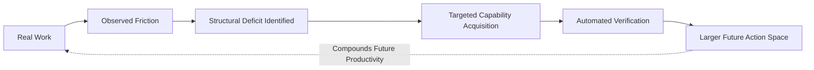

# Why Ambit

> This is the argument, not the reference. It runs ahead of the software deliberately. The [README](../README.md) describes what runs today; [the roadmap](./roadmap.md) says, section by section, what is built and what remains.

I built Ambit because my agent stack crossed the point where neither I nor the agents could reliably keep the whole thing in our heads.

Multiple models. MCP servers. Skills. Subagents. Local machines. Hosted services. Credentials. Scheduled jobs. A homelab.

Every component had configuration. Nothing had a model of what the whole system could actually do.

Ambit is a capability graph for agent stacks. What I wanted from it was the questions no config file answers:

- What does this provider actually support?
- Which parts of the stack are decaying?
- Are three different failures actually the same structural deficit?

The graph is exposed over MCP, so this is not only a visualization for humans. An agent can use Ambit as an external model of the environment it operates inside, instead of reconstructing that environment from context every session.

## Composition is the part that got interesting

The thing I became interested in while building it is bigger than tool inventory.

Agent systems become capable through composition.

Shell + Tailscale + Docker + monitoring + a scheduler + the right authority may compose into *"safely recover this service while I'm asleep."*

No individual config entry says that.

And the inverse matters too. Having a tool installed does not mean an agent can reliably use it. Having the technical ability to perform an action does not mean it has the authority to do so.

So the direction is to move from *what tools exist?* to *what actions are actually reachable?*

That means distinguishing:

```
installed ≠ callable ≠ working ≠ reliable ≠ authorized ≠ appropriate
```

## What an agent could notice

Eventually an agent should be able to say:

> We have hit this same environmental limitation four times. This is not a reasoning failure. We are missing a reusable capability.

Then close it: show the capability delta, build the chosen path, verify it, and leave the result on the map.

The result is a different kind of compounding:



A workaround gets you through today. A capability that has been verified and left on the map is there for every session after this one, until it decays and the graph says so.

## Accounting, and then a ledger

What Ambit is doing is closest to accounting. Partly a dependency graph, partly IAM, partly a CMDB, partly an audit ledger — but with *capacity for action* as the thing being accounted for.

The ≠ chain above is the short form. Ordinary tool registries collapse seven different things into one. Something can be **available** without being **authorized**; **authorized** without being **reachable**; reachable without being **verified**; and a **composed** capability can exist that no component declares. Two more decide whether it holds. **Delegated**, where a human or another agent supplies a missing step. **Persistent**, where it survives the current interaction. Together those seven are most of what determines whether a system can actually cause something to happen.

The version of this I find most interesting is longitudinal. Instead of describing only today, record what the system could do at time T, and what changed. A system gains a machine, then network access, then credentials, then a scheduler, then memory, then deploy authority, then the ability to create further agents. Each is an infrastructure change *and* a change in the reachable frontier.

That is a balance sheet for agency. And it makes visible the entries no changelog can:

> The system acquired autonomous incident-recovery capability yesterday, although no component added yesterday was itself an incident-recovery system.

## Effective agency as a governed object

I think this also points at a problem that gets less attention than model alignment.

**Effective agency can grow much faster than model intelligence.**

Give the same model shell access, persistent execution, credentials, browser control, local machines, memory, schedulers, and delegation, and you have created a radically more consequential system without changing a single model weight.

Those capabilities currently accumulate across JSON files, OAuth scopes, shell scripts, prompts, containers, machines, and human memory. No single artifact represents the total.

Ambit's longer-term thesis is: **make effective agency a governed object.**

Capability should be distinct from authority. New abilities should be verified before being trusted. Human approval should remain an explicit dependency where it matters. Revocation and blast radius should be computable. An agent should be able to propose expanding its environment without thereby having unilateral authority to expand it.

The design norm:

> **No increase in effective capability without a corresponding increase in legibility, verification, and governability.**

Ambit does not measure how intelligent the AI is. It tries to measure what intelligence has acquired the means to do.

The abstraction is tested where it stops being software: robots add physical actuation, and brain-computer interfaces erode the boundary between human and machine capability. [The affordance frontier](./affordance-frontier.md) works those cases through, and takes the argument to its end.
