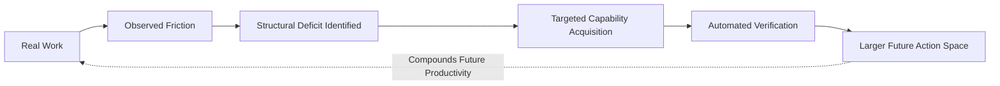

# Why Ambit

I built Ambit because my agent stack crossed the point where neither I nor the agents could reliably keep the whole thing in our heads.

Multiple models. MCP servers. Skills. Subagents. Local machines. Hosted services. Credentials. Scheduled jobs. A homelab.

Every component had configuration. Nothing had a model of what the whole system could actually do.

Ambit is a capability graph for agent stacks. It discovers capabilities from your configuration, models their dependencies and maturity, and lets both you and your agents ask:

- What am I one dependency away from?
- What does this provider actually support?
- What breaks if I remove it?
- Which missing primitive unlocks the most?
- Which parts of the stack are decaying?
- Are three different failures actually the same structural deficit?

The graph is exposed over MCP, so this is not only a visualisation for humans. An agent can use Ambit as an external model of the environment it operates inside, instead of reconstructing that environment from context every session.

## Composition is the part that got interesting

The thing I became interested in while building it is bigger than tool inventory.

Agent systems become capable through composition.

Shell + Tailscale + Docker + monitoring + a scheduler + the right authority may compose into *"safely recover this service while I'm asleep."*

No individual config entry says that.

And the inverse matters too. Having a tool installed does not mean an agent can reliably use it. Having the technical ability to perform an action does not mean it has the authority to do so.

So the direction is to move from *what tools exist?* to *what actions are actually reachable?*

That means distinguishing:

```
installed ≠ callable ≠ working ≠ reliable ≠ authorized
```

## A different relationship between an agent and its environment

It also changes what an agent can notice. Eventually one should be able to say:

> We have hit this same environmental limitation four times. This is not a reasoning failure. We are missing a reusable capability.

Then show the user the capability delta, compare ways to close it, help build the chosen path, verify that it works, and leave that new capability available to every future agent.

The result is a different kind of compounding:



> [!TIP]
> This cycle shifts the dynamic from *repeated manual workarounds* to *durable infrastructure accumulation*. Every resolved deficit permanently expands the agent's autonomous frontier.

## Accounting, and then a ledger

What Ambit is doing is closest to accounting. Partly a dependency graph, partly IAM, partly a CMDB, partly an audit ledger — but with *capacity for action* as the thing being accounted for.

Ordinary tool registries collapse seven different things into one. Something can be **available** without being **authorized**; **authorized** without being **reachable**; reachable without being **verified**; and a **composed** capability can exist that no component declares. Add **delegated** — a human or another agent supplies a missing step — and **persistent** — it survives the current interaction — and you have most of what determines whether a system can actually cause something to happen.

The version of this I find most interesting is longitudinal. Instead of describing only today, record what the system could do at time T, and what changed. A system gains a machine, then network access, then credentials, then a scheduler, then memory, then deploy authority, then the ability to create further agents. Each is an infrastructure change *and* a change in the reachable frontier.

That is a balance sheet for agency. And it makes visible the entries no changelog can:

> The system acquired autonomous incident-recovery capability yesterday, although no component added yesterday was itself an incident-recovery system.

## The safety argument

I think this also points at a problem that gets less attention than model alignment.

**Effective agency can grow much faster than model intelligence.**

Give the same model shell access, persistent execution, credentials, browser control, local machines, memory, schedulers, and delegation, and you have created a radically more consequential system without changing a single model weight.

Those capabilities currently accumulate across JSON files, OAuth scopes, shell scripts, prompts, containers, machines, and human memory. No single artefact represents the total.

Ambit's longer-term thesis is: **make effective agency a governed object.**

Capability should be distinct from authority. New abilities should be verified before being trusted. Human approval should remain an explicit dependency where it matters. Revocation and blast radius should be computable. An agent should be able to propose expanding its environment without thereby having unilateral authority to expand it.

The design norm:

> **No increase in effective capability without a corresponding increase in legibility, verification, and governability.**

## Why the unit might be the system

I do not think AGI necessarily arrives as one monolithic model crossing a threshold.

It may arrive compositionally: models plus tools plus persistence plus credentials plus infrastructure plus humans, forming systems whose aggregate ability to act becomes the historically relevant thing.

If that is roughly right, the unit we need to understand is no longer just the model. It is the agentic system — and model benchmarks describe only one input into the transition. The other dimension is the infrastructure through which intelligence becomes consequential.

A mature version of this should be able to say: *this model did not change, but the system around it acquired twelve new reachable capabilities this month.* At some point descriptions like that stop looking like a chatbot's tool configuration and start looking like the operational anatomy of a persistent actor.

Ambit does not measure how intelligent the AI is. It tries to measure what intelligence has acquired the means to do.

The same argument extends past software — robots add physical actuation, and brain-computer interfaces erode the boundary between human and machine capability entirely. Those cases are where the abstraction is tested rather than merely asserted, and they are worked through in [the affordance frontier](./affordance-frontier.md).

---

**What actually exists today** is narrower than the argument above, deliberately so: capability discovery, dependency mapping, maturity and decay analysis, failure-cascade analysis, near-miss discovery, and an MCP-readable model of the environment. Verified capability, explicit authority, and goal-to-capability planning are [the roadmap](./roadmap.md), not the product.

The [README](../README.md) describes only what runs.

Repo: [`zz-plant/ambit`](https://github.com/zz-plant/ambit)
